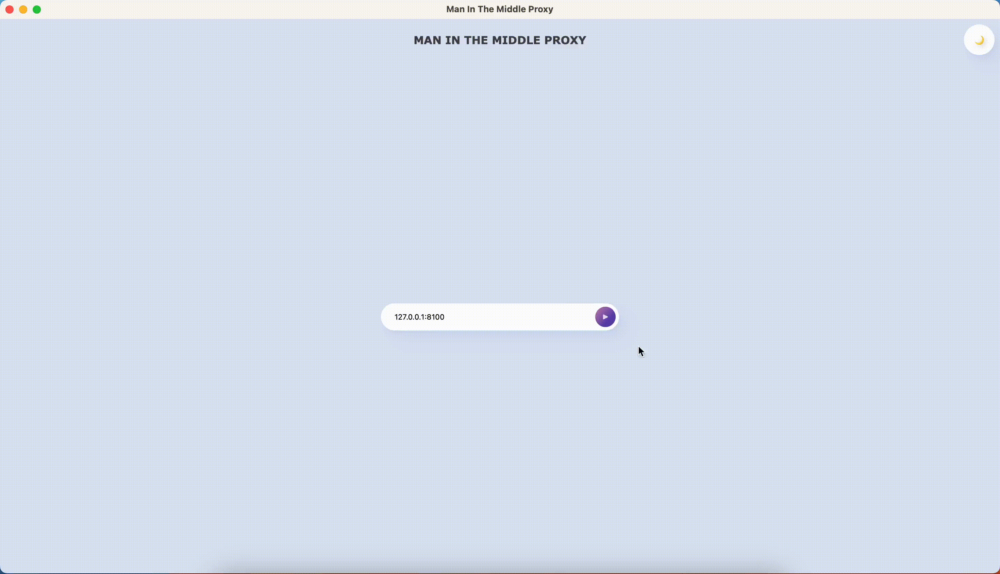

<div align="center">

<h1> Cheolsu Proxy </h1>
<h2> A simple <i>Man In The Middle</i> proxy</h2>
</div>


## Description

Rust-based **Man in the Middle proxy**, an early-stage project aimed at providing visibility into network traffic. Currently, it displays both HTTP and HTTPS requests and responses, but our future goal is to allow for manipulation of the traffic for more advanced use cases.



## Features

- 🔐 HTTP / HTTP(s)
- 🔒 TLS 1.0/1.1 레거시 클라이언트 지원 (하이브리드 TLS 핸들러)
- 🖱️ Gui
- ⌨️ Possibility of choosing a customised address and listening port
- 🔍 Details for each request and response
- 🎯 Filtering the list of requests by method
- ❌ Deleting a single request from the list
- 🚫 Clear all requests and clean the table
- 🌌 Dark / light theme
- 🔐 **보안**: 사용자별 고유 CA 인증서 자동 생성 (개인키는 바이너리에 포함되지 않음)

## Getting Started

### 1. 인증서 자동 생성 및 설치

Cheolsu Proxy는 첫 실행 시 자동으로 고유한 CA 인증서를 생성합니다.

**macOS에서 인증서 수동 설치:**

1. 앱을 실행하면 콘솔에 인증서 파일 경로가 표시됩니다:

   ```
   📁 경로: ~/Library/Application Support/com.cheolsu-proxy/cheolsu-proxy.cer
   ```

2. Keychain Access 앱을 실행하세요

3. 'login' 키체인을 선택하세요

4. File > Import Items... 메뉴를 선택하세요

5. 위 경로의 `cheolsu-proxy.cer` 파일을 선택하세요

6. 인증서를 더블클릭하고 '항상 신뢰'로 설정하세요

**다른 OS 가이드:**

- [Ubuntu guide](https://ubuntu.com/server/docs/security-trust-store)
- [Windows guide](https://learn.microsoft.com/en-us/skype-sdk/sdn/articles/installing-the-trusted-root-certificate)

### 2. 시스템 프록시 설정

로컬 시스템 프록시를 `127.0.0.1:8100`으로 설정하세요.

- [MacOS guide](https://support.apple.com/it-it/guide/mac-help/mchlp2591/mac)
- [Ubuntu guide](https://help.ubuntu.com/stable/ubuntu-help/net-proxy.html.en)

## 📚 Documentation

자세한 문서는 [공식 문서 사이트](https://ohah.github.io/cheolsu-proxy)를 참조하세요.

- **사용자 가이드**: 설치, 설정, 사용법
- **기여자 가이드**: 개발 환경 설정, 코드 구조, 기여 방법
- **기능 문서**: TLS 지원, 인증서 설정 등

### 로컬 문서

기존 마크다운 문서는 [document/](document/) 디렉토리를 참조하세요.

- [TLS 1.0/1.1 지원](document/features/TLS_1_0_1_1_SUPPORT.md) - 레거시 TLS 클라이언트 지원
- [Windows guide](https://support.microsoft.com/en-us/windows/use-a-proxy-server-in-windows-03096c53-0554-4ffe-b6ab-8b1deee8dae1#:~:text=a%20VPN%20connection-,Select%20the%20Start%20button%2C%20then%20select%20Settings%20%3E%20Network%20%26%20Internet,information%20for%20that%20VPN%20connection.)

## Start Development

### 사전 요구사항

- [Rust](https://rustup.rs/) (stable)
- [Bun](https://bun.sh/) 또는 npm
- [Tauri CLI](https://v2.tauri.app/start/prerequisites/)
- OpenSSL 3.x (빌드에 필요)

**macOS:**

```bash
brew install openssl@3 pkg-config
```

### 1. 인증서 생성

프록시가 HTTPS 트래픽을 중간에서 분석하려면 CA 인증서가 필요합니다. 프로젝트 루트의 `crates/` 디렉토리에서 인증서 생성 스크립트를 실행하세요:

```bash
cd crates
bash ../install_cer.sh
```

> 스크립트가 `crates/proxyapi_v2/src/certificate_authority/` 디렉토리에 인증서 파일들을 생성합니다.
> 개인키는 PKCS#8 형식으로 변환됩니다 (rcgen 라이브러리 호환).

### 2. CA 인증서 시스템 신뢰 등록

생성된 CA 인증서를 운영체제에 등록해야 HTTPS 프록시가 정상 동작합니다.

**macOS:**

```bash
open crates/proxyapi_v2/src/certificate_authority/cheolsu-proxy.cer
```

Keychain Access가 열리면 인증서를 더블클릭 → "신뢰" 섹션 → **"항상 신뢰"** 로 설정하세요.

**Linux:**

```bash
sudo cp crates/proxyapi_v2/src/certificate_authority/cheolsu-proxy.cer /usr/local/share/ca-certificates/cheolsu-proxy.crt
sudo update-ca-certificates
```

**Windows:**

인증서 관리자(`certmgr.msc`)에서 "신뢰할 수 있는 루트 인증 기관"에 `cheolsu-proxy.cer`를 가져오세요.

### 3. 개발 서버 실행

```bash
cd tauri-ui
bun install
bun tauri dev
```

OpenSSL 링크 오류가 발생하면 환경변수를 설정하세요:

```bash
PKG_CONFIG_PATH="/opt/homebrew/opt/openssl@3/lib/pkgconfig" bun tauri dev
```

### 4. CLI (Headless) 모드

GUI 없이 프록시만 실행할 수 있습니다:

```bash
bun tauri dev -- -- --headless --port 8100
```

| 옵션            | 단축 | 설명                                 |
| --------------- | ---- | ------------------------------------ |
| `--headless`    | `-H` | GUI 없이 프록시만 실행               |
| `--port <PORT>` | `-p` | 프록시 리슨 포트 (기본: 8100)        |
| `--host <HOST>` | `-b` | 프록시 리슨 호스트 (기본: 127.0.0.1) |
| `--verbose`     | `-v` | 상세 로깅 활성화                     |

### 5. 테스트

```bash
# 단위 테스트 (TLS 전략 선택, ClientHello 파싱 등)
PKG_CONFIG_PATH="/opt/homebrew/opt/openssl@3/lib/pkgconfig" cargo test -p proxyapi_v2 --lib

# 통합 테스트 (CA 인증서 시스템 신뢰 등록 필요)
PKG_CONFIG_PATH="/opt/homebrew/opt/openssl@3/lib/pkgconfig" cargo test -p proxyapi_v2 --test rcgen_ca
```

### 인증서 파일 위치

- **개발 환경**: `crates/proxyapi_v2/src/certificate_authority/`
- **프로덕션 (macOS)**: `~/Library/Application Support/com.cheolsu-proxy/`
- **프로덕션 (Windows)**: `%APPDATA%/com.cheolsu-proxy/` (향후 지원)
- **프로덕션 (Linux)**: `~/.config/com.cheolsu-proxy/` (향후 지원)

## Documentation and Help

If you have questions on how to use [cheolsu-proxy](https://github.com/ohah/cheolsu-proxy), please use GitHub Discussions!


## Contributing

Contributions are always welcome!

See `contributing.md` for ways to get started.

Please adhere to this project's `code of conduct`.

## Licenses

See [LICENSE-APACHE](LICENSE-APACHE), [LICENSE-MIT](LICENSE-MIT) for details
