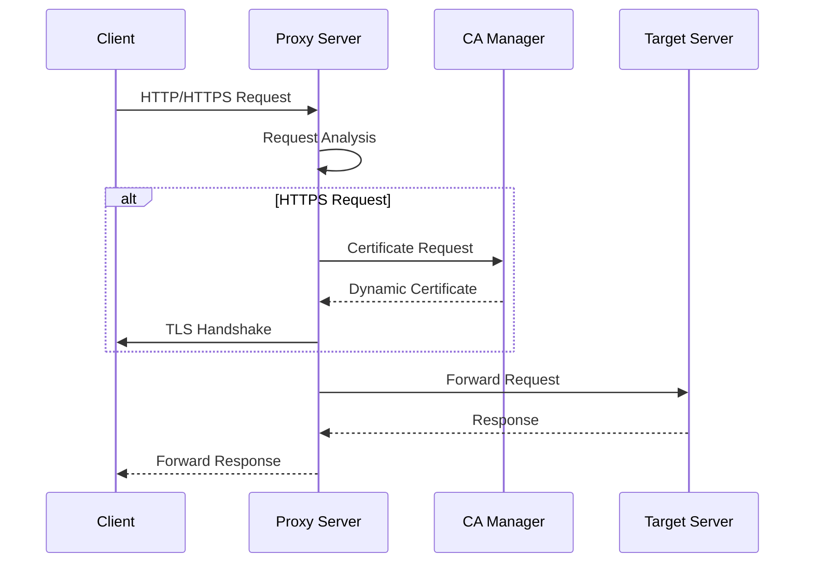
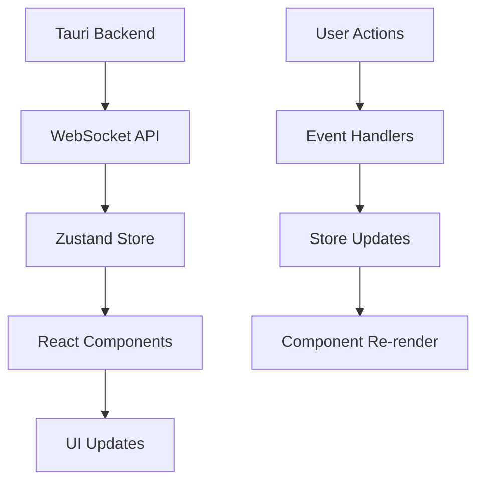

# Code Structure

Cheolsu Proxy is structured as a Rust-based monorepo with a Tauri desktop application.

## Overall Structure

```
cheolsu-proxy/
├── Cargo.toml                 # Workspace root configuration
├── Cargo.lock                 # Dependency lock file
├── README.md                  # Project introduction
├── CONTRIBUTING.md            # Contributing guide (English)
├── CONTRIBUTING_KO.md         # Contributing guide (Korean)
├── docs/                      # Documentation (existing)
├── assets/                    # Project assets
├── tauri-ui/                  # Frontend (React + TypeScript)
├── proxyapi/                  # Legacy proxy API
├── proxyapi_models/           # Legacy models
├── proxyapi_v2/               # New proxy API
├── proxyapi_v2_models/        # New models
└── proxy_v2_models/           # Common models
```

## Workspace Structure

### Root Cargo.toml

```toml
[workspace]
members = [
    "proxyapi",
    "proxyapi_models",
    "proxyapi_v2",
    "proxyapi_v2_models",
    "proxy_v2_models",
    "tauri-ui/src-tauri"
]

[workspace.dependencies]
# Common dependency definitions
```

## Backend Structure

### 1. proxyapi_v2/ (Main Proxy Engine)

```
proxyapi_v2/
├── Cargo.toml                 # Package configuration
├── src/
│   ├── lib.rs                 # Library entry point
│   ├── error.rs               # Error type definitions
│   ├── body.rs                # HTTP body handling
│   ├── decoder.rs             # HTTP decoder
│   ├── rewind.rs              # Stream rewind
│   ├── noop.rs                # No-op handler
│   ├── tls_version_detector.rs # TLS version detection
│   ├── hybrid_tls_handler.rs  # Hybrid TLS handler
│   ├── certificate_authority/ # CA certificate management
│   │   ├── mod.rs
│   │   ├── rcgen_authority.rs # rcgen-based CA
│   │   └── openssl_authority.rs # OpenSSL-based CA
│   └── proxy/                 # Proxy core logic
│       ├── mod.rs
│       ├── builder.rs         # Proxy builder
│       └── internal.rs        # Internal proxy logic
├── examples/                  # Usage examples
├── tests/                     # Integration tests
└── benches/                   # Benchmarks
```

### 2. certificate_authority/ (CA Management)

#### Module Structure

```rust
// mod.rs
pub trait CertificateAuthority {
    fn generate_certificate(&self, domain: &str) -> Result<Certificate, Error>;
    fn gen_pkcs12_identity(&self, domain: &str) -> Result<Identity, Error>;
}

pub struct RcgenAuthority { /* ... */ }
pub struct OpensslAuthority { /* ... */ }
```

#### Key Features

- **Dynamic Certificate Generation**: Automatic certificate generation per domain
- **PKCS12 Support**: PKCS12 certificate generation for native-tls
- **Cross-platform**: Support for macOS, Windows, Linux

### 3. proxy/ (Proxy Core)

#### Builder Pattern

```rust
// builder.rs
pub struct ProxyBuilder {
    listen_addr: SocketAddr,
    ca: Box<dyn CertificateAuthority>,
    tls_handler: Box<dyn TlsHandler>,
}

impl ProxyBuilder {
    pub fn new() -> Self { /* ... */ }
    pub fn listen_addr(mut self, addr: SocketAddr) -> Self { /* ... */ }
    pub fn certificate_authority(mut self, ca: Box<dyn CertificateAuthority>) -> Self { /* ... */ }
    pub fn build(self) -> Result<Proxy, Error> { /* ... */ }
}
```

#### Internal Logic

```rust
// internal.rs
pub struct Proxy {
    listener: TcpListener,
    ca: Box<dyn CertificateAuthority>,
    tls_handler: Box<dyn TlsHandler>,
}

impl Proxy {
    pub async fn run(&self) -> Result<(), Error> { /* ... */ }
    async fn handle_connection(&self, stream: TcpStream) -> Result<(), Error> { /* ... */ }
    async fn handle_http(&self, stream: TcpStream) -> Result<(), Error> { /* ... */ }
    async fn handle_https(&self, stream: TcpStream) -> Result<(), Error> { /* ... */ }
}
```

## Frontend Structure (tauri-ui/)

### FSD (Feature-Sliced Design) Architecture

```
tauri-ui/src/
├── main.tsx                   # Application entry point
├── main.css                   # Global styles
├── app/                       # Application layer
│   ├── App.tsx                # Root component
│   ├── layouts/               # Layout components
│   └── providers/             # Context providers
├── pages/                     # Page layer
│   ├── network-dashboard/     # Network dashboard
│   └── sessions/              # Session management
├── widgets/                   # Widget layer
│   ├── network-table/         # Network table
│   ├── network-header/        # Network header
│   └── host-path-tree/        # Host path tree
├── features/                  # Feature layer
│   ├── network-table/         # Network table features
│   ├── transaction-details/   # Transaction details
│   └── websocket-test/        # WebSocket test
├── entities/                  # Entity layer
│   ├── proxy/                 # Proxy entity
│   ├── session/               # Session entity
│   └── transaction/           # Transaction entity
└── shared/                    # Shared layer
    ├── api/                   # API client
    ├── ui/                    # UI components
    ├── lib/                   # Utility functions
    ├── stores/                # State management
    └── assets/                # Static assets
```

### Layer Responsibilities

#### 1. app/ (Application Layer)

- **App.tsx**: Root component, routing setup
- **layouts/**: Common layout components
- **providers/**: React Context providers

#### 2. pages/ (Page Layer)

- **network-dashboard/**: Main network monitoring page
- **sessions/**: Session management page

#### 3. widgets/ (Widget Layer)

- **network-table/**: Network request table
- **network-header/**: Network header information
- **host-path-tree/**: Host-based path tree

#### 4. features/ (Feature Layer)

- **network-table/**: Table-related features (filtering, sorting, etc.)
- **transaction-details/**: Transaction detail view
- **websocket-test/**: WebSocket test functionality

#### 5. entities/ (Entity Layer)

- **proxy/**: Proxy-related data models
- **session/**: Session-related data models
- **transaction/**: Transaction-related data models

#### 6. shared/ (Shared Layer)

- **api/**: Backend API client
- **ui/**: Reusable UI components
- **lib/**: Utility functions
- **stores/**: Zustand state management
- **assets/**: Static assets

## Tauri Backend (tauri-ui/src-tauri/)

```
src-tauri/
├── Cargo.toml                 # Tauri backend configuration
├── tauri.conf.json            # Tauri configuration
├── src/
│   ├── main.rs                # Main entry point
│   ├── lib.rs                 # Library entry point
│   ├── proxy.rs               # Legacy proxy
│   ├── proxy_v2.rs            # New proxy
│   └── certificate_authority/ # CA management
├── capabilities/              # Tauri permission settings
├── icons/                     # App icons
└── gen/                       # Auto-generated files
```

### Tauri Configuration

```json
// tauri.conf.json
{
  "build": {
    "beforeDevCommand": "npm run dev",
    "beforeBuildCommand": "npm run build",
    "devPath": "http://localhost:1420",
    "distDir": "../dist"
  },
  "package": {
    "productName": "Cheolsu Proxy",
    "version": "0.1.0"
  }
}
```

## Data Flow

### 1. Proxy Request Processing



### 2. Frontend Data Flow



## State Management

### Zustand Store Structure

```typescript
// stores/proxy-store.ts
interface ProxyStore {
  // State
  isRunning: boolean;
  listenAddr: string;
  requests: Transaction[];

  // Actions
  startProxy: () => void;
  stopProxy: () => void;
  addRequest: (request: Transaction) => void;
  clearRequests: () => void;
}

// stores/session-store.ts
interface SessionStore {
  // State
  sessions: Session[];
  activeSession: string | null;

  // Actions
  createSession: () => void;
  switchSession: (id: string) => void;
  deleteSession: (id: string) => void;
}
```

## API Communication

### WebSocket API

```typescript
// shared/api/proxy.ts
export class ProxyAPI {
  private ws: WebSocket;

  connect(): void {
    this.ws = new WebSocket("ws://localhost:8080/ws");
    this.ws.onmessage = (event) => {
      const data = JSON.parse(event.data);
      this.handleMessage(data);
    };
  }

  private handleMessage(data: any): void {
    switch (data.type) {
      case "request":
        proxyStore.getState().addRequest(data.payload);
        break;
      case "response":
        // Handle response
        break;
    }
  }
}
```

## Test Structure

### Rust Tests

```
tests/
├── common/                    # Common test utilities
│   └── mod.rs
├── integration_error_handling_tests.rs
├── logging_handler_error_tests.rs
├── openssl_ca.rs
├── rcgen_ca.rs
└── websocket.rs
```

### Frontend Tests

```
__tests__/
├── components/                # Component tests
├── pages/                     # Page tests
├── utils/                     # Utility tests
└── setup.ts                   # Test setup
```

## Build and Deployment

### Development Build

```bash
# Backend build
cargo build

# Frontend build
cd tauri-ui && npm run build

# Tauri app build
cd tauri-ui && npm run tauri build
```

### Production Build

```bash
# Release build
cargo build --release

# Tauri app packaging
cd tauri-ui && npm run tauri build -- --target universal-apple-darwin
```

## Performance Optimization

### Backend Optimization

- **Asynchronous Processing**: Using tokio runtime
- **Memory Pooling**: Object pool pattern implementation
- **Streaming**: Large data streaming processing

### Frontend Optimization

- **Virtualization**: Large list virtualization
- **Memoization**: React.memo, useMemo usage
- **Code Splitting**: Dynamic import usage

## Security Considerations

### Backend Security

- **Certificate Management**: Secure CA certificate generation
- **Memory Security**: Safe memory management
- **Input Validation**: All input data validation

### Frontend Security

- **XSS Prevention**: Input data escaping
- **CSRF Prevention**: Token-based authentication
- **Content Security Policy**: CSP header settings

## Extensibility

### Plugin System (Future)

```rust
// Plugin trait
pub trait Plugin {
    fn name(&self) -> &str;
    fn version(&self) -> &str;
    fn handle_request(&self, request: &mut Request) -> Result<(), Error>;
    fn handle_response(&self, response: &mut Response) -> Result<(), Error>;
}
```

### API Extension

- REST API addition
- GraphQL support
- gRPC support

Understanding this structure will help you effectively navigate and contribute to the Cheolsu Proxy codebase.
