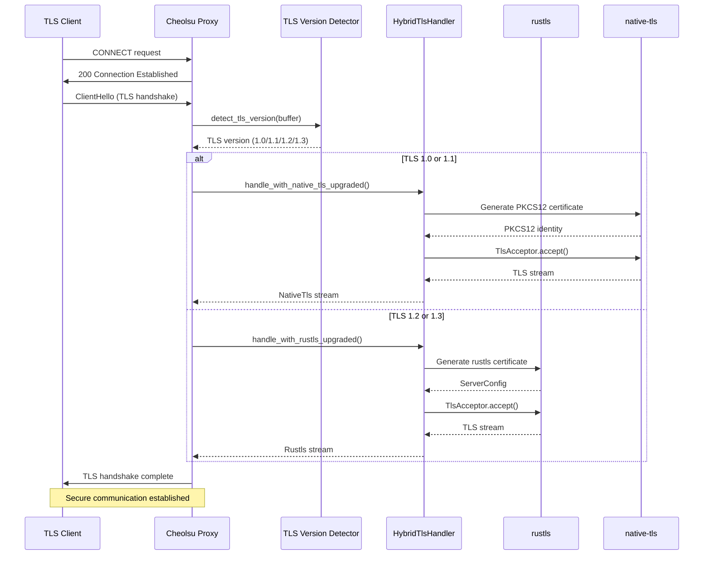
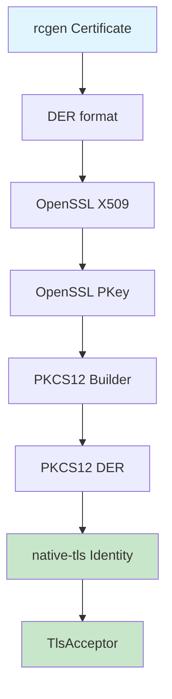
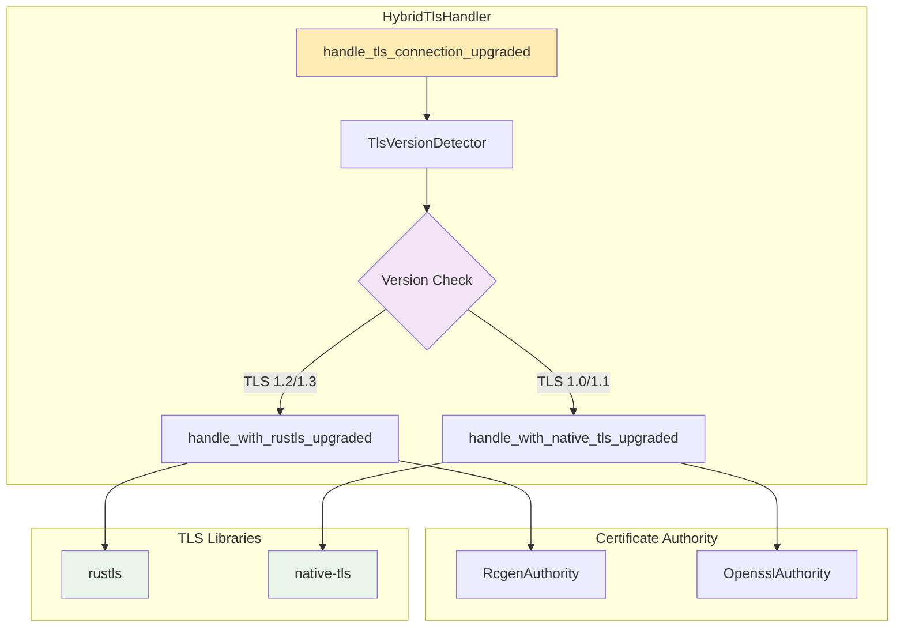

# TLS 1.0/1.1 Legacy Support

Cheolsu Proxy supports not only modern TLS versions but also legacy TLS 1.0/1.1 clients. To achieve this, we've implemented a hybrid approach that automatically detects TLS versions and selects the appropriate TLS library.

## 🎯 Key Features

- **Automatic TLS Version Detection**: Automatically detects TLS version from ClientHello
- **Hybrid TLS Processing**: Uses native-tls for TLS 1.0/1.1, rustls for TLS 1.2+
- **Cross-platform Compatibility**: Works on macOS, Windows, and Linux
- **PKCS12 Certificate Support**: Automatic generation of PKCS12 certificates for native-tls

## 🔧 Implementation Approach

### TLS Version-Specific Library Selection

```
TLS 1.0/1.1 → native-tls (OpenSSL-based)
TLS 1.2/1.3 → rustls (Pure Rust)
```

### Core Flow

1. **ClientHello Reception** → TLS version detection (buffer[3..5])
2. **Version-Specific Handler Selection**:
   - TLS 1.0/1.1: `HybridTlsHandler::handle_with_native_tls_upgraded()`
   - TLS 1.2+: `HybridTlsHandler::handle_with_rustls_upgraded()`
3. **Certificate Generation**: Generate PKCS12 format certificates for native-tls
4. **TLS Handshake**: Perform handshake with selected library

## 📊 Architecture

### TLS Handshake Flow



### PKCS12 Certificate Generation Flow



### Hybrid TLS Handler Structure



## 📁 Key Implementation Files

### 1. CertificateAuthority Trait Extension

- `proxyapi_v2/src/certificate_authority/mod.rs`
- Added `gen_pkcs12_identity()` method

### 2. PKCS12 Certificate Generation

- `proxyapi_v2/src/certificate_authority/rcgen_authority.rs`
- `proxyapi_v2/src/certificate_authority/openssl_authority.rs`
- Convert rcgen/OpenSSL certificates to PKCS12

### 3. Hybrid TLS Handler

- `proxyapi_v2/src/hybrid_tls_handler.rs`
- TLS version detection and appropriate handler selection
- Perfect support for Upgraded streams

### 4. Proxy Integration

- `proxyapi_v2/src/proxy/internal.rs`
- Integration of existing rustls logic with hybrid handler

## 🚀 Usage

### Build

```bash
cargo build --package proxyapi_v2 \
  --features "native-tls-client,rcgen-ca,openssl-ca"
```

### Test

```bash
cargo run --example tls_hybrid_test \
  --features "native-tls-client,rcgen-ca,openssl-ca" \
  --package proxyapi_v2
```

## 📊 Test Results

```
📋 TLS Version Detection Test:
--------------------------
  TLS 1.0 → "TLS 1.0" (native-tls) ✅
  TLS 1.1 → "TLS 1.1" (native-tls) ✅
  TLS 1.2 → "TLS 1.2" (rustls) ✅
  TLS 1.3 → "TLS 1.3" (rustls) ✅
```

## 🔍 Technical Details

### PKCS12 Conversion Flow

```
rcgen Certificate (DER)
→ openssl::x509::X509
→ openssl::pkcs12::Pkcs12
→ native_tls::Identity
```

### TLS Version Detection

```rust
// Extract version from TLS record header
let version_bytes = [buffer[3], buffer[4]];
match version_bytes {
    [0x03, 0x01] => Some(TlsVersion::Tls10),
    [0x03, 0x02] => Some(TlsVersion::Tls11),
    [0x03, 0x03] => Some(TlsVersion::Tls12),
    [0x03, 0x04] => Some(TlsVersion::Tls13),
    _ => None,
}
```

## 🛡️ Security Considerations

### Risks of Legacy TLS Support

- **TLS 1.0/1.1 have security vulnerabilities**
- Use of vulnerable encryption algorithms like RC4, MD5, SHA-1
- Vulnerable to attacks like BEAST, POODLE

### Recommendations

1. **Use Latest TLS Versions**: Use TLS 1.2 or higher whenever possible
2. **Upgrade Legacy Clients**: Recommend updating old clients
3. **Establish Security Policies**: Clear policies for legacy TLS usage

## 🔧 Troubleshooting

### TLS Handshake Failure

**Symptoms**: TLS 1.0/1.1 clients cannot connect

**Solutions**:

1. Verify native-tls feature is enabled
2. Check if OpenSSL library is installed
3. Verify PKCS12 certificate generation succeeded

### Certificate Errors

**Symptoms**: "certificate verify failed" error

**Solutions**:

1. Verify CA certificate is properly installed
2. Check certificate chain validation logic
3. Verify system time is correct

### Performance Issues

**Symptoms**: Slow TLS handshake

**Solutions**:

1. Implement certificate generation caching
2. Optimize connection pooling
3. Monitor memory usage

## 📈 Future Improvements

### Performance Optimization

- [ ] Certificate generation caching
- [ ] Connection pooling implementation
- [ ] Memory usage optimization

### Security Enhancement

- [ ] TLS 1.0/1.1 usage warnings
- [ ] Vulnerable encryption algorithm detection
- [ ] Security policy enforcement

### Monitoring

- [ ] TLS version-specific statistics
- [ ] Security event logging
- [ ] Performance metrics collection
