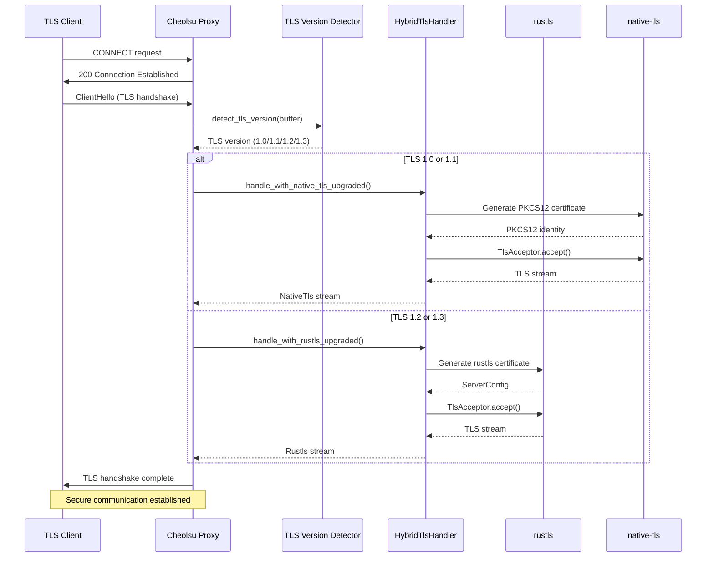
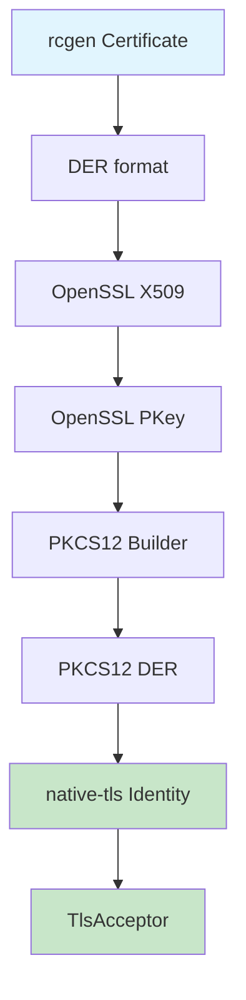
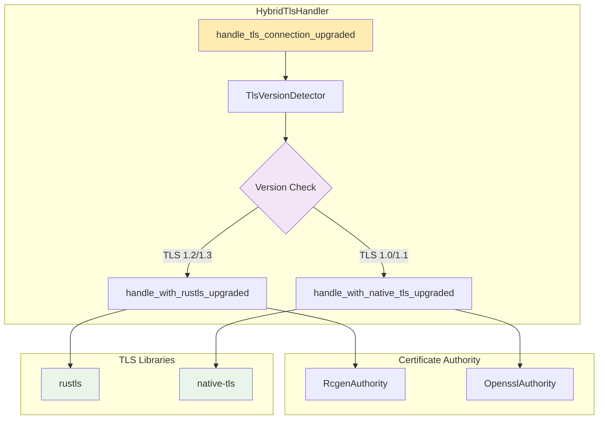

# TLS 1.0/1.1 Native-TLS 지원

## 개요

Cheolsu Proxy에 TLS 1.0/1.1 레거시 클라이언트 지원을 추가했습니다. TLS 버전을 자동 감지하여 적절한 TLS 라이브러리를 선택하는 하이브리드 방식을 구현했습니다.

## 🎯 주요 기능

- **자동 TLS 버전 감지**: ClientHello에서 TLS 버전을 자동으로 감지
- **하이브리드 TLS 처리**: TLS 1.0/1.1은 native-tls, TLS 1.2+는 rustls 사용
- **크로스 플랫폼 호환성**: macOS, Windows, Linux에서 모두 동작
- **PKCS12 인증서 지원**: native-tls용 PKCS12 인증서 자동 생성

## 🔧 구현 방식

### TLS 버전별 라이브러리 선택

```
TLS 1.0/1.1 → native-tls (OpenSSL 기반)
TLS 1.2/1.3 → rustls (순수 Rust)
```

### 핵심 플로우

1. **ClientHello 수신** → TLS 버전 감지 (buffer[3..5])
2. **버전별 핸들러 선택**:
   - TLS 1.0/1.1: `HybridTlsHandler::handle_with_native_tls_upgraded()`
   - TLS 1.2+: `HybridTlsHandler::handle_with_rustls_upgraded()`
3. **인증서 생성**: PKCS12 형식으로 native-tls용 인증서 생성
4. **TLS 핸드셰이크**: 선택된 라이브러리로 핸드셰이크 수행

## 📊 아키텍처 다이어그램

### TLS 핸드셰이크 플로우



### PKCS12 인증서 생성 플로우



### 하이브리드 TLS 핸들러 구조



## 📁 주요 변경 파일

### 1. CertificateAuthority 트레이트 확장

- `proxyapi_v2/src/certificate_authority/mod.rs`
- `gen_pkcs12_identity()` 메서드 추가

### 2. PKCS12 인증서 생성

- `proxyapi_v2/src/certificate_authority/rcgen_authority.rs`
- `proxyapi_v2/src/certificate_authority/openssl_authority.rs`
- rcgen/OpenSSL 인증서를 PKCS12로 변환

### 3. 하이브리드 TLS 핸들러

- `proxyapi_v2/src/hybrid_tls_handler.rs`
- TLS 버전 감지 및 적절한 핸들러 선택
- Upgraded 스트림 완벽 지원

### 4. 프록시 통합

- `proxyapi_v2/src/proxy/internal.rs`
- 기존 rustls 로직과 하이브리드 핸들러 통합

## 🚀 사용 방법

### 빌드

```bash
cargo build --package proxyapi_v2 \
  --features "native-tls-client,rcgen-ca,openssl-ca"
```

### 테스트

```bash
cargo run --example tls_hybrid_test \
  --features "native-tls-client,rcgen-ca,openssl-ca" \
  --package proxyapi_v2
```

## 📊 테스트 결과

```
📋 TLS 버전 감지 테스트:
--------------------------
  TLS 1.0 → "TLS 1.0" (native-tls) ✅
  TLS 1.1 → "TLS 1.1" (native-tls) ✅
  TLS 1.2 → "TLS 1.2" (rustls) ✅
  TLS 1.3 → "TLS 1.3" (rustls) ✅
```

## 🔍 기술적 세부사항

### PKCS12 변환 플로우

```
rcgen Certificate (DER)
→ openssl::x509::X509
→ openssl::pkcs12::Pkcs12
→ native_tls::Identity
```

### TLS 버전 감지

```rust
// TLS 레코드 헤더에서 버전 추출
let version_bytes = [buffer[3], buffer[4]];
match version_bytes {
    [0x03, 0x01] => Some(TlsVersion::Tls10),
    [0x03, 0x02] => Some(TlsVersion::Tls11),
    [0x03, 0x03] => Some(TlsVersion::Tls12),
    [0x03, 0x04] => Some(TlsVersion::Tls13),
    _ => None,
}
```
