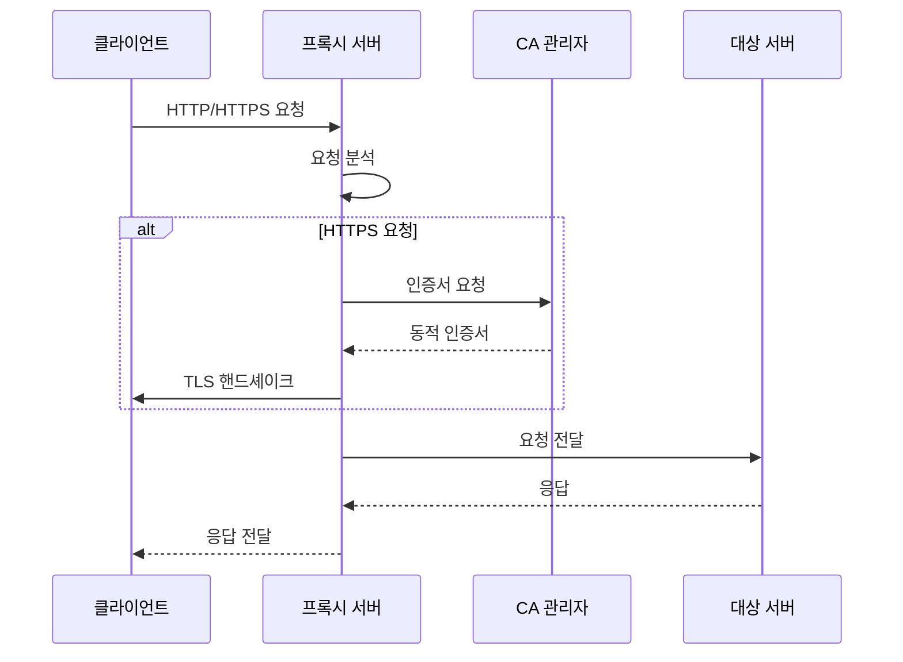
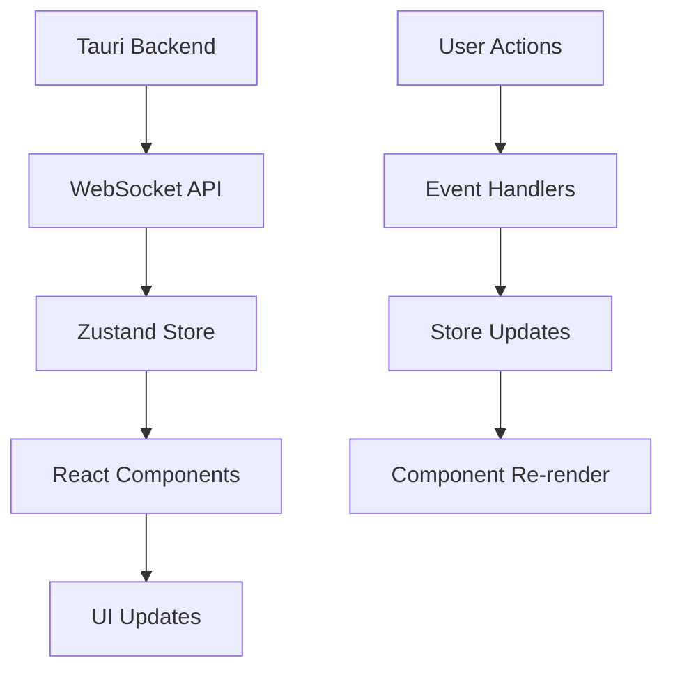

# 프로젝트 구조

Cheolsu Proxy는 Rust 기반의 모노레포 구조로 구성되어 있으며, Tauri를 사용한 데스크톱 애플리케이션입니다.

## 전체 구조

```
cheolsu-proxy/
├── Cargo.toml                 # 워크스페이스 루트 설정
├── Cargo.lock                 # 의존성 잠금 파일
├── README.md                  # 프로젝트 소개
├── CONTRIBUTING.md            # 기여 가이드 (영어)
├── CONTRIBUTING_KO.md         # 기여 가이드 (한국어)
├── docs/                      # 문서 (기존)
├── assets/                    # 프로젝트 에셋
├── tauri-ui/                  # 프론트엔드 (React + TypeScript)
├── proxyapi/                  # 레거시 프록시 API
├── proxyapi_models/           # 레거시 모델
├── proxyapi_v2/               # 새로운 프록시 API
├── proxyapi_v2_models/        # 새로운 모델
└── proxy_v2_models/           # 공통 모델
```

## 워크스페이스 구조

### 루트 Cargo.toml

```toml
[workspace]
members = [
    "proxyapi",
    "proxyapi_models",
    "proxyapi_v2",
    "proxyapi_v2_models",
    "proxy_v2_models",
    "tauri-ui/src-tauri"
]

[workspace.dependencies]
# 공통 의존성 정의
```

## 백엔드 구조

### 1. proxyapi_v2/ (메인 프록시 엔진)

```
proxyapi_v2/
├── Cargo.toml                 # 패키지 설정
├── src/
│   ├── lib.rs                 # 라이브러리 진입점
│   ├── error.rs               # 에러 타입 정의
│   ├── body.rs                # HTTP 바디 처리
│   ├── decoder.rs             # HTTP 디코더
│   ├── rewind.rs              # 스트림 리와인드
│   ├── noop.rs                # No-op 핸들러
│   ├── tls_version_detector.rs # TLS 버전 감지
│   ├── hybrid_tls_handler.rs  # 하이브리드 TLS 핸들러
│   ├── certificate_authority/ # CA 인증서 관리
│   │   ├── mod.rs
│   │   ├── rcgen_authority.rs # rcgen 기반 CA
│   │   └── openssl_authority.rs # OpenSSL 기반 CA
│   └── proxy/                 # 프록시 핵심 로직
│       ├── mod.rs
│       ├── builder.rs         # 프록시 빌더
│       └── internal.rs        # 내부 프록시 로직
├── examples/                  # 사용 예제
├── tests/                     # 통합 테스트
└── benches/                   # 벤치마크
```

### 2. certificate_authority/ (CA 관리)

#### 모듈 구조

```rust
// mod.rs
pub trait CertificateAuthority {
    fn generate_certificate(&self, domain: &str) -> Result<Certificate, Error>;
    fn gen_pkcs12_identity(&self, domain: &str) -> Result<Identity, Error>;
}

pub struct RcgenAuthority { /* ... */ }
pub struct OpensslAuthority { /* ... */ }
```

#### 주요 기능

- **동적 인증서 생성**: 도메인별 인증서 자동 생성
- **PKCS12 지원**: native-tls용 PKCS12 인증서 생성
- **크로스 플랫폼**: macOS, Windows, Linux 지원

### 3. proxy/ (프록시 핵심)

#### Builder 패턴

```rust
// builder.rs
pub struct ProxyBuilder {
    listen_addr: SocketAddr,
    ca: Box<dyn CertificateAuthority>,
    tls_handler: Box<dyn TlsHandler>,
}

impl ProxyBuilder {
    pub fn new() -> Self { /* ... */ }
    pub fn listen_addr(mut self, addr: SocketAddr) -> Self { /* ... */ }
    pub fn certificate_authority(mut self, ca: Box<dyn CertificateAuthority>) -> Self { /* ... */ }
    pub fn build(self) -> Result<Proxy, Error> { /* ... */ }
}
```

#### 내부 로직

```rust
// internal.rs
pub struct Proxy {
    listener: TcpListener,
    ca: Box<dyn CertificateAuthority>,
    tls_handler: Box<dyn TlsHandler>,
}

impl Proxy {
    pub async fn run(&self) -> Result<(), Error> { /* ... */ }
    async fn handle_connection(&self, stream: TcpStream) -> Result<(), Error> { /* ... */ }
    async fn handle_http(&self, stream: TcpStream) -> Result<(), Error> { /* ... */ }
    async fn handle_https(&self, stream: TcpStream) -> Result<(), Error> { /* ... */ }
}
```

## 프론트엔드 구조 (tauri-ui/)

### FSD (Feature-Sliced Design) 아키텍처

```
tauri-ui/src/
├── main.tsx                   # 애플리케이션 진입점
├── main.css                   # 글로벌 스타일
├── app/                       # 애플리케이션 레이어
│   ├── App.tsx                # 루트 컴포넌트
│   ├── layouts/               # 레이아웃 컴포넌트
│   └── providers/             # 컨텍스트 프로바이더
├── pages/                     # 페이지 레이어
│   ├── network-dashboard/     # 네트워크 대시보드
│   └── sessions/              # 세션 관리
├── widgets/                   # 위젯 레이어
│   ├── network-table/         # 네트워크 테이블
│   ├── network-header/        # 네트워크 헤더
│   └── host-path-tree/        # 호스트 경로 트리
├── features/                  # 기능 레이어
│   ├── network-table/         # 네트워크 테이블 기능
│   ├── transaction-details/   # 트랜잭션 상세
│   └── websocket-test/        # WebSocket 테스트
├── entities/                  # 엔티티 레이어
│   ├── proxy/                 # 프록시 엔티티
│   ├── session/               # 세션 엔티티
│   └── transaction/           # 트랜잭션 엔티티
└── shared/                    # 공유 레이어
    ├── api/                   # API 클라이언트
    ├── ui/                    # UI 컴포넌트
    ├── lib/                   # 유틸리티 함수
    ├── stores/                # 상태 관리
    └── assets/                # 정적 에셋
```

### 각 레이어의 역할

#### 1. app/ (애플리케이션 레이어)

- **App.tsx**: 루트 컴포넌트, 라우팅 설정
- **layouts/**: 공통 레이아웃 컴포넌트
- **providers/**: React Context 프로바이더

#### 2. pages/ (페이지 레이어)

- **network-dashboard/**: 메인 네트워크 모니터링 페이지
- **sessions/**: 세션 관리 페이지

#### 3. widgets/ (위젯 레이어)

- **network-table/**: 네트워크 요청 테이블
- **network-header/**: 네트워크 헤더 정보
- **host-path-tree/**: 호스트별 경로 트리

#### 4. features/ (기능 레이어)

- **network-table/**: 테이블 관련 기능 (필터링, 정렬 등)
- **transaction-details/**: 트랜잭션 상세 보기
- **websocket-test/**: WebSocket 테스트 기능

#### 5. entities/ (엔티티 레이어)

- **proxy/**: 프록시 관련 데이터 모델
- **session/**: 세션 관련 데이터 모델
- **transaction/**: 트랜잭션 관련 데이터 모델

#### 6. shared/ (공유 레이어)

- **api/**: 백엔드 API 클라이언트
- **ui/**: 재사용 가능한 UI 컴포넌트
- **lib/**: 유틸리티 함수
- **stores/**: Zustand 상태 관리
- **assets/**: 정적 에셋

## Tauri 백엔드 (tauri-ui/src-tauri/)

```
src-tauri/
├── Cargo.toml                 # Tauri 백엔드 설정
├── tauri.conf.json            # Tauri 설정
├── src/
│   ├── main.rs                # 메인 진입점
│   ├── lib.rs                 # 라이브러리 진입점
│   ├── proxy.rs               # 레거시 프록시
│   ├── proxy_v2.rs            # 새로운 프록시
│   └── certificate_authority/ # CA 관리
├── capabilities/              # Tauri 권한 설정
├── icons/                     # 앱 아이콘
└── gen/                       # 자동 생성 파일
```

### Tauri 설정

```json
// tauri.conf.json
{
  "build": {
    "beforeDevCommand": "npm run dev",
    "beforeBuildCommand": "npm run build",
    "devPath": "http://localhost:1420",
    "distDir": "../dist"
  },
  "package": {
    "productName": "Cheolsu Proxy",
    "version": "0.1.0"
  }
}
```

## 데이터 플로우

### 1. 프록시 요청 처리



### 2. 프론트엔드 데이터 플로우



## 상태 관리

### Zustand 스토어 구조

```typescript
// stores/proxy-store.ts
interface ProxyStore {
  // 상태
  isRunning: boolean;
  listenAddr: string;
  requests: Transaction[];

  // 액션
  startProxy: () => void;
  stopProxy: () => void;
  addRequest: (request: Transaction) => void;
  clearRequests: () => void;
}

// stores/session-store.ts
interface SessionStore {
  // 상태
  sessions: Session[];
  activeSession: string | null;

  // 액션
  createSession: () => void;
  switchSession: (id: string) => void;
  deleteSession: (id: string) => void;
}
```

## API 통신

### WebSocket API

```typescript
// shared/api/proxy.ts
export class ProxyAPI {
  private ws: WebSocket;

  connect(): void {
    this.ws = new WebSocket("ws://localhost:8080/ws");
    this.ws.onmessage = (event) => {
      const data = JSON.parse(event.data);
      this.handleMessage(data);
    };
  }

  private handleMessage(data: any): void {
    switch (data.type) {
      case "request":
        proxyStore.getState().addRequest(data.payload);
        break;
      case "response":
        // 응답 처리
        break;
    }
  }
}
```

## 테스트 구조

### Rust 테스트

```
tests/
├── common/                    # 공통 테스트 유틸리티
│   └── mod.rs
├── integration_error_handling_tests.rs
├── logging_handler_error_tests.rs
├── openssl_ca.rs
├── rcgen_ca.rs
└── websocket.rs
```

### 프론트엔드 테스트

```
__tests__/
├── components/                # 컴포넌트 테스트
├── pages/                     # 페이지 테스트
├── utils/                     # 유틸리티 테스트
└── setup.ts                   # 테스트 설정
```

## 빌드 및 배포

### 개발 빌드

```bash
# 백엔드 빌드
cargo build

# 프론트엔드 빌드
cd tauri-ui && npm run build

# Tauri 앱 빌드
cd tauri-ui && npm run tauri build
```

### 프로덕션 빌드

```bash
# 릴리즈 빌드
cargo build --release

# Tauri 앱 패키징
cd tauri-ui && npm run tauri build -- --target universal-apple-darwin
```

## 성능 최적화

### 백엔드 최적화

- **비동기 처리**: tokio 런타임 사용
- **메모리 풀링**: 객체 풀 패턴 적용
- **스트리밍**: 대용량 데이터 스트리밍 처리

### 프론트엔드 최적화

- **가상화**: 대용량 리스트 가상화
- **메모이제이션**: React.memo, useMemo 사용
- **코드 스플리팅**: 동적 import 사용

## 보안 고려사항

### 백엔드 보안

- **인증서 관리**: 안전한 CA 인증서 생성
- **메모리 보안**: 안전한 메모리 관리
- **입력 검증**: 모든 입력 데이터 검증

### 프론트엔드 보안

- **XSS 방지**: 입력 데이터 이스케이핑
- **CSRF 방지**: 토큰 기반 인증
- **콘텐츠 보안 정책**: CSP 헤더 설정

## 확장성

### 플러그인 시스템 (향후)

```rust
// 플러그인 트레이트
pub trait Plugin {
    fn name(&self) -> &str;
    fn version(&self) -> &str;
    fn handle_request(&self, request: &mut Request) -> Result<(), Error>;
    fn handle_response(&self, response: &mut Response) -> Result<(), Error>;
}
```

### API 확장

- REST API 추가
- GraphQL 지원
- gRPC 지원

이 구조를 이해하면 Cheolsu Proxy의 코드베이스를 효과적으로 탐색하고 기여할 수 있습니다.
