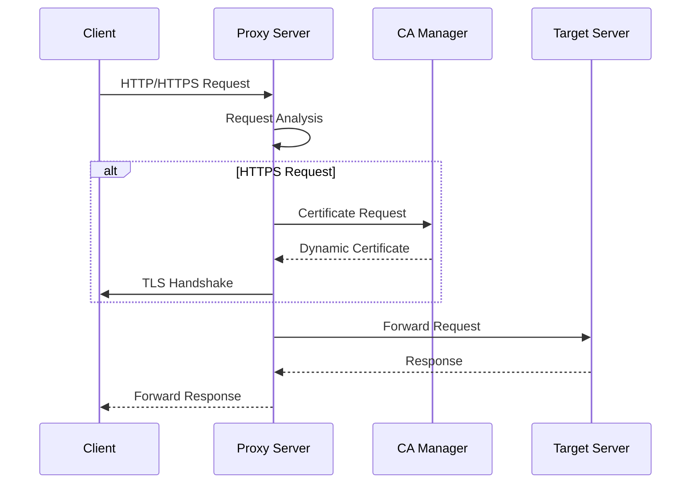
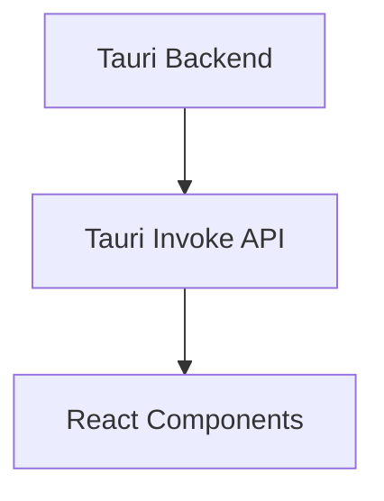

# Code Structure

Cheolsu Proxy is structured as a Rust-based monorepo with a Tauri desktop application.

## Overall Structure

```
cheolsu-proxy/
├── Cargo.toml                 # Workspace root configuration
├── Cargo.lock                 # Dependency lock file
├── README.md                  # Project introduction
├── CONTRIBUTING.md            # Contributing guide (English)
├── CONTRIBUTING_KO.md         # Contributing guide (Korean)
├── document/                  # Documentation (existing)
├── assets/                    # Project assets
├── desktop/                  # Frontend (React + TypeScript)
├── proxyapi/                  # Legacy proxy API
├── proxyapi_models/           # Legacy models
├── proxyapi_v2/               # New proxy API
└── proxy_v2_models/           # Common models
```

## Workspace Structure

### Root Cargo.toml

```toml
[workspace]
members = [
    "proxyapi",
    "proxyapi_v2",
    "proxyapi_models",
    "desktop/src-tauri"
]

[workspace.dependencies]
# Common dependency definitions
```

### External Crates

`proxy_v2_models` is not a workspace member but is a separate crate that other workspace members reference as a dependency.

## Backend Structure

### 1. proxyapi_v2/ (Main Proxy Engine)

```
proxyapi_v2/
├── Cargo.toml                 # Package configuration
├── src/
│   ├── lib.rs                 # Library entry point
│   ├── error.rs               # Error type definitions
│   ├── body.rs                # HTTP body handling
│   ├── decoder.rs             # HTTP decoder
│   ├── rewind.rs              # Stream rewind
│   ├── noop.rs                # No-op handler
│   ├── tls_version_detector.rs # TLS version detection
│   ├── hybrid_tls_handler.rs  # Hybrid TLS handler
│   └── tunnel_event.rs        # Tunnel event handling
│   ├── certificate_authority/ # CA certificate management
│   │   ├── mod.rs
│   │   ├── rcgen_authority.rs # rcgen-based CA
│   │   ├── openssl_authority.rs # OpenSSL-based CA
│   │   ├── cheolsu-proxy.cnf  # OpenSSL configuration file
│   │   └── cheolsu-proxy.srl  # OpenSSL serial number file
│   └── proxy/                 # Proxy core logic
│       ├── mod.rs
│       ├── builder.rs         # Proxy builder
│       └── internal.rs        # Internal proxy logic
├── examples/                  # Usage examples
│   ├── improved_rustls_proxy.rs
│   ├── log.rs
│   ├── noop.rs
│   ├── openssl.rs
│   └── tls_hybrid_test.rs
├── tests/                     # Integration tests
│   ├── common/
│   │   └── mod.rs
│   ├── integration_error_handling_tests.rs
│   ├── logging_handler_error_tests.rs
│   ├── openssl_ca.rs
│   ├── rcgen_ca.rs
│   └── websocket.rs
└── benches/                   # Benchmarks
    ├── certificate_authorities.rs
    ├── decoder.rs
    └── proxy.rs
```

### 2. certificate_authority/ (CA Management)

#### Module Structure

```rust
// mod.rs
pub trait CertificateAuthority {
    fn generate_certificate(&self, domain: &str) -> Result<Certificate, Error>;
    fn gen_pkcs12_identity(&self, domain: &str) -> Result<Identity, Error>;
}

pub struct RcgenAuthority { /* ... */ }
pub struct OpensslAuthority { /* ... */ }
```

#### Key Features

- **Dynamic Certificate Generation**: Automatic certificate generation per domain
- **PKCS12 Support**: PKCS12 certificate generation for native-tls
- **Cross-platform**: Support for macOS, Windows

### 3. proxy/ (Proxy Core)

#### Builder Pattern

```rust
// builder.rs
pub struct ProxyBuilder {
    listen_addr: SocketAddr,
    ca: Box<dyn CertificateAuthority>,
    tls_handler: Box<dyn TlsHandler>,
}

impl ProxyBuilder {
    pub fn new() -> Self { /* ... */ }
    pub fn listen_addr(mut self, addr: SocketAddr) -> Self { /* ... */ }
    pub fn certificate_authority(mut self, ca: Box<dyn CertificateAuthority>) -> Self { /* ... */ }
    pub fn build(self) -> Result<Proxy, Error> { /* ... */ }
}
```

#### Internal Logic

```rust
// internal.rs
pub struct Proxy {
    listener: TcpListener,
    ca: Box<dyn CertificateAuthority>,
    tls_handler: Box<dyn TlsHandler>,
}

impl Proxy {
    pub async fn run(&self) -> Result<(), Error> { /* ... */ }
    async fn handle_connection(&self, stream: TcpStream) -> Result<(), Error> { /* ... */ }
    async fn handle_http(&self, stream: TcpStream) -> Result<(), Error> { /* ... */ }
    async fn handle_https(&self, stream: TcpStream) -> Result<(), Error> { /* ... */ }
}
```

## Frontend Structure (desktop/)

### FSD (Feature-Sliced Design) Architecture

```
desktop/src/
├── main.tsx                   # Application entry point
├── main.css                   # Global styles
├── app/                       # Application layer
│   ├── App.tsx                # Root component
│   ├── layouts/               # Layout components
│   └── providers/             # Context providers
│       ├── index.ts
│       ├── router-provider.tsx
│       └── use-theme-provider.ts
├── pages/                     # Page layer
│   ├── network-dashboard/     # Network dashboard
│   │   ├── hooks/
│   │   │   ├── index.ts
│   │   │   ├── use-proxy-event-control.ts
│   │   │   ├── use-theme-provider.ts
│   │   │   ├── use-transaction-filters.ts
│   │   │   └── use-transactions.ts
│   │   ├── index.ts
│   │   ├── lib/
│   │   │   ├── index.ts
│   │   │   └── utils.ts
│   │   └── ui/
│   │       ├── index.ts
│   │       └── network-dashboard.tsx
│   └── sessions/              # Session management
│       ├── index.ts
│       └── ui/
│           └── sessions-page.tsx
├── widgets/                   # Widget layer
│   ├── network-table/         # Network table
│   │   ├── hooks/
│   │   │   ├── index.ts
│   │   │   └── use-table-data.ts
│   │   ├── index.ts
│   │   ├── lib/
│   │   │   ├── index.ts
│   │   │   └── utils.ts
│   │   ├── model/
│   │   │   ├── consts.ts
│   │   │   ├── index.ts
│   │   │   └── types.ts
│   │   └── ui/
│   │       ├── cells/
│   │       │   ├── action-cell.tsx
│   │       │   ├── index.ts
│   │       │   ├── method-cell.tsx
│   │       │   ├── path-cell.tsx
│   │       │   ├── size-cell.tsx
│   │       │   ├── status-cell.tsx
│   │       │   └── time-cell.tsx
│   │       ├── index.ts
│   │       ├── network-table.tsx
│   │       ├── table-body.tsx
│   │       ├── table-header.tsx
│   │       └── table-row.tsx
│   ├── network-header/        # Network header
│   │   ├── index.ts
│   │   ├── model/
│   │   │   ├── consts.ts
│   │   │   └── index.ts
│   │   └── ui/
│   │       ├── index.ts
│   │       ├── network-controls.tsx
│   │       ├── network-filters.tsx
│   │       ├── network-header.tsx
│   │       └── network-stats.tsx
│   └── host-path-tree/        # Host path tree
│       ├── hooks/
│       │   ├── index.ts
│       │   ├── use-host-tree.ts
│       │   └── use-node-actions.ts
│       ├── index.ts
│       ├── lib/
│       │   ├── index.ts
│       │   ├── node-ui-utils.tsx
│       │   ├── tree-builder.ts
│       │   └── utils.ts
│       ├── model/
│       │   ├── index.ts
│       │   └── types.ts
│       └── ui/
│           ├── host-path-tree.tsx
│           ├── index.ts
│           ├── node-content.tsx
│           ├── transaction-list.tsx
│           └── tree-node.tsx
├── features/                  # Feature layer
│   ├── network-table/         # Network table features
│   │   └── api/
│   ├── transaction-details/   # Transaction details
│   │   ├── context/
│   │   │   └── form-context.tsx
│   │   ├── hooks/
│   │   │   ├── index.ts
│   │   │   ├── use-transaction-edit.ts
│   │   │   └── use-transaction-tabs.ts
│   │   ├── index.ts
│   │   ├── lib/
│   │   │   ├── index.ts
│   │   │   └── utils.ts
│   │   ├── model/
│   │   │   ├── consts.ts
│   │   │   ├── index.ts
│   │   │   └── types.ts
│   │   └── ui/
│   │       ├── form-components.tsx
│   │       ├── index.ts
│   │       ├── transaction-body.tsx
│   │       ├── transaction-details.tsx
│   │       ├── transaction-header.tsx
│   │       ├── transaction-headers.tsx
│   │       └── transaction-response.tsx
│   └── websocket-test/        # WebSocket test
│       └── ui/
├── entities/                  # Entity layer
│   ├── proxy/                 # Proxy entity
│   │   ├── index.ts
│   │   └── model/
│   │       ├── data-type.ts
│   │       ├── index.ts
│   │       └── types.ts
│   ├── session/               # Session entity
│   │   ├── index.ts
│   │   └── model/
│   │       ├── index.ts
│   │       └── types.ts
│   └── transaction/           # Transaction entity
│       ├── index.ts
│       └── lib/
│           ├── index.ts
│           └── utils.ts
└── shared/                    # Shared layer
    ├── api/                   # API client
    │   └── proxy.ts
    ├── app-sidebar/           # App sidebar
    │   ├── hooks/
    │   │   ├── index.ts
    │   │   └── use-sidebar-collapse.ts
    │   ├── index.ts
    │   ├── model/
    │   │   ├── consts.ts
    │   │   ├── index.ts
    │   │   ├── sidebar-store.ts
    │   │   └── types.ts
    │   └── ui/
    │       ├── app-sidebar.tsx
    │       ├── index.ts
    │       ├── sidebar-header.tsx
    │       ├── sidebar-navigation.tsx
    │       └── sidebar-status.tsx
    ├── assets/                # Static assets
    │   ├── index.ts
    │   └── logo.png
    ├── lib/                   # Utility functions
    │   ├── class-name.ts
    │   └── index.ts
    ├── stores/                # State management
    │   ├── index.ts
    │   ├── proxy-store.ts
    │   └── session-store.ts
    └── ui/                    # UI components
        ├── badge.tsx
        ├── button.tsx
        ├── card.tsx
        ├── command.tsx
        ├── dialog.tsx
        ├── index.ts
        ├── input.tsx
        ├── layout.tsx
        ├── multi-select.tsx
        ├── popover.tsx
        ├── resizable.tsx
        ├── scroll-area.tsx
        ├── select.tsx
        ├── separator.tsx
        ├── sidebar.tsx
        ├── sonner.tsx
        ├── tabs.tsx
        ├── textarea.tsx
        └── virtualized-scroll-area.tsx
```

### Layer Responsibilities

#### 1. app/ (Application Layer)

- **App.tsx**: Root component, routing setup
- **layouts/**: Common layout components
- **providers/**: React Context providers

#### 2. pages/ (Page Layer)

- **network-dashboard/**: Main network monitoring page
- **sessions/**: Session management page

#### 3. widgets/ (Widget Layer)

- **network-table/**: Network request table
- **network-header/**: Network header information
- **host-path-tree/**: Host-based path tree

#### 4. features/ (Feature Layer)

- **network-table/**: Table-related features (filtering, sorting, etc.)
- **transaction-details/**: Transaction detail view
- **websocket-test/**: WebSocket test functionality

#### 5. entities/ (Entity Layer)

- **proxy/**: Proxy-related data models
- **session/**: Session-related data models
- **transaction/**: Transaction-related data models

#### 6. shared/ (Shared Layer)

- **api/**: Backend API client
- **ui/**: Reusable UI components
- **lib/**: Utility functions
- **stores/**: Zustand state management
- **assets/**: Static assets

## Tauri Backend (desktop/src-tauri/)

```
src-tauri/
├── Cargo.toml                 # Tauri backend configuration
├── tauri.conf.json            # Tauri configuration
├── src/
│   ├── main.rs                # Main entry point
│   ├── lib.rs                 # Library entry point
│   ├── proxy.rs               # Legacy proxy
│   ├── proxy_v2.rs            # New proxy
│   └── certificate_authority/ # CA management
│       ├── cheolsu-proxy.cnf  # OpenSSL configuration file
│       └── cheolsu-proxy.srl  # OpenSSL serial number file
├── capabilities/              # Tauri permission settings
├── icons/                     # App icons
└── gen/                       # Auto-generated files
```

### Tauri Configuration

```json
// tauri.conf.json
{
  "build": {
    "beforeDevCommand": "bun run dev",
    "beforeBuildCommand": "bun run build",
    "devPath": "http://localhost:1420",
    "distDir": "../dist"
  },
  "package": {
    "productName": "Cheolsu Proxy",
    "version": "0.1.0"
  }
}
```

## Data Flow

### 1. Proxy Request Processing



### 2. Frontend Data Flow



## State Management

### Zustand Store Structure

```typescript
// stores/proxy-store.ts
interface ProxyStore {
  // State
  isRunning: boolean;
  listenAddr: string;
  requests: Transaction[];

  // Actions
  startProxy: () => void;
  stopProxy: () => void;
  addRequest: (request: Transaction) => void;
  clearRequests: () => void;
}

// stores/session-store.ts
interface SessionStore {
  // State
  sessions: Session[];
  activeSession: string | null;

  // Actions
  createSession: () => void;
  switchSession: (id: string) => void;
  deleteSession: (id: string) => void;
}
```

## API Communication

### Tauri Invoke API

```typescript
// shared/api/proxy.ts
import { invoke } from "@tauri-apps/api/core";

export async function fetchProxyStatus(): Promise<boolean> {
  return await invoke("proxy_status");
}

export async function startProxy(address: string): Promise<void> {
  return await invoke("start_proxy", { addr: address });
}

export async function stopProxy(): Promise<void> {
  return await invoke("stop_proxy");
}

// New proxy functions using proxyapi_v2
export interface ProxyStartResult {
  status: boolean;
  message: string;
}

export async function startProxyV2(port: number = 8100): Promise<ProxyStartResult> {
  return invoke("start_proxy_v2", { addr: `127.0.0.1:${port}` });
}

export async function stopProxyV2(): Promise<void> {
  return invoke("stop_proxy_v2");
}

export async function getProxyV2Status(): Promise<boolean> {
  return invoke("proxy_v2_status");
}
```

## Test Structure

### Rust Tests

```
tests/
├── common/                    # Common test utilities
│   └── mod.rs
├── integration_error_handling_tests.rs
├── logging_handler_error_tests.rs
├── openssl_ca.rs
├── rcgen_ca.rs
└── websocket.rs
```

### Frontend Tests

```
__tests__/
├── components/                # Component tests
├── pages/                     # Page tests
├── utils/                     # Utility tests
└── setup.ts                   # Test setup
```

## Build and Deployment

### Development Build

```bash
# Backend build
cargo build

# Frontend build
cd desktop && bun run build

# Tauri app build
cd desktop && bun run tauri build
```

### Production Build

```bash
# Release build
cargo build --release

# Tauri app packaging
cd desktop && bun run tauri build -- --target universal-apple-darwin
```

## Performance Optimization

### Backend Optimization

- **Asynchronous Processing**: Using tokio runtime
- **Memory Pooling**: Object pool pattern implementation
- **Streaming**: Large data streaming processing

### Frontend Optimization

- **Virtualization**: Large list virtualization
- **Memoization**: React.memo, useMemo usage
- **Code Splitting**: Dynamic import usage

## Security Considerations

### Backend Security

- **Certificate Management**: Secure CA certificate generation
- **Memory Security**: Safe memory management
- **Input Validation**: All input data validation

### Frontend Security

- **XSS Prevention**: Input data escaping
- **CSRF Prevention**: Token-based authentication
- **Content Security Policy**: CSP header settings

## Extensibility

### Plugin System (Future)

```rust
// Plugin trait
pub trait Plugin {
    fn name(&self) -> &str;
    fn version(&self) -> &str;
    fn handle_request(&self, request: &mut Request) -> Result<(), Error>;
    fn handle_response(&self, response: &mut Response) -> Result<(), Error>;
}
```

### API Extension

- REST API addition
- GraphQL support
- gRPC support

Understanding this structure will help you effectively navigate and contribute to the Cheolsu Proxy codebase.
