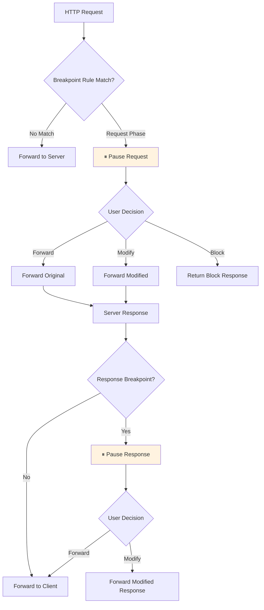

# Breakpoint

## Overview

Breakpoint pauses HTTP requests or responses at specific phases, allowing you to inspect and optionally modify them before forwarding. Similar to a debugger breakpoint, it provides interactive control over traffic flow in real-time.

Unlike intercept rules that automatically modify traffic based on predefined rules, Breakpoint lets you inspect each request/response and decide on a case-by-case basis — ideal for interactive debugging.



---

## Rule Configuration

### Breakpoint Rules

Use wildcard patterns to specify which requests to pause.

| Setting               | Description                                      |
| --------------------- | ------------------------------------------------ |
| **Pattern**           | URL wildcard pattern (e.g., `*api.example.com*`) |
| **Break on Request**  | Pause at the request phase                       |
| **Break on Response** | Pause at the response phase                      |
| **Enabled**           | Toggle rule on/off                               |

Setting both request and response breakpoints will pause twice for a single request.

### Timeout

Paused requests are automatically forwarded after **60 seconds** by default, preventing applications from hanging indefinitely if a breakpoint is left unresolved.

---

## Actions

### Forward

Pass the request/response through without modification.

### Modify

Edit the request or response before forwarding.

**Request modifications:**

- URL
- HTTP method
- Headers
- Body

**Response modifications:**

- Status code
- Headers
- Body

### Block

Immediately return a block response without forwarding to the server. Available only for request-phase breakpoints.

---

## Use Cases

### API Debugging

Modify request parameters in real-time to test various scenarios — change authentication tokens, edit request body fields, and observe server behavior.

### Error Simulation

Change server response status codes to 500 or inject error messages to verify client-side error handling logic.

### Timing Control

Pause specific requests to test async processing, loading states, and timeout handling in time-sensitive logic.

---

## Usage

### Desktop

1. Select **Breakpoint** from the sidebar
2. Add rules with patterns and break phases
3. When a rule matches, you'll be notified and the request/response pauses
4. Inspect the content and choose Forward, Modify, or Block

### TUI

1. Navigate to the **Breakpoint** tab
2. Add/edit rules
3. Review and resolve paused requests

### MCP

```
"Add a breakpoint rule for api.example.com"
"Show me the list of pending breakpoints"
```
