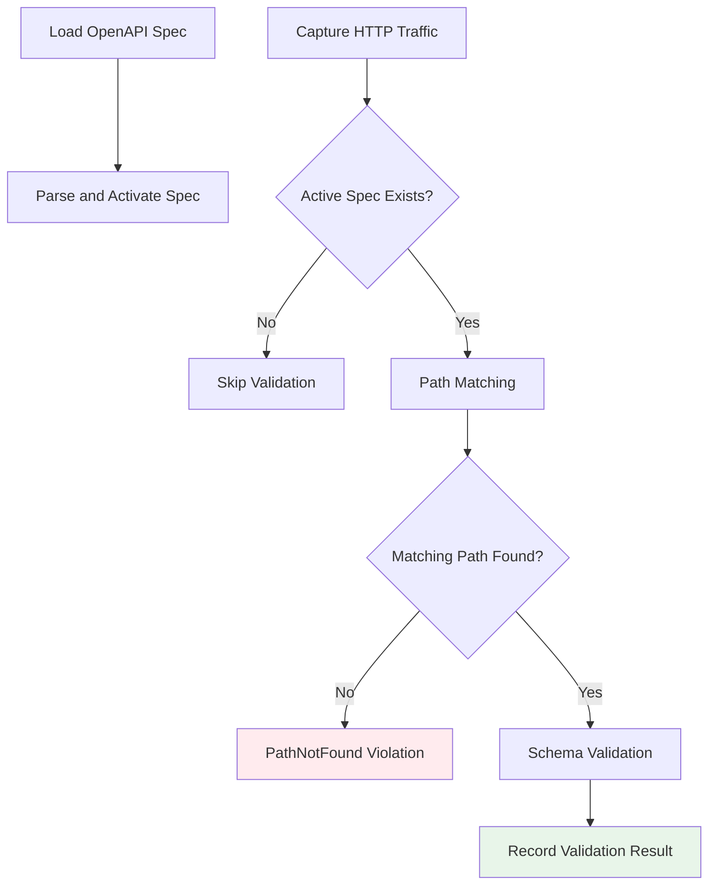

# Contract Testing

## Overview

Contract Testing automatically validates captured HTTP traffic against OpenAPI (Swagger) specifications. Load an API spec and all requests/responses passing through the proxy are checked against it in real-time, reporting any violations.

Catch discrepancies between API specs and actual implementations early to prevent contract violations between frontend and backend.

---

## How It Works



1. Load an OpenAPI spec file (JSON or YAML)
2. Perform path matching on traffic passing through the proxy
3. Compare actual requests/responses against the matched path's schema
4. Report violations

---

## Spec Management

| Feature            | Description                                     |
| ------------------ | ----------------------------------------------- |
| **Load**           | Load an OpenAPI spec file (JSON/YAML supported) |
| **Unload**         | Remove a loaded spec                            |
| **Enable/Disable** | Toggle validation for individual specs          |
| **List**           | View loaded specs                               |

Multiple OpenAPI specs can be loaded simultaneously, each individually toggleable.

---

## Validation Results

Each result includes:

| Field                 | Description                      |
| --------------------- | -------------------------------- |
| **Request ID**        | Validated transaction identifier |
| **Spec ID**           | Matched OpenAPI spec             |
| **Violations**        | List of violations found         |
| **Matched Path**      | Matched path pattern from spec   |
| **Matched Operation** | Matched HTTP method              |

---

## Use Cases

### API Development Validation

Load your API spec during backend development to get immediate feedback when actual responses differ from the spec. Automatically detect field type mismatches, missing required fields, and more.

### Frontend-Backend Integration Testing

Validate that actual communication follows the API contract agreed upon by frontend and backend teams.

### API Migration

Load the existing spec during API version upgrades to verify that new version responses don't break existing contracts.

---

## Usage

### Desktop

1. Select **Contract Testing** from the sidebar
2. Load an OpenAPI spec file
3. Validation runs automatically during traffic capture
4. Review violations

### MCP

```
"Load the OpenAPI spec"
"Show me the Contract Testing validation results"
```
