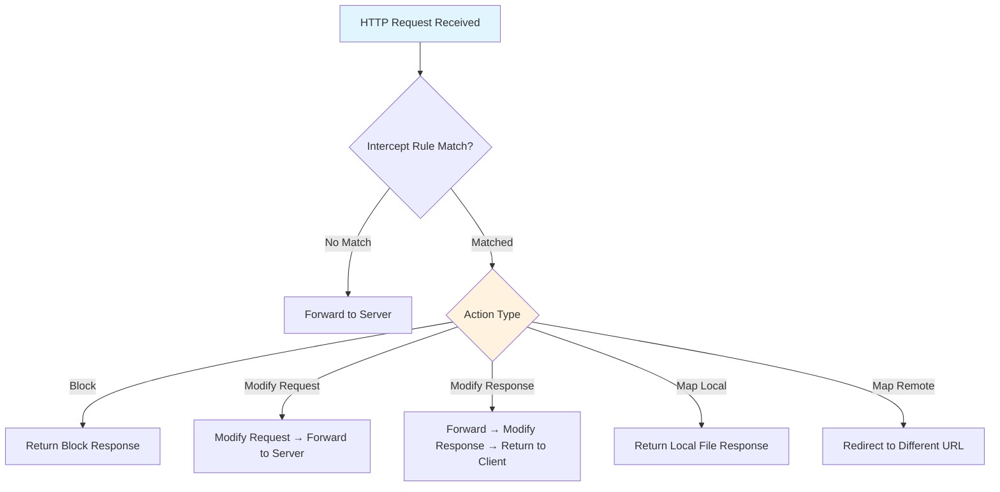

# Intercept Rules

Intercept rules let you automatically modify, block, or redirect HTTP traffic as it flows through the proxy. Instead of manually editing requests and responses one at a time, you define rules that apply to all matching traffic in real time.

This is one of the most powerful features of Cheolsu Proxy and covers a wide range of development and testing scenarios:

- **Testing error handling** -- Simulate server errors (500, 503) to verify your app degrades gracefully.
- **Blocking unwanted requests** -- Block analytics, ad networks, or tracking pixels during development so they don't clutter your traffic log.
- **Redirecting to local or staging servers** -- Point production API calls at a local dev server without changing client code.
- **Injecting headers** -- Add authentication tokens, CORS headers, or feature flags to every request or response.
- **Mocking responses** -- Return a local JSON file instead of calling the real server, useful for offline development or reproducing specific edge cases.

---

## Action Types

### Block

Reject matching requests immediately without forwarding them to the server. The proxy returns a response with the status code and body you specify.

**Example scenario:** You are profiling your app's load time and want to measure it without third-party scripts. Create a block rule matching `*analytics*` and `*ads*` to prevent those requests from completing.

- **Status Code** -- HTTP status code to return (default: 403).
- **Response Body** -- Optional body to include in the response.

### Modify Request

Alter the request before it leaves the proxy and reaches the server. You can add or remove headers and replace the body.

**Example scenario:** Your staging API requires an `Authorization` header that your client doesn't send in development mode. Add a Modify Request rule that injects the header on every request to `*api.staging.example.com*`.

- **Add Headers** -- Append new headers to the request.
- **Remove Headers** -- Strip existing headers from the request.
- **Set Body** -- Replace the request body entirely.

### Modify Response

Alter the server's response before it reaches the client. Useful for injecting headers or overriding response content.

**Example scenario:** A third-party API does not return CORS headers, blocking your browser-based client. Add a Modify Response rule that appends `Access-Control-Allow-Origin: *` and related headers to every response from that API.

- **Set Status** -- Change the HTTP status code.
- **Add/Remove Headers** -- Add or strip response headers.
- **Set Body** -- Replace the response body.

### Map Local

Return the contents of a local file as the response instead of contacting the server. This is ideal for working offline or testing against fixture data.

**Example scenario:** You are building a dashboard that consumes `/api/v1/metrics`. The backend isn't ready yet, so you create a `metrics.json` file on disk and map the endpoint to it.

- **File Path** -- Absolute path to the local file.
- **Status Code** -- HTTP status code to return (default: 200).
- **Headers** -- Optional response headers.

### Map Remote

Redirect matching requests to a different URL. The proxy fetches the response from the new URL and returns it to the client.

**Example scenario:** You want to test your app against a local API server running at `http://localhost:8080` while the app is configured to call `https://api.example.com`. A Map Remote rule transparently rewrites the destination.

- **Target URL** -- The URL to redirect to.
- **Preserve Path** -- When enabled, appends the original request path to the target URL. For example, a request to `https://api.example.com/v1/users` with target `http://localhost:8080` and Preserve Path enabled becomes `http://localhost:8080/v1/users`.

---

## Rule Configuration

### Pattern Matching

Rules match traffic using wildcard patterns applied to the full request URL. The `*` character matches any sequence of characters.

| Pattern | What it matches |
| --- | --- |
| `*ads.example.com*` | Any URL containing `ads.example.com` |
| `*api.example.com/v1/*` | URLs under the `/v1/` path on `api.example.com` |
| `*.json` | Any URL ending with `.json` |
| `*example.com/users*` | Any URL containing `example.com/users` |
| `*` | All traffic (use with caution) |

Patterns are case-sensitive. If you need to match both `API` and `api`, include both variants or use scripting for more complex logic.

### HTTP Method Filter

You can optionally restrict a rule to a specific HTTP method: GET, POST, PUT, DELETE, PATCH, HEAD, or OPTIONS. When no method is specified, the rule applies to all methods.

This is useful when you want different behavior for reads and writes. For example, you might block POST requests to a payments endpoint during testing while still allowing GET requests.

### Enable/Disable Toggle

Each rule has an enable/disable toggle. Disabled rules are saved but do not affect traffic. This lets you keep rules around for later use without deleting them.

---

## Usage

### Desktop

1. Select **Intercept Rules** from the sidebar.
2. Click **Add Rule**.
3. Enter a URL pattern.
4. Choose an action type (Block, Modify Request, Modify Response, Map Local, or Map Remote).
5. Configure the action-specific options.
6. Save the rule.

You can also create rules directly from the traffic table: right-click a transaction and choose to create a rule pre-filled with that transaction's URL.

### TUI

1. Navigate to the **Rules** tab.
2. Press the key to add a new rule.
3. Fill in the pattern, select an action type, and configure options through the form.
4. Confirm to save.

Existing rules can be edited or deleted from the same tab.

### MCP

When using Cheolsu Proxy's MCP server with an AI assistant, you can manage rules through natural language:

- "Add a rule to block all requests to ads.example.com"
- "Create a rule that adds CORS headers to responses from api.example.com"
- "List all active intercept rules"
- "Remove the rule that blocks analytics requests"

The MCP server exposes `add_rule`, `list_rules`, and `remove_rule` tools. See the [MCP Server](./mcp-server.md) documentation for setup details.
