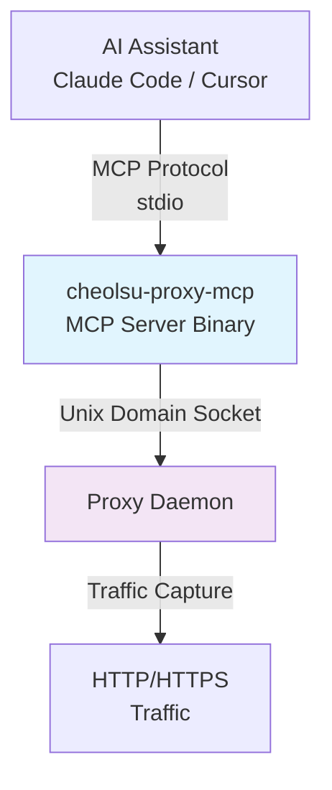

# MCP Server

Cheolsu Proxy includes a built-in [Model Context Protocol (MCP)](https://modelcontextprotocol.io/) server that exposes captured network traffic and proxy controls to AI assistants. This lets you use tools like Claude Code, Cursor, and Claude Desktop to query, analyze, and manipulate proxy traffic through natural language.

Instead of manually searching through hundreds of requests, you can ask your AI assistant questions like "find all requests to the payments API that returned errors" or "generate TypeScript interfaces from this API response." The MCP server bridges the gap between Cheolsu Proxy's traffic data and your AI-powered development workflow.

---

## Prerequisites

Before setting up the MCP server, make sure you have:

1. **Cheolsu Proxy installed and running.** The MCP server communicates with the proxy daemon over a Unix Domain Socket. The proxy must be running for the MCP server to function.
2. **An MCP-compatible AI client.** Currently supported clients include Claude Code, Cursor, and Claude Desktop.
3. **The `cheolsu-proxy-mcp` binary.** This is included with the Cheolsu Proxy installation. You will need its file path during setup.

---

## Setup

### Step 1: Get the MCP Configuration

In the Cheolsu Proxy desktop app, click the **MCP Server** button at the bottom of the left sidebar. A JSON configuration snippet will appear. Click the copy button to copy it to your clipboard.

### Step 2: Register with Your AI Client

Paste the configuration into your AI client's MCP settings.

**Claude Code**

The simplest approach is to use the CLI:

```bash
claude mcp add cheolsu-proxy -- /path/to/cheolsu-proxy-mcp
```

Alternatively, add it manually to `.claude/settings.json`:

```json
{
  "mcpServers": {
    "cheolsu-proxy": {
      "command": "/path/to/cheolsu-proxy-mcp"
    }
  }
}
```

**Cursor**

Add to `.cursor/mcp.json`:

```json
{
  "mcpServers": {
    "cheolsu-proxy": {
      "command": "/path/to/cheolsu-proxy-mcp"
    }
  }
}
```

Replace `/path/to/cheolsu-proxy-mcp` with the actual path shown in the MCP configuration from Step 1.

### Step 3: Verify the Connection

With Cheolsu Proxy running, ask your AI assistant a simple question like "What is the proxy status?" If the MCP server is connected correctly, the assistant will use the `proxy_status` tool and return information about the running proxy.

---

## Available Tools

A total of **48 tools** are provided. The full list by category is below.

### Traffic Inspection

| Tool                     | Description                                                                       |
| ------------------------ | --------------------------------------------------------------------------------- |
| `search_traffic`         | Search captured traffic by host, HTTP method, status code, or URL path            |
| `get_transaction`        | Get the full request and response (headers and body) for a specific transaction   |
| `get_websocket_messages` | Get captured WebSocket messages, optionally filtered by connection URI            |
| `get_sse_events`         | Get captured Server-Sent Events (SSE), optionally filtered by connection URI      |
| `diff_transactions`      | Compare two transactions (request + response). Useful for regression/before-after |
| `proxy_status`           | Check whether the proxy daemon is running and view traffic statistics             |
| `clear_traffic`          | Clear all captured traffic data from memory                                       |

### Analytics

| Tool                       | Description                                                                      |
| -------------------------- | -------------------------------------------------------------------------------- |
| `analyze_performance`      | Analyze slow requests + P50/P95/P99 latency percentiles                          |
| `analyze_errors`           | Analyze error rates (breakdown by status code and endpoint, recent errors)       |
| `analyze_endpoints`        | Per-endpoint stats (frequency, avg/P95 response time, error rate, response size) |
| `detect_duplicates`        | Detect the same URL called multiple times in a short window (missing caching)    |
| `detect_n_plus_one`        | Detect N+1 query patterns (same parameterized endpoint called repeatedly)        |
| `analyze_traffic_timeline` | Request volume, errors, and average latency over time buckets                    |
| `analyze_full`             | Run all analyses at once and return a comprehensive summary report               |

### Request Replay

| Tool              | Description                                                                         |
| ----------------- | ----------------------------------------------------------------------------------- |
| `replay_request`  | Send an HTTP request directly, bypassing the proxy. Useful for testing APIs         |
| `replay_sequence` | Replay multiple captured transactions in sequence (optional delay between requests) |
| `advanced_repeat` | Repeat a request with configurable concurrency/delay and return aggregate stats     |

### Intercept Rule Management

| Tool          | Description                                                                              |
| ------------- | ---------------------------------------------------------------------------------------- |
| `list_rules`  | List all currently configured intercept rules                                            |
| `add_rule`    | Add a new intercept rule (block, modify_request, modify_response, map_local, map_remote) |
| `remove_rule` | Remove an intercept rule by its ID                                                       |

### Breakpoints

| Tool                       | Description                                                                  |
| -------------------------- | ---------------------------------------------------------------------------- |
| `list_breakpoints`         | List all breakpoint rules                                                    |
| `add_breakpoint`           | Add a breakpoint rule (pause matching requests/responses for manual editing) |
| `remove_breakpoint`        | Remove a breakpoint rule by its ID                                           |
| `list_pending_breakpoints` | List currently paused (pending) breakpoints                                  |
| `resolve_breakpoint`       | Resolve a pending breakpoint (forward / modify_and_forward / drop / abort)   |

### Host Mapping

| Tool                  | Description                                                                |
| --------------------- | -------------------------------------------------------------------------- |
| `list_host_mappings`  | List all host mappings (DNS spoofing rules)                                |
| `add_host_mapping`    | Add a host mapping rule (wildcard support, original Host header preserved) |
| `remove_host_mapping` | Remove a host mapping rule by its ID                                       |

### Reverse Proxy

| Tool                        | Description                                                                |
| --------------------------- | -------------------------------------------------------------------------- |
| `list_reverse_proxy_rules`  | List all reverse proxy rules                                               |
| `add_reverse_proxy_rule`    | Add a reverse proxy rule (Host pattern → backend server, wildcard support) |
| `remove_reverse_proxy_rule` | Remove a reverse proxy rule by its ID                                      |

### Server Replay

| Tool                   | Description                                                                     |
| ---------------------- | ------------------------------------------------------------------------------- |
| `list_server_replay`   | List all server replay entries                                                  |
| `add_server_replay`    | Register a captured transaction for server replay (cached response for matches) |
| `remove_server_replay` | Remove a server replay entry by its ID                                          |
| `clear_server_replay`  | Clear all server replay entries                                                 |

### Settings

| Tool                         | Description                                                           |
| ---------------------------- | --------------------------------------------------------------------- |
| `update_upstream_proxy`      | Configure upstream proxy (forward all traffic through it)             |
| `update_throttle`            | Configure network throttling (bytes/sec, simulate slow connections)   |
| `update_proxy_auth`          | Configure proxy authentication (basic / bearer / apikey)              |
| `update_connection_strategy` | Set upstream connection strategy (lazy / eager / eager_with_fallback) |
| `update_quick_settings`      | Quick settings (no_caching, block_cookies, no_gzip, block_quic)       |
| `update_client_certificate`  | Configure mTLS client certificate                                     |
| `update_ssl_proxying_list`   | Configure SSL proxying list (blacklist/whitelist mode)                |

### Session & Export

| Tool                    | Description                                                                       |
| ----------------------- | --------------------------------------------------------------------------------- |
| `save_session`          | Save captured traffic to a `.cheolsu` session file (`.cheolsu.gz` for gzip)       |
| `load_session`          | Load a session (`.cheolsu`, `.cheolsu.gz`) or import a HAR (`.har`) (append opt.) |
| `export_har`            | Export captured traffic as HAR 1.2 JSON (filter by host/path)                     |
| `generate_openapi_spec` | Generate an OpenAPI 3.0 specification from captured traffic                       |

### Scripting

| Tool            | Description                                                    |
| --------------- | -------------------------------------------------------------- |
| `load_script`   | Load a JavaScript/TypeScript script (file path or inline code) |
| `unload_script` | Unload the currently loaded script                             |

---

## Usage Examples

Here are practical ways to use the MCP server during development:

**Debugging API errors**

Ask: "Find any requests that returned 500 errors in the last few minutes."

The assistant uses `search_traffic` with a status code filter, then you can follow up with "Show me the full request and response for that failed request" to get details via `get_transaction`.

**Generating code from traffic**

Ask: "Look at the response from the /api/v1/users endpoint and generate TypeScript interfaces for it."

The assistant fetches the response body and creates type definitions matching the actual API shape.

**Managing intercept rules**

Ask: "Block all requests to tracking.example.com" or "Add a rule that returns a 503 for the payments API."

The assistant uses `add_rule` to create the rule. You can verify with "List all active intercept rules."

**Testing API changes**

Ask: "Replay the last POST request to /api/orders but change the quantity to 0."

The assistant uses `replay_request` to send a modified version of a previously captured request.

**Analyzing WebSocket traffic**

Ask: "Show me the MQTT messages from the IoT device connection."

The assistant uses `get_websocket_messages` with a URI filter to retrieve the relevant messages.

---

## Architecture



The MCP server binary is a standalone process that acts as a client of the proxy daemon. It communicates with the AI assistant over standard input/output using the MCP protocol, and connects to the proxy daemon over a Unix Domain Socket.

The MCP server keeps the most recent 1,000 HTTP transactions, 5,000 WebSocket messages, and 5,000 SSE events in memory for fast querying. Older data is discarded automatically. Use `clear_traffic` to reset the data manually if needed.
