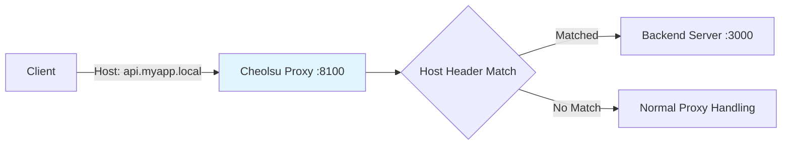

# Reverse Proxy

## Overview

Reverse Proxy lets you use Cheolsu Proxy as a reverse proxy. Unlike a forward proxy, clients send requests directly to Cheolsu Proxy's port without any proxy configuration. Requests are routed to configured backend servers based on the Host header.

Useful when proxy configuration is difficult, or when you want to selectively capture traffic for specific domains.

---

## Rule Configuration

| Setting            | Description                                              |
| ------------------ | -------------------------------------------------------- |
| **Match Host**     | Host header pattern (e.g., `api.myapp.local`, `*.local`) |
| **Backend Scheme** | `http` or `https` (default: `http`)                      |
| **Backend Host**   | Backend server address                                   |
| **Backend Port**   | Backend server port                                      |
| **Rewrite Host**   | Rewrite Host header to backend address (default: yes)    |
| **Enabled**        | Toggle rule on/off                                       |

---

## How It Works



1. Client sends a relative-path request to Cheolsu Proxy's port (e.g., `GET /api/users`)
2. Host header is checked against reverse proxy rules
3. Matched requests are forwarded to the configured backend server
4. Backend response is returned to the client

---

## Use Cases

### Local Development

```
Match Host:    api.myapp.local
Backend Host:  localhost
Backend Port:  3000
```

Add `127.0.0.1 api.myapp.local` to `/etc/hosts`, then browse `http://api.myapp.local:8100` to monitor your local development server traffic.

### Microservice Debugging

Set up multiple reverse proxy rules to monitor inter-service communication through a single proxy.

```
Match Host:  auth.local    → localhost:3001
Match Host:  users.local   → localhost:3002
Match Host:  orders.local  → localhost:3003
```

---

## Usage

### Desktop

1. Select **Reverse Proxy** from the sidebar
2. Click **Add Rule**
3. Configure match host and backend server
4. Save

### MCP

```
"Set up reverse proxy for api.local to localhost:3000"
"Show me the reverse proxy rules"
```
