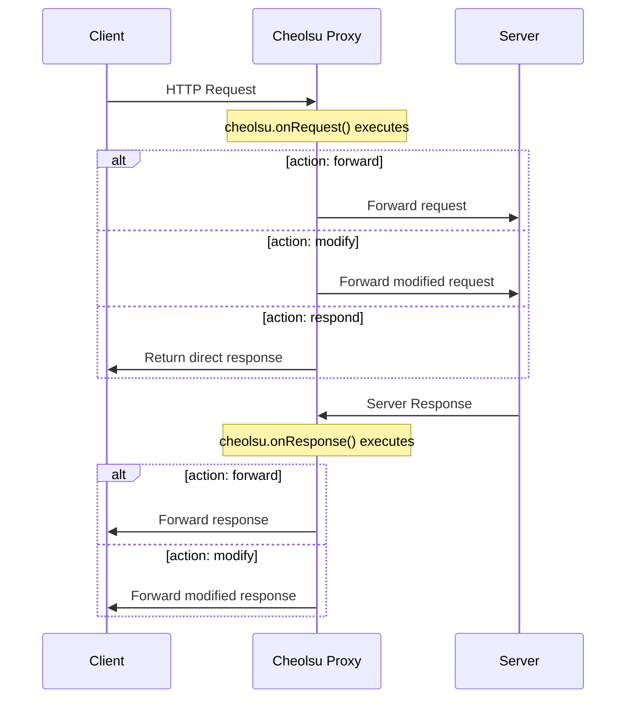

# Scripting

Cheolsu Proxy includes a JavaScript/TypeScript scripting engine powered by Deno Core (V8). Scripts let you programmatically intercept and modify HTTP requests, responses, and WebSocket messages as they flow through the proxy.

## When to Use Scripting

Intercept rules handle straightforward cases like blocking URLs, adding headers, or mapping to local files. Scripting is the right choice when you need logic that rules cannot express:

- **Conditional modifications** -- Add a header only when the request body contains a specific field, or change the response based on the request URL.
- **Data transformation** -- Parse JSON responses and mask sensitive fields, rewrite URLs in response bodies, or transform data formats.
- **Stateful behavior** -- Count requests, aggregate data across multiple calls, or implement rate limiting.
- **Dynamic responses** -- Generate mock responses with timestamps, random data, or values computed from the request.
- **Complex matching** -- Use regular expressions, inspect nested JSON fields, or match against multiple conditions.



---

## Practical Recipes

### Add CORS Headers to All Responses

When developing a frontend against an API that lacks CORS headers, this script adds them to every response:

```javascript
cheolsu.onResponse((request, response) => {
  return {
    action: "modify",
    response: {
      ...response,
      headers: {
        ...response.headers,
        "Access-Control-Allow-Origin": "*",
        "Access-Control-Allow-Methods": "GET, POST, PUT, DELETE, OPTIONS",
        "Access-Control-Allow-Headers": "Content-Type, Authorization",
      },
    },
  };
});
```

### Inject an Authorization Token

Automatically add a bearer token to all requests to your API, avoiding the need to configure it in your app during development:

```javascript
const API_TOKEN = "eyJhbGciOiJIUzI1NiIs...";

cheolsu.onRequest((request) => {
  if (request.url.includes("api.example.com")) {
    request.headers["Authorization"] = `Bearer ${API_TOKEN}`;
    return { action: "modify", request };
  }
  return { action: "forward" };
});
```

### Mask Sensitive Fields in Responses

Replace personal data in API responses so you can share screenshots or recordings without exposing real user information:

```javascript
cheolsu.onResponse((request, response) => {
  if (response.headers["content-type"]?.includes("application/json")) {
    try {
      const data = JSON.parse(response.body);
      maskFields(data, ["email", "phone", "ssn", "password"]);
      return {
        action: "modify",
        response: {
          ...response,
          body: JSON.stringify(data),
        },
      };
    } catch (e) {
      // Not valid JSON, forward as-is
    }
  }
  return { action: "forward" };
});

function maskFields(obj, fields) {
  if (typeof obj !== "object" || obj === null) return;
  for (const key of Object.keys(obj)) {
    if (fields.includes(key.toLowerCase())) {
      obj[key] = "***MASKED***";
    } else if (typeof obj[key] === "object") {
      maskFields(obj[key], fields);
    }
  }
}
```

### Simulate Network Delay

Add artificial latency to test how your application handles slow responses:

```javascript
cheolsu.onRequest(async (request) => {
  if (request.url.includes("/api/slow-endpoint")) {
    // Simulate 3 seconds of network delay
    await new Promise((resolve) => setTimeout(resolve, 3000));
  }
  return { action: "forward" };
});
```

---

## Hook API

Hook functions support both synchronous and asynchronous (async/await) patterns.

### cheolsu.onRequest(handler)

Called before an HTTP request is forwarded to the server. The handler receives a request object and must return an action.

**Request object:**

| Property | Type | Description |
| --- | --- | --- |
| `method` | string | HTTP method (GET, POST, etc.) |
| `url` | string | Full request URL |
| `headers` | object | Request headers as key-value pairs |
| `body` | string | Request body |

**Return values:**

```javascript
// Forward the request unchanged
return { action: "forward" };

// Forward with modifications
return { action: "modify", request: { ...request, headers: { ...request.headers, "X-Custom": "value" } } };

// Respond directly without contacting the server
return {
  action: "respond",
  response: {
    status: 200,
    headers: { "Content-Type": "application/json" },
    body: JSON.stringify({ mocked: true }),
  },
};
```

### cheolsu.onResponse(handler)

Called before a server response is delivered to the client. The handler receives the original request and the response.

**Response object:**

| Property | Type | Description |
| --- | --- | --- |
| `status` | number | HTTP status code |
| `headers` | object | Response headers as key-value pairs |
| `body` | string | Response body |

**Return values:**

```javascript
// Forward the response unchanged
return { action: "forward" };

// Forward with modifications
return {
  action: "modify",
  response: { ...response, headers: { ...response.headers, "X-Modified": "true" } },
};
```

### cheolsu.onWebSocketMessage(handler)

Called before a WebSocket message is forwarded. The handler receives a message object.

**Message object:**

| Property | Type | Description |
| --- | --- | --- |
| `direction` | string | `"to_server"` or `"to_client"` |
| `payload` | string | Message content |
| `is_binary` | boolean | Whether the message is binary |

**Return values:**

```javascript
// Forward unchanged
return { action: "forward" };

// Forward with modified content
return { action: "modify", payload: "new content", is_binary: false };

// Drop the message entirely
return { action: "drop" };
```

---

## Supported File Types

Scripts can be written in JavaScript or TypeScript:

- `.js`, `.ts`, `.mjs`, `.mts`

TypeScript is automatically transpiled using oxc. No build step is required.

---

## Timer API

```javascript
const id = setTimeout(callback, delay);   // Execute after delay (ms)
clearTimeout(id);                          // Cancel a timeout

const id = setInterval(callback, delay);   // Execute repeatedly at interval (ms)
clearInterval(id);                         // Cancel an interval
```

**Note:** Timers only fire during hook execution while the event loop is active. They cannot be used as background timers between hook invocations.

---

## Console API

Scripts can log output to the GUI/TUI console panel:

- `console.log()` -- General output
- `console.warn()` -- Warning messages
- `console.error()` -- Error messages
- `console.info()` -- Informational messages
- `console.debug()` -- Debug messages

Logs appear in real time, making it easy to trace script behavior as traffic flows through the proxy.

---

## API Reference

### Available APIs

| API | Description |
| --- | --- |
| `cheolsu.onRequest(handler)` | Register HTTP request hook (sync/async) |
| `cheolsu.onResponse(handler)` | Register HTTP response hook (sync/async) |
| `cheolsu.onWebSocketMessage(handler)` | Register WebSocket message hook (sync/async) |
| `console.log/warn/error/info/debug()` | Console logging |
| `setTimeout(callback, delay)` | Delayed execution |
| `clearTimeout(id)` | Cancel timeout |
| `setInterval(callback, delay)` | Repeated execution |
| `clearInterval(id)` | Cancel interval |
| `async` / `await` | Asynchronous processing |
| `Promise` | Promise API |
| `JSON.parse()` / `JSON.stringify()` | JSON processing |
| `Math.*` | Math functions |
| `Date` | Date/time |
| `RegExp` | Regular expressions |
| `Array` / `Object` / `String` / `Map` / `Set` | Standard built-in objects |
| `Symbol` / `WeakMap` / `WeakSet` / `Proxy` / `Reflect` | ECMAScript standard |
| `TextEncoder` / `TextDecoder` | Text encoding (V8 built-in) |
| `structuredClone()` | Deep clone (V8 built-in) |
| TypeScript | Automatic transpilation |

### Unavailable APIs

| API | Reason |
| --- | --- |
| `fetch()` | Network I/O not registered |
| `XMLHttpRequest` | Browser-only API |
| `require()` | CommonJS module system not supported |
| `import` / `export` (ESM) | ES module system not supported |
| `fs` / `path` / `os` | Node.js built-in modules not supported |
| `process` | Node.js-only global object |
| `Buffer` | Node.js-only (use `Uint8Array` instead) |
| `crypto` | Web Crypto API not registered |
| `WebSocket` (client) | Network I/O not supported |
| `Worker` / `SharedWorker` | Worker threads not supported |
| `localStorage` / `sessionStorage` | Browser-only API |
| `DOM API` (`document`, `window`) | Browser-only |
| `alert()` / `confirm()` / `prompt()` | Browser-only |
| Top-level `await` | Not supported in script mode (only inside hooks) |

---

## Usage

### Desktop

1. Select **Script** from the sidebar.
2. Write code directly in the built-in Monaco editor, or enter a file path to load a script from disk.
3. Run the script with `Cmd/Ctrl + Enter`.
4. Monitor output in the console panel below the editor.
5. API documentation is available in the API Reference tab for quick lookup.

### TUI

1. Navigate to the **Script** tab.
2. Enter the path to a script file.
3. Load or unload the script.

### MCP

When using the MCP server with an AI assistant, you can ask it to write and load scripts:

- "Write a script that adds CORS headers to all API responses"
- "Create a script that logs all POST request bodies"
- "Write a script that masks email addresses in responses"

---

## Auto Reload

When a script is loaded from a file, Cheolsu Proxy watches the file for changes and automatically reloads the script when the file is saved. A 500ms debounce is applied to avoid reloading during rapid edits.

This works well with an external editor workflow: keep Cheolsu Proxy running, edit your script in your preferred editor, and see changes take effect immediately on the next request.
