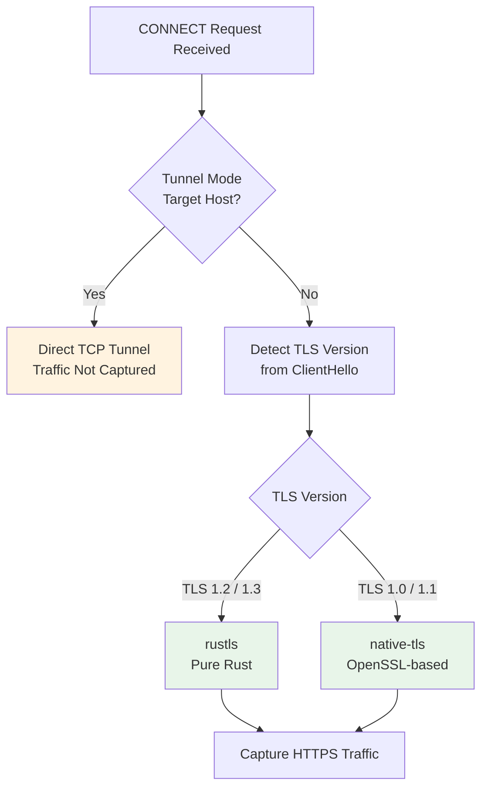

# TLS Support

Cheolsu Proxy handles TLS (HTTPS) traffic transparently. When you configure your device to use the proxy, HTTPS requests are intercepted, decrypted for inspection, and re-encrypted before being forwarded. This all happens automatically -- you do not need to configure TLS settings in most cases.

This page explains what Cheolsu Proxy does behind the scenes, what situations might require your attention, and how to resolve common TLS-related issues.

---

## How It Works

When your browser or app sends an HTTPS request through the proxy, the following happens:

1. The client sends a CONNECT request to the proxy for the target host.
2. The proxy generates a certificate for that host on the fly, signed by its own Certificate Authority (CA).
3. The client completes a TLS handshake with the proxy using that generated certificate.
4. The proxy establishes a separate TLS connection to the real server.
5. Traffic flows through the proxy, which can inspect and display the decrypted content.

For this to work without certificate warnings, the proxy's CA certificate must be trusted by your device. Cheolsu Proxy handles CA certificate installation as part of its initial setup.

---

## TLS Version Compatibility

Most modern clients use TLS 1.2 or 1.3. However, some older applications, embedded devices, or legacy systems still use TLS 1.0 or 1.1. Cheolsu Proxy supports all of these.

The proxy automatically detects the TLS version from the client's initial handshake and selects the appropriate handler:

| Client TLS Version | Handler                            |
| ------------------ | ---------------------------------- |
| TLS 1.2 / 1.3      | rustls (modern, pure-Rust library) |
| TLS 1.0 / 1.1      | native-tls (OS-level TLS library)  |

This hybrid approach means you can inspect traffic from both modern browsers and legacy clients without any configuration changes.

---

## Tunnel Mode

Some hosts enforce strict TLS requirements that are incompatible with proxy interception. Apple services are a common example -- they use certificate pinning and other mechanisms that cause TLS handshakes to fail when a proxy-generated certificate is presented.

For these hosts, Cheolsu Proxy uses tunnel mode: it creates a direct TCP tunnel between the client and server without attempting to intercept the TLS traffic. The connection passes through the proxy at the TCP level, but the encrypted content is not inspected.

Tunnel mode is applied automatically for known hosts, including various Apple service domains such as:

- `gateway.icloud.com`
- `p112-contacts.icloud.com`
- `p112-caldav.icloud.com`
- `wps.apple.com`

Traffic that passes through tunnel mode appears in the traffic list as CONNECT requests, but the request and response bodies are not available for inspection.

---

## Troubleshooting

### Certificate Not Trusted

**Symptom:** Your browser shows a certificate warning or your app refuses to connect with "certificate verify failed."

**Solution:** The proxy's CA certificate is not installed or not trusted on your device. Open Cheolsu Proxy's settings and follow the CA certificate installation instructions for your platform. On macOS, the certificate needs to be added to the Keychain and marked as trusted. On Windows, it needs to be added to the Trusted Root Certification Authorities store.

### Connection Fails for Specific Hosts

**Symptom:** Requests to certain hosts (often Apple services) fail with a TLS handshake error.

**Solution:** These hosts likely use certificate pinning. Check whether the host is already in the tunnel mode list. If not, it may need to be added. In most cases, Cheolsu Proxy's default tunnel list covers the common cases.

### Legacy Client Cannot Connect

**Symptom:** An older application or device using TLS 1.0/1.1 cannot establish a connection through the proxy.

**Solution:** Verify that the proxy was built with legacy TLS support enabled (the `native-tls-client` feature). This is included in the standard distribution. If the client still fails, check that the system's OpenSSL library supports the required TLS version.

### Slow TLS Handshakes

**Symptom:** HTTPS requests take noticeably longer than expected to start.

**Solution:** Certificate generation happens on the fly for each new host. The first request to a host may be slightly slower. Subsequent requests to the same host reuse the cached certificate and should be fast.

---

## Security Notes

TLS 1.0 and 1.1 are considered deprecated and have known vulnerabilities. Cheolsu Proxy supports them to enable inspection of legacy traffic during development and debugging, not for production use. If you are inspecting traffic from a legacy client, be aware that the connection between the client and the proxy uses weaker cryptography than TLS 1.2+.

For best security, upgrade legacy clients to support TLS 1.2 or higher whenever possible.
