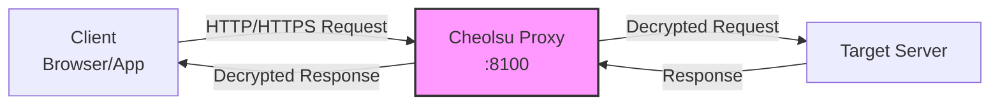
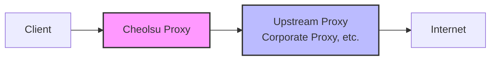
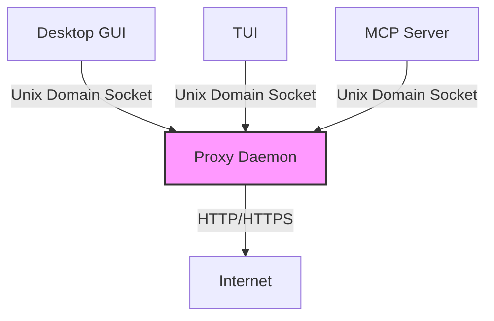

# Proxying

How Cheolsu Proxy routes traffic, and how to configure your system, browsers, and mobile devices to use it.

---

## How Cheolsu Proxy Works

Cheolsu Proxy operates as a **Man-In-The-Middle (MITM) proxy**. It sits between your client applications (browsers, mobile apps, CLI tools) and the internet, intercepting and recording all HTTP and HTTPS traffic that passes through it.

The proxy supports two protocols:

- **HTTP Proxy** — The standard protocol for proxying HTTP and HTTPS (via CONNECT) traffic. This is what most browsers and operating systems expect.
- **SOCKS Proxy** — A lower-level protocol that can proxy any TCP traffic, not just HTTP. Useful for tools and applications that support SOCKS but not HTTP proxies.

By default, Cheolsu Proxy listens on port `8100`. All traffic routed to this port is captured, inspected, and forwarded to its original destination.



## System Proxy Auto-Configuration (macOS)

On macOS, Cheolsu Proxy can automatically configure your system's proxy settings so that all network traffic from all applications is routed through the proxy. This uses the `networksetup` command under the hood to set the system-wide HTTP and HTTPS proxy.

When you start the proxy:

1. Cheolsu Proxy detects your active network interface
2. It sets the system HTTP and HTTPS proxy to `127.0.0.1:8100`
3. All applications that respect system proxy settings (Safari, Chrome, most native apps) automatically route traffic through the proxy

When you stop the proxy, the system proxy settings are restored to their previous state.

> Some applications (notably Firefox and many development tools) do not use the system proxy by default. See the sections below for how to configure them manually.

## Manual Proxy Setup Per Browser

If you prefer not to use the system-wide proxy, or if you need to configure a specific browser, you can set up the proxy manually.

### Chrome / Edge / Safari (macOS)

These browsers use the macOS system proxy settings. If the system proxy auto-configuration is active, no additional setup is needed.

To configure manually without the system proxy:

1. Open **System Settings** > **Network** > your active connection > **Details** > **Proxies**
2. Enable **Web Proxy (HTTP)** and **Secure Web Proxy (HTTPS)**
3. Set the server to `127.0.0.1` and port to `8100`

### Firefox

Firefox has its own proxy settings, independent of the operating system:

1. Open **Firefox** > **Settings** > **General**
2. Scroll down to **Network Settings** and click **Settings**
3. Select **Manual proxy configuration**
4. Set HTTP Proxy to `127.0.0.1` and Port to `8100`
5. Check **Also use this proxy for HTTPS**
6. Click **OK**

### Command-Line Tools (curl, wget, etc.)

Set the standard proxy environment variables:

```bash
export http_proxy=http://127.0.0.1:8100
export https_proxy=http://127.0.0.1:8100
```

Or pass the proxy directly:

```bash
curl -x http://127.0.0.1:8100 https://httpbin.org/get
```

## Changing the Proxy Port

If port `8100` conflicts with another service on your machine:

1. Open Cheolsu Proxy **Settings**
2. Go to **Proxy Port**
3. Enter a new port number (e.g., `8080`, `9000`)
4. Restart the proxy for the change to take effect

Remember to update any manual proxy configurations to use the new port.

## Upstream Proxy Configuration (Proxy Chaining)

In some environments — particularly corporate networks — your traffic already needs to pass through an existing proxy to reach the internet. Cheolsu Proxy supports **proxy chaining**, where it forwards traffic through an upstream proxy instead of connecting directly.

This means the traffic flow becomes:

```
Your Browser → Cheolsu Proxy → Corporate Proxy → Internet
```



To configure an upstream proxy:

1. Open Cheolsu Proxy **Settings**
2. Find the **Upstream Proxy** section
3. Enter the upstream proxy address and port
4. Save and restart the proxy

This is also useful when you want to chain Cheolsu Proxy with other debugging tools.

## Daemon Architecture

Cheolsu Proxy uses a **daemon architecture** where the proxy engine runs as a background process, separate from the user interface. This design enables several important capabilities:

- **Multiple clients, one daemon** — The Desktop GUI, TUI, and MCP Server can all connect to the same running proxy daemon simultaneously. You can inspect traffic in the GUI while an AI assistant queries it through MCP.
- **Interface independence** — You can close the GUI and reopen it without interrupting the proxy. The daemon continues capturing traffic in the background.
- **Stability** — If a UI crashes, the proxy keeps running. No traffic is lost.

The daemon starts automatically when you launch any Cheolsu Proxy interface and stops when the last client disconnects (or when you explicitly stop it).



## Mobile Device Proxy Setup

To capture traffic from a phone or tablet, route its traffic through Cheolsu Proxy running on your computer. Both devices must be on the **same Wi-Fi network**.

### Step 1 — Find Your Computer's IP Address

On macOS:

```bash
# Check your local IP
ipconfig getifaddr en0
```

Or go to **System Settings** > **Network** > your active connection — your IP address is shown there (e.g., `192.168.1.42`).

### Step 2 — Configure the Mobile Device

#### iOS

1. Go to **Settings** > **Wi-Fi**
2. Tap the **(i)** icon next to your connected network
3. Scroll down to **HTTP Proxy** and select **Manual**
4. Set **Server** to your computer's IP (e.g., `192.168.1.42`)
5. Set **Port** to `8100`
6. Tap **Save**

#### Android

1. Go to **Settings** > **Wi-Fi**
2. Long-press your connected network and select **Modify Network**
3. Expand **Advanced Options**
4. Set **Proxy** to **Manual**
5. Set **Proxy hostname** to your computer's IP (e.g., `192.168.1.42`)
6. Set **Proxy port** to `8100`
7. Save

### Step 3 — Install the CA Certificate

For HTTPS traffic inspection on mobile, you also need to install Cheolsu Proxy's CA certificate on the device. See [SSL Certificates](./ssl-certificates.md) for detailed instructions for iOS and Android.

### Verify the Connection

After configuring the mobile proxy and certificate:

1. Open a browser on the mobile device
2. Visit any website
3. The traffic should appear in Cheolsu Proxy on your computer

If it does not work:

- Verify both devices are on the same Wi-Fi network
- Check that your computer's firewall allows incoming connections on port `8100`
- Confirm the IP address is correct (it can change if your router uses DHCP)

## Related Documentation

- [SSL Certificates](./ssl-certificates.md) — Install and trust the CA certificate for HTTPS interception
- [Installation](./installation.md) — Download and initial setup
- [Recording](./recording.md) — Capture and inspect traffic
- [Troubleshooting](./troubleshooting.md) — Network and proxy connection issues

---

**Next step**: Start capturing and inspecting traffic with the [Recording](./recording.md) guide.
