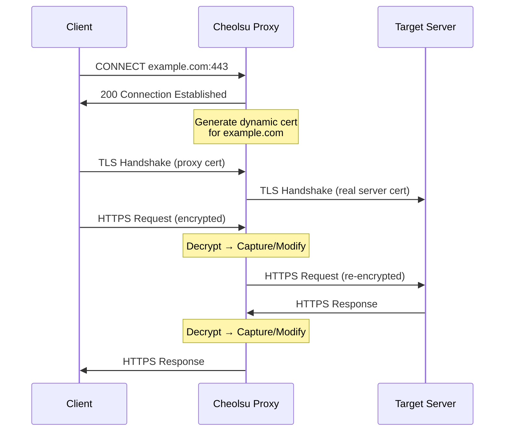

# SSL Certificates

How Cheolsu Proxy intercepts HTTPS traffic, and how to trust its certificate on your devices.

---

## How HTTPS Interception Works

When you visit an HTTPS site through Cheolsu Proxy, the proxy needs to decrypt the traffic so you can inspect it. Here is what happens under the hood:

1. **Cheolsu Proxy generates its own Certificate Authority (CA)** on first launch. This CA is unique to your installation.
2. When your browser connects to `https://example.com` through the proxy, Cheolsu Proxy dynamically generates a certificate for `example.com`, signed by its CA.
3. Your browser receives this proxy-signed certificate instead of the real one from the server.
4. If your system trusts the Cheolsu Proxy CA, the browser accepts the certificate and the connection proceeds normally — but now the proxy can read and display the request and response.

Without trusting the CA certificate, your browser will show security warnings on every HTTPS site, and many applications will refuse to connect entirely.

## macOS Certificate Installation

1. Open Cheolsu Proxy
2. Go to **Settings** then **Certificates**
3. Click the **Install Certificate** button
4. Enter your macOS password to authorize the installation

The app automatically installs the certificate and configures trust settings. Restart your browser after installation.

## Windows Certificate Installation

> Windows support is coming soon.

## Mobile Device Certificate Installation

To inspect traffic from a phone or tablet, you need to install the CA certificate on that device too. Make sure the mobile device is configured to use Cheolsu Proxy as its HTTP proxy first (see [Proxying](./proxying.md) for details).

### iOS

1. With the proxy configured, open Safari and navigate to the certificate download URL shown in Cheolsu Proxy's **Settings** > **Certificates** section
2. iOS will prompt you to download a configuration profile — tap **Allow**
3. Go to **Settings** > **General** > **VPN & Device Management**
4. Tap the downloaded profile and tap **Install**
5. Then go to **Settings** > **General** > **About** > **Certificate Trust Settings**
6. Enable full trust for the Cheolsu Proxy root certificate

### Android

1. Transfer the CA certificate file to the device (e.g., via email or file sharing)
2. Go to **Settings** > **Security** > **Encryption & Credentials** > **Install a Certificate** > **CA Certificate**
3. Select the certificate file and confirm installation

> On Android 7+, user-installed CA certificates are not trusted by default for apps targeting API 24+. You may need to configure a network security config for specific apps, or use a rooted device to install the certificate as a system CA.

## Firefox Certificate Store

Firefox uses its own certificate store, separate from the operating system. Even after trusting the certificate in macOS Keychain, Firefox will still show warnings unless you also add it to Firefox:

1. Open **Firefox** > **Settings** > **Privacy & Security**
2. Scroll down to **Certificates** and click **View Certificates**
3. Go to the **Authorities** tab
4. Click **Import** and select the Cheolsu Proxy CA certificate file
5. Check **Trust this CA to identify websites** and click **OK**

Alternatively, you can configure Firefox to use the system certificate store:

1. Open `about:config` in Firefox
2. Set `security.enterprise_roots.enabled` to `true`

This tells Firefox to also trust certificates from the macOS Keychain, which is often the simpler approach.

## Certificate Regeneration

If your certificate expires, becomes compromised, or you simply want a fresh one:

1. Go to **Settings** > **Certificates**
2. Click **Regenerate Certificate**
3. Re-install and re-trust the new certificate on all devices

> After regenerating, you must repeat the trust process on every device and browser where the old certificate was installed.

## Troubleshooting

### "Your connection is not secure" warnings

- Check that the certificate status shows **Trusted** in **Settings** > **Certificates**
- Restart your browser after installing the certificate
- Check that the proxy is actually running and your traffic is routed through it

### Certificate installation fails

- Ensure you are running Cheolsu Proxy with sufficient permissions
- Try reinstalling the certificate from **Settings** > **Certificates**

### HTTPS works in Chrome but not Firefox

- Firefox uses its own certificate store — see the [Firefox Certificate Store](#firefox-certificate-store) section above

### Mobile device still shows warnings

- Confirm the device is actually routing traffic through the proxy (check by visiting an HTTP site first)
- On iOS, make sure you completed **both** steps: installing the profile and enabling trust in Certificate Trust Settings
- On Android 7+, user CA certificates may not be trusted by apps — see the Android section above

## Related Documentation

- [Installation](./installation.md) — Initial setup and download
- [Proxying](./proxying.md) — Configure devices to route traffic through the proxy
- [TLS Support](../features/tls-support.md) — TLS version compatibility and configuration
- [Troubleshooting](./troubleshooting.md) — General troubleshooting guide

---

**Next step**: Configure your system or browser to route traffic through the proxy in the [Proxying](./proxying.md) guide.
