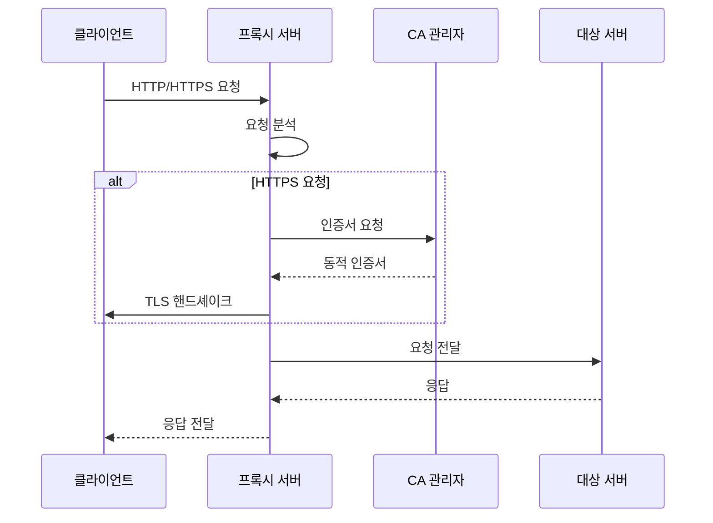
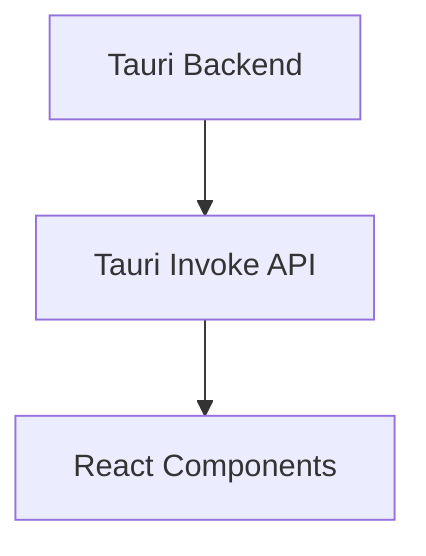

# 프로젝트 구조

Cheolsu Proxy는 Rust 기반의 모노레포 구조로 구성되어 있으며, Tauri를 사용한 데스크톱 애플리케이션입니다.

## 전체 구조

```
cheolsu-proxy/
├── Cargo.toml                 # 워크스페이스 루트 설정
├── Cargo.lock                 # 의존성 잠금 파일
├── README.md                  # 프로젝트 소개
├── CONTRIBUTING.md            # 기여 가이드 (영어)
├── CONTRIBUTING_KO.md         # 기여 가이드 (한국어)
├── document/                  # 문서 (기존)
├── assets/                    # 프로젝트 에셋
├── desktop/                  # 프론트엔드 (React + TypeScript)
├── proxyapi/                  # 레거시 프록시 API
├── proxyapi_models/           # 레거시 모델
├── proxyapi_v2/               # 새로운 프록시 API
├── proxyapi_v2_models/        # 새로운 모델
└── proxy_v2_models/           # 공통 모델
```

## 워크스페이스 구조

### 루트 Cargo.toml

```toml
[workspace]
members = [
    "proxyapi",
    "proxyapi_v2",
    "proxyapi_models",
    "desktop/src-tauri",
]

[workspace.dependencies]
# 공통 의존성 정의
```

### 워크스페이스 외부 크레이트

`proxy_v2_models`는 워크스페이스 멤버는 아니지만, 다른 워크스페이스 멤버들이 의존성으로 참조하는 별도의 크레이트입니다.

#### 주요 모듈
- **har.rs**: HAR 1.2 형식 변환 모듈 (`build_har()`, `build_har_json()`)
- **request.rs / response.rs**: HTTP 요청/응답 모델
- **data_type.rs**: 데이터 타입 분류
- **file_storage.rs**: Body 파일 저장 관리

## 백엔드 구조

### 1. proxyapi_v2/ (메인 프록시 엔진)

```
proxyapi_v2/
├── Cargo.toml                 # 패키지 설정
├── src/
│   ├── lib.rs                 # 라이브러리 진입점
│   ├── error.rs               # 에러 타입 정의
│   ├── body.rs                # HTTP 바디 처리
│   ├── decoder.rs             # HTTP 디코더
│   ├── rewind.rs              # 스트림 리와인드
│   ├── noop.rs                # No-op 핸들러
│   ├── tls_version_detector.rs # TLS 버전 감지
│   ├── hybrid_tls_handler.rs  # 하이브리드 TLS 핸들러
│   └── tunnel_event.rs        # 터널 이벤트 처리
│   ├── certificate_authority/ # CA 인증서 관리
│   │   ├── mod.rs
│   │   ├── rcgen_authority.rs # rcgen 기반 CA
│   │   ├── openssl_authority.rs # OpenSSL 기반 CA
│   │   ├── cheolsu-proxy.cnf  # OpenSSL 설정 파일
│   │   └── cheolsu-proxy.srl  # OpenSSL 직렬 번호 파일
│   └── proxy/                 # 프록시 핵심 로직
│       ├── mod.rs
│       ├── builder.rs         # 프록시 빌더
│       └── internal.rs        # 내부 프록시 로직
├── examples/                  # 사용 예제
│   ├── improved_rustls_proxy.rs
│   ├── log.rs
│   ├── noop.rs
│   ├── openssl.rs
│   └── tls_hybrid_test.rs
├── tests/                     # 통합 테스트
│   ├── common/
│   │   └── mod.rs
│   ├── integration_error_handling_tests.rs
│   ├── logging_handler_error_tests.rs
│   ├── openssl_ca.rs
│   ├── rcgen_ca.rs
│   └── websocket.rs
└── benches/                   # 벤치마크
    ├── certificate_authorities.rs
    ├── decoder.rs
    └── proxy.rs
```

### 2. certificate_authority/ (CA 관리)

#### 모듈 구조

```rust
// mod.rs
pub trait CertificateAuthority {
    fn generate_certificate(&self, domain: &str) -> Result<Certificate, Error>;
    fn gen_pkcs12_identity(&self, domain: &str) -> Result<Identity, Error>;
}

pub struct RcgenAuthority { /* ... */ }
pub struct OpensslAuthority { /* ... */ }
```

#### 주요 기능

- **동적 인증서 생성**: 도메인별 인증서 자동 생성
- **PKCS12 지원**: native-tls용 PKCS12 인증서 생성
- **크로스 플랫폼**: macOS, Windows 지원

### 3. proxy/ (프록시 핵심)

#### Builder 패턴

```rust
// builder.rs
pub struct ProxyBuilder {
    listen_addr: SocketAddr,
    ca: Box<dyn CertificateAuthority>,
    tls_handler: Box<dyn TlsHandler>,
}

impl ProxyBuilder {
    pub fn new() -> Self { /* ... */ }
    pub fn listen_addr(mut self, addr: SocketAddr) -> Self { /* ... */ }
    pub fn certificate_authority(mut self, ca: Box<dyn CertificateAuthority>) -> Self { /* ... */ }
    pub fn build(self) -> Result<Proxy, Error> { /* ... */ }
}
```

#### 내부 로직

```rust
// internal.rs
pub struct Proxy {
    listener: TcpListener,
    ca: Box<dyn CertificateAuthority>,
    tls_handler: Box<dyn TlsHandler>,
}

impl Proxy {
    pub async fn run(&self) -> Result<(), Error> { /* ... */ }
    async fn handle_connection(&self, stream: TcpStream) -> Result<(), Error> { /* ... */ }
    async fn handle_http(&self, stream: TcpStream) -> Result<(), Error> { /* ... */ }
    async fn handle_https(&self, stream: TcpStream) -> Result<(), Error> { /* ... */ }
}
```

## 프론트엔드 구조 (desktop/)

### FSD (Feature-Sliced Design) 아키텍처

```
desktop/src/
├── main.tsx                   # 애플리케이션 진입점
├── main.css                   # 글로벌 스타일
├── app/                       # 애플리케이션 레이어
│   ├── App.tsx                # 루트 컴포넌트
│   ├── layouts/               # 레이아웃 컴포넌트
│   └── providers/             # 컨텍스트 프로바이더
│       ├── index.ts
│       ├── router-provider.tsx
│       └── use-theme-provider.ts
├── pages/                     # 페이지 레이어
│   ├── network-dashboard/     # 네트워크 대시보드
│   │   ├── hooks/
│   │   │   ├── index.ts
│   │   │   ├── use-proxy-event-control.ts
│   │   │   ├── use-theme-provider.ts
│   │   │   ├── use-transaction-filters.ts
│   │   │   └── use-transactions.ts
│   │   ├── index.ts
│   │   ├── lib/
│   │   │   ├── index.ts
│   │   │   └── utils.ts
│   │   └── ui/
│   │       ├── index.ts
│   │       └── network-dashboard.tsx
│   └── sessions/              # 세션 관리
│       ├── index.ts
│       └── ui/
│           └── sessions-page.tsx
├── widgets/                   # 위젯 레이어
│   ├── network-table/         # 네트워크 테이블
│   │   ├── hooks/
│   │   │   ├── index.ts
│   │   │   └── use-table-data.ts
│   │   ├── index.ts
│   │   ├── lib/
│   │   │   ├── index.ts
│   │   │   └── utils.ts
│   │   ├── model/
│   │   │   ├── consts.ts
│   │   │   ├── index.ts
│   │   │   └── types.ts
│   │   └── ui/
│   │       ├── cells/
│   │       │   ├── action-cell.tsx
│   │       │   ├── index.ts
│   │       │   ├── method-cell.tsx
│   │       │   ├── path-cell.tsx
│   │       │   ├── size-cell.tsx
│   │       │   ├── status-cell.tsx
│   │       │   └── time-cell.tsx
│   │       ├── index.ts
│   │       ├── network-table.tsx
│   │       ├── table-body.tsx
│   │       ├── table-header.tsx
│   │       └── table-row.tsx
│   ├── network-header/        # 네트워크 헤더
│   │   ├── index.ts
│   │   ├── model/
│   │   │   ├── consts.ts
│   │   │   └── index.ts
│   │   └── ui/
│   │       ├── index.ts
│   │       ├── network-controls.tsx
│   │       ├── network-filters.tsx
│   │       ├── network-header.tsx
│   │       └── network-stats.tsx
│   └── host-path-tree/        # 호스트 경로 트리
│       ├── hooks/
│       │   ├── index.ts
│       │   ├── use-host-tree.ts
│       │   └── use-node-actions.ts
│       ├── index.ts
│       ├── lib/
│       │   ├── index.ts
│       │   ├── node-ui-utils.tsx
│       │   ├── tree-builder.ts
│       │   └── utils.ts
│       ├── model/
│       │   ├── index.ts
│       │   └── types.ts
│       └── ui/
│           ├── host-path-tree.tsx
│           ├── index.ts
│           ├── node-content.tsx
│           ├── transaction-list.tsx
│           └── tree-node.tsx
├── features/                  # 기능 레이어
│   ├── network-table/         # 네트워크 테이블 기능
│   │   └── api/
│   ├── transaction-details/   # 트랜잭션 상세
│   │   ├── context/
│   │   │   └── form-context.tsx
│   │   ├── hooks/
│   │   │   ├── index.ts
│   │   │   ├── use-transaction-edit.ts
│   │   │   └── use-transaction-tabs.ts
│   │   ├── index.ts
│   │   ├── lib/
│   │   │   ├── index.ts
│   │   │   └── utils.ts
│   │   ├── model/
│   │   │   ├── consts.ts
│   │   │   ├── index.ts
│   │   │   └── types.ts
│   │   └── ui/
│   │       ├── form-components.tsx
│   │       ├── index.ts
│   │       ├── transaction-body.tsx
│   │       ├── transaction-details.tsx
│   │       ├── transaction-header.tsx
│   │       ├── transaction-headers.tsx
│   │       └── transaction-response.tsx
│   └── websocket-test/        # WebSocket 테스트
│       └── ui/
├── entities/                  # 엔티티 레이어
│   ├── proxy/                 # 프록시 엔티티
│   │   ├── index.ts
│   │   └── model/
│   │       ├── data-type.ts
│   │       ├── index.ts
│   │       └── types.ts
│   ├── session/               # 세션 엔티티
│   │   ├── index.ts
│   │   └── model/
│   │       ├── index.ts
│   │       └── types.ts
│   └── transaction/           # 트랜잭션 엔티티
│       ├── index.ts
│       └── lib/
│           ├── index.ts
│           └── utils.ts
└── shared/                    # 공유 레이어
    ├── api/                   # API 클라이언트
    │   └── proxy.ts
    ├── app-sidebar/           # 앱 사이드바
    │   ├── hooks/
    │   │   ├── index.ts
    │   │   └── use-sidebar-collapse.ts
    │   ├── index.ts
    │   ├── model/
    │   │   ├── consts.ts
    │   │   ├── index.ts
    │   │   ├── sidebar-store.ts
    │   │   └── types.ts
    │   └── ui/
    │       ├── app-sidebar.tsx
    │       ├── index.ts
    │       ├── sidebar-header.tsx
    │       ├── sidebar-navigation.tsx
    │       └── sidebar-status.tsx
    ├── assets/                # 정적 에셋
    │   ├── index.ts
    │   └── logo.png
    ├── lib/                   # 유틸리티 함수
    │   ├── class-name.ts
    │   └── index.ts
    ├── stores/                # 상태 관리
    │   ├── index.ts
    │   ├── proxy-store.ts
    │   └── session-store.ts
    └── ui/                    # UI 컴포넌트
        ├── badge.tsx
        ├── button.tsx
        ├── card.tsx
        ├── command.tsx
        ├── dialog.tsx
        ├── index.ts
        ├── input.tsx
        ├── layout.tsx
        ├── multi-select.tsx
        ├── popover.tsx
        ├── resizable.tsx
        ├── scroll-area.tsx
        ├── select.tsx
        ├── separator.tsx
        ├── sidebar.tsx
        ├── sonner.tsx
        ├── tabs.tsx
        ├── textarea.tsx
        └── virtualized-scroll-area.tsx
```

### 각 레이어의 역할

#### 1. app/ (애플리케이션 레이어)

- **App.tsx**: 루트 컴포넌트, 라우팅 설정
- **layouts/**: 공통 레이아웃 컴포넌트
- **providers/**: React Context 프로바이더

#### 2. pages/ (페이지 레이어)

- **network-dashboard/**: 메인 네트워크 모니터링 페이지
- **sessions/**: 세션 관리 페이지

#### 3. widgets/ (위젯 레이어)

- **network-table/**: 네트워크 요청 테이블
- **network-header/**: 네트워크 헤더 정보
- **host-path-tree/**: 호스트별 경로 트리

#### 4. features/ (기능 레이어)

- **network-table/**: 테이블 관련 기능 (필터링, 정렬 등)
- **transaction-details/**: 트랜잭션 상세 보기
- **har-export/**: HAR 1.2 형식으로 트랜잭션 내보내기
- **websocket-test/**: WebSocket 테스트 기능

#### 5. entities/ (엔티티 레이어)

- **proxy/**: 프록시 관련 데이터 모델
- **session/**: 세션 관련 데이터 모델
- **transaction/**: 트랜잭션 관련 데이터 모델

#### 6. shared/ (공유 레이어)

- **api/**: 백엔드 API 클라이언트
- **ui/**: 재사용 가능한 UI 컴포넌트
- **lib/**: 유틸리티 함수
- **stores/**: Zustand 상태 관리
- **assets/**: 정적 에셋

## Tauri 백엔드 (desktop/src-tauri/)

```
src-tauri/
├── Cargo.toml                 # Tauri 백엔드 설정
├── tauri.conf.json            # Tauri 설정
├── src/
│   ├── main.rs                # 메인 진입점
│   ├── lib.rs                 # 라이브러리 진입점
│   ├── proxy.rs               # 레거시 프록시
│   ├── proxy_v2.rs            # 새로운 프록시
│   └── certificate_authority/ # CA 관리
│       ├── cheolsu-proxy.cnf  # OpenSSL 설정 파일
│       └── cheolsu-proxy.srl  # OpenSSL 직렬 번호 파일
├── capabilities/              # Tauri 권한 설정
├── icons/                     # 앱 아이콘
└── gen/                       # 자동 생성 파일
```

### Tauri 설정

```json
// tauri.conf.json
{
  "build": {
    "beforeDevCommand": "bun run dev",
    "beforeBuildCommand": "bun run build",
    "devPath": "http://localhost:1420",
    "distDir": "../dist"
  },
  "package": {
    "productName": "Cheolsu Proxy",
    "version": "0.1.0"
  }
}
```

## 데이터 플로우

### 1. 프록시 요청 처리



### 2. 프론트엔드 데이터 플로우



## 상태 관리

### Zustand 스토어 구조

```typescript
// stores/proxy-store.ts
interface ProxyStore {
  // 상태
  isRunning: boolean;
  listenAddr: string;
  requests: Transaction[];

  // 액션
  startProxy: () => void;
  stopProxy: () => void;
  addRequest: (request: Transaction) => void;
  clearRequests: () => void;
}

// stores/session-store.ts
interface SessionStore {
  // 상태
  sessions: Session[];
  activeSession: string | null;

  // 액션
  createSession: () => void;
  switchSession: (id: string) => void;
  deleteSession: (id: string) => void;
}
```

## API 통신

### Tauri Invoke API

```typescript
// shared/api/proxy.ts
import { invoke } from "@tauri-apps/api/core";

export async function fetchProxyStatus(): Promise<boolean> {
  return await invoke("proxy_status");
}

export async function startProxy(address: string): Promise<void> {
  return await invoke("start_proxy", { addr: address });
}

export async function stopProxy(): Promise<void> {
  return await invoke("stop_proxy");
}

// proxyapi_v2를 사용하는 새로운 프록시 함수들
export interface ProxyStartResult {
  status: boolean;
  message: string;
}

export async function startProxyV2(port: number = 8100): Promise<ProxyStartResult> {
  return invoke("start_proxy_v2", { addr: `127.0.0.1:${port}` });
}

export async function stopProxyV2(): Promise<void> {
  return invoke("stop_proxy_v2");
}

export async function getProxyV2Status(): Promise<boolean> {
  return invoke("proxy_v2_status");
}
```

## 테스트 구조

### Rust 테스트

```
tests/
├── common/                    # 공통 테스트 유틸리티
│   └── mod.rs
├── integration_error_handling_tests.rs
├── logging_handler_error_tests.rs
├── openssl_ca.rs
├── rcgen_ca.rs
└── websocket.rs
```

### 프론트엔드 테스트

```
__tests__/
├── components/                # 컴포넌트 테스트
├── pages/                     # 페이지 테스트
├── utils/                     # 유틸리티 테스트
└── setup.ts                   # 테스트 설정
```

## 성능 최적화

### 백엔드 최적화

- **비동기 처리**: tokio 런타임 사용
- **메모리 풀링**: 객체 풀 패턴 적용
- **스트리밍**: 대용량 데이터 스트리밍 처리

### 프론트엔드 최적화

- **가상화**: 대용량 리스트 가상화
- **메모이제이션**: React.memo, useMemo 사용
- **코드 스플리팅**: 동적 import 사용

## 보안 고려사항

### 백엔드 보안

- **인증서 관리**: 안전한 CA 인증서 생성
- **메모리 보안**: 안전한 메모리 관리
- **입력 검증**: 모든 입력 데이터 검증

### 프론트엔드 보안

- **XSS 방지**: 입력 데이터 이스케이핑
- **CSRF 방지**: 토큰 기반 인증
- **콘텐츠 보안 정책**: CSP 헤더 설정

## 확장성

### 플러그인 시스템 (향후)

```rust
// 플러그인 트레이트
pub trait Plugin {
    fn name(&self) -> &str;
    fn version(&self) -> &str;
    fn handle_request(&self, request: &mut Request) -> Result<(), Error>;
    fn handle_response(&self, response: &mut Response) -> Result<(), Error>;
}
```

이 구조를 이해하면 Cheolsu Proxy의 코드베이스를 효과적으로 탐색하고 기여할 수 있습니다.
