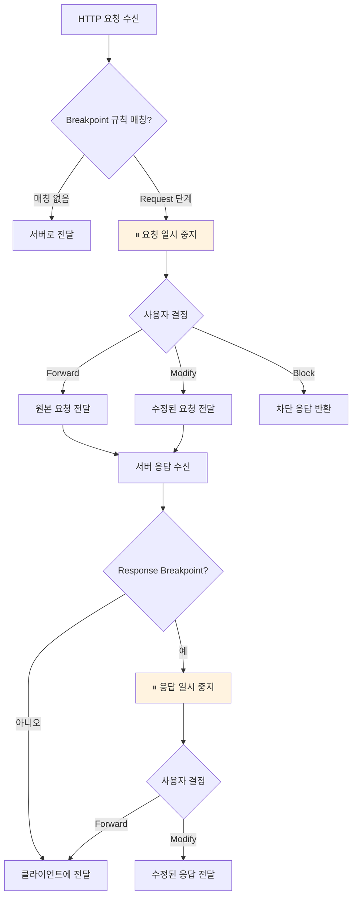

# Breakpoint (중단점)

## 개요

Breakpoint는 HTTP 요청 또는 응답을 특정 시점에서 일시 중지하고, 내용을 검사하거나 수정한 후 전달하는 기능입니다. 디버거의 브레이크포인트와 유사하게 동작하며, 트래픽 흐름을 실시간으로 제어할 수 있습니다.

인터셉트 규칙이 사전 정의된 규칙에 따라 자동으로 트래픽을 수정하는 것과 달리, Breakpoint는 요청/응답을 직접 검사하고 상황에 따라 다른 조치를 취할 수 있어 대화형 디버깅에 적합합니다.



---

## 규칙 설정

### Breakpoint 규칙

와일드카드 패턴을 사용하여 중단할 요청을 지정합니다.

| 설정 항목 | 설명 |
| --- | --- |
| **패턴** | URL 와일드카드 패턴 (예: `*api.example.com*`) |
| **Request 중단** | 요청 단계에서 일시 중지 여부 |
| **Response 중단** | 응답 단계에서 일시 중지 여부 |
| **활성화** | 규칙 활성화/비활성화 토글 |

Request와 Response 중단을 동시에 설정하면, 하나의 요청에 대해 두 번 일시 중지됩니다.

### 타임아웃

Breakpoint로 일시 중지된 요청은 기본 **60초** 후 자동으로 원본 그대로 전달됩니다. 이는 실수로 Breakpoint를 해제하지 않아 애플리케이션이 무한 대기하는 상황을 방지합니다.

---

## 액션

일시 중지된 요청/응답에 대해 다음 조치를 취할 수 있습니다:

### Forward (전달)

요청/응답을 수정 없이 원본 그대로 전달합니다. 내용을 확인한 후 문제가 없을 때 사용합니다.

### Modify (수정)

요청 또는 응답의 내용을 수정한 후 전달합니다.

**요청 수정 가능 항목:**
- URL
- HTTP 메서드
- 헤더
- 바디

**응답 수정 가능 항목:**
- 상태 코드
- 헤더
- 바디

### Block (차단)

요청을 서버로 전달하지 않고 즉시 차단 응답을 반환합니다. Request 단계 Breakpoint에서만 사용 가능합니다.

---

## 활용 사례

### API 디버깅

API 요청의 파라미터를 실시간으로 수정하여 다양한 시나리오를 테스트할 수 있습니다. 예를 들어, 인증 토큰을 변경하거나, 요청 바디의 특정 필드를 수정하여 서버의 반응을 확인할 수 있습니다.

### 에러 시뮬레이션

서버 응답의 상태 코드를 500으로 변경하거나, 에러 메시지를 주입하여 클라이언트의 에러 처리 로직을 검증할 수 있습니다.

### 타이밍 제어

특정 요청을 일시 중지하여 비동기 처리, 로딩 상태, 타임아웃 처리 등 시간에 의존적인 로직을 테스트할 수 있습니다.

---

## 사용 방법

### Desktop

1. 사이드바에서 **Breakpoint** 메뉴 선택
2. **규칙 추가** 버튼으로 패턴과 중단 단계 설정
3. 규칙이 매칭되면 알림과 함께 요청/응답이 일시 중지됨
4. 내용을 검사하고 Forward, Modify, Block 중 선택

### TUI

1. **Breakpoint** 탭으로 이동
2. 규칙 추가/편집
3. 일시 중지된 요청 확인 및 조치

### MCP

AI 어시스턴트를 통해 Breakpoint를 관리할 수 있습니다.

```
"api.example.com에 대한 breakpoint 규칙을 추가해줘"
"현재 일시 중지된 요청 목록을 보여줘"
```
