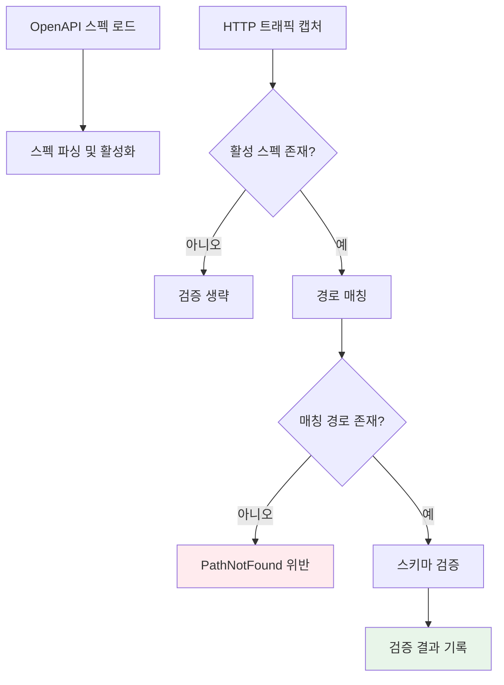

# Contract Testing

## 개요

Contract Testing은 캡처된 HTTP 트래픽이 OpenAPI (Swagger) 스펙을 준수하는지 자동으로 검증하는 기능입니다. API 스펙 문서를 로드하면, 프록시를 통과하는 모든 요청/응답을 실시간으로 스펙과 대조하여 위반 사항을 보고합니다.

API 스펙과 실제 구현 사이의 불일치를 조기에 발견하여 프론트엔드-백엔드 간 계약 위반 문제를 예방할 수 있습니다.

---

## 동작 방식



1. OpenAPI 스펙 파일(JSON 또는 YAML)을 로드
2. 프록시를 통과하는 트래픽에 대해 경로 매칭 수행
3. 매칭된 경로의 스키마와 실제 요청/응답을 비교
4. 위반 사항을 목록으로 보고

---

## 스펙 관리

| 기능 | 설명 |
| --- | --- |
| **로드** | OpenAPI 스펙 파일 로드 (JSON/YAML 지원) |
| **언로드** | 로드된 스펙 제거 |
| **활성화/비활성화** | 개별 스펙의 검증 토글 |
| **목록 조회** | 로드된 스펙 목록 확인 |

여러 OpenAPI 스펙을 동시에 로드할 수 있으며, 각 스펙을 개별적으로 활성화/비활성화할 수 있습니다.

---

## 검증 결과

각 검증 결과에는 다음 정보가 포함됩니다:

| 항목 | 설명 |
| --- | --- |
| **요청 ID** | 검증된 트랜잭션 식별자 |
| **스펙 ID** | 매칭된 OpenAPI 스펙 |
| **위반 사항** | 발견된 위반 목록 |
| **매칭 경로** | 스펙에서 매칭된 경로 패턴 |
| **매칭 작업** | 매칭된 HTTP 메서드 |

---

## 활용 사례

### API 개발 검증

백엔드 개발 중 API 스펙을 로드해두면, 실제 응답이 스펙과 다른 경우 즉시 알 수 있습니다. 필드 타입 불일치, 필수 필드 누락 등을 자동으로 감지합니다.

### 프론트엔드-백엔드 통합 테스트

프론트엔드와 백엔드 팀이 합의한 API 스펙을 기준으로, 실제 통신이 계약대로 이루어지는지 검증합니다.

### API 마이그레이션

API 버전 업그레이드 시 기존 스펙을 로드하여, 새 버전의 응답이 기존 계약을 깨뜨리지 않는지 확인합니다.

---

## 사용 방법

### Desktop

1. 사이드바에서 **Contract Testing** 메뉴 선택
2. OpenAPI 스펙 파일 로드
3. 트래픽 캡처 중 자동으로 검증 수행
4. 위반 사항 확인

### MCP

```
"OpenAPI 스펙을 로드해줘"
"Contract Testing 검증 결과를 보여줘"
```
