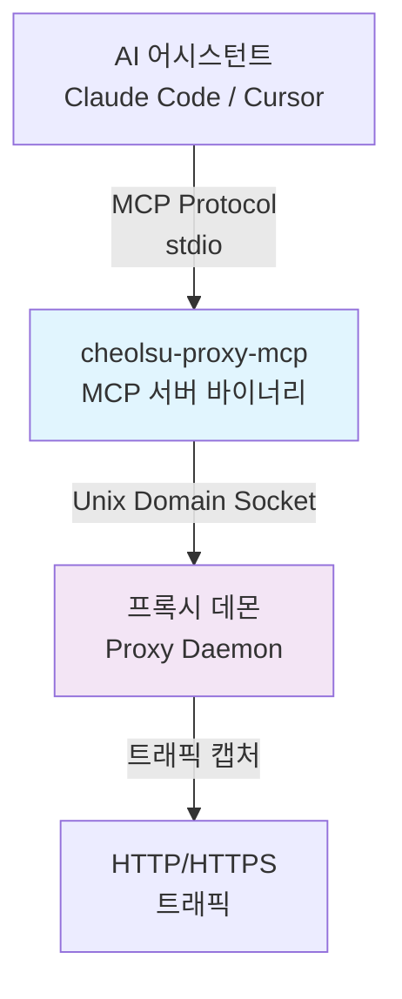

# MCP Server

## 개요

Cheolsu Proxy는 [Model Context Protocol (MCP)](https://modelcontextprotocol.io/) 서버를 내장하고 있어, AI 어시스턴트가 캡처된 네트워크 트래픽을 직접 조회하고 조작할 수 있습니다.

MCP(Model Context Protocol)는 AI 어시스턴트가 외부 도구와 데이터 소스에 접근할 수 있도록 하는 개방형 프로토콜입니다. Cheolsu Proxy의 MCP 서버를 AI 클라이언트에 연결하면, 자연어로 트래픽을 검색하고, API 응답을 분석하고, 인터셉트 규칙을 관리할 수 있습니다.

이 기능이 유용한 대표적인 시나리오는 다음과 같습니다.

- **API 디버깅**: "최근 500 에러가 난 요청을 찾아서 응답 바디를 보여줘"와 같이 자연어로 트래픽을 검색하고 분석
- **코드 생성**: 캡처된 API 요청/응답을 기반으로 TypeScript 인터페이스, API 클라이언트 코드 등을 자동 생성
- **테스트 자동화**: AI 어시스턴트가 요청을 재전송하고 결과를 비교하여 API 동작 검증
- **규칙 관리**: "이 도메인을 차단해줘", "CORS 헤더를 추가하는 규칙을 만들어줘" 등 자연어로 인터셉트 규칙 관리

---

## 전제 조건

MCP 서버를 사용하려면 다음 조건이 충족되어야 합니다.

1. **Cheolsu Proxy 앱 실행 중**: MCP 서버는 프록시 데몬에 연결하여 동작하므로, 앱이 실행 중이어야 합니다.
2. **MCP 서버 바이너리**: `cheolsu-proxy-mcp` 바이너리가 필요합니다. Cheolsu Proxy 설치 시 함께 설치됩니다.
3. **MCP 지원 AI 클라이언트**: Claude Code, Cursor, Claude Desktop 등 MCP를 지원하는 AI 클라이언트가 필요합니다.

---

## 설정 방법

### 1. MCP 설정 복사

앱 좌측 사이드바 하단의 **MCP Server** 버튼을 클릭하면 설정 JSON이 표시됩니다. 복사 버튼을 눌러 클립보드에 복사하세요.

### 2. AI 클라이언트에 등록

복사한 설정을 AI 클라이언트의 MCP 설정 파일에 붙여넣습니다.

**Claude Code**

CLI 명령어로 간편하게 등록할 수 있습니다:

```bash
claude mcp add cheolsu-proxy -- /path/to/cheolsu-proxy-mcp
```

또는 `.claude/settings.json`에 직접 추가:

```json
{
  "mcpServers": {
    "cheolsu-proxy": {
      "command": "/path/to/cheolsu-proxy-mcp"
    }
  }
}
```

**Cursor** (`.cursor/mcp.json`)

```json
{
  "mcpServers": {
    "cheolsu-proxy": {
      "command": "/path/to/cheolsu-proxy-mcp"
    }
  }
}
```

### 3. 연결 확인

설정 후 AI 클라이언트에서 Cheolsu Proxy의 MCP 도구가 인식되는지 확인합니다. Claude Code의 경우 `/mcp` 명령으로 연결 상태를 확인할 수 있습니다.

---

## 제공되는 MCP Tools

총 **48개**의 도구를 제공합니다. 아래는 카테고리별 전체 목록입니다.

### 트래픽 조회

| Tool                     | 설명                                                                  |
| ------------------------ | --------------------------------------------------------------------- |
| `search_traffic`         | 호스트, HTTP 메서드, 상태코드, URL 경로로 캡처된 트래픽 검색          |
| `get_transaction`        | 특정 트랜잭션의 요청/응답 헤더 및 바디 상세 조회                      |
| `get_websocket_messages` | 캡처된 WebSocket 메시지 조회 (연결 URI 필터 지원)                     |
| `get_sse_events`         | 캡처된 SSE(Server-Sent Events) 조회 (연결 URI 필터 지원)              |
| `diff_transactions`      | 두 트랜잭션(요청+응답)을 비교해 차이 표시. 회귀 테스트/배포 전후 비교 |
| `proxy_status`           | 프록시 데몬 상태 및 트래픽 통계 확인                                  |
| `clear_traffic`          | 메모리에 캡처된 트래픽 데이터 초기화                                  |

### 분석

| Tool                       | 설명                                                                |
| -------------------------- | ------------------------------------------------------------------- |
| `analyze_performance`      | 느린 요청 분석 + P50/P95/P99 지연 백분위                            |
| `analyze_errors`           | 에러율 분석 (상태코드/엔드포인트별 분해, 최근 에러)                 |
| `analyze_endpoints`        | 엔드포인트별 통계 (호출 빈도, 평균/P95 응답시간, 에러율, 응답 크기) |
| `detect_duplicates`        | 짧은 시간 내 중복 호출된 동일 URL 탐지 (불필요한 재요청/캐싱 누락)  |
| `detect_n_plus_one`        | N+1 쿼리 패턴 탐지 (동일 파라미터 엔드포인트의 연속 호출)           |
| `analyze_traffic_timeline` | 시간 버킷별 요청량·에러·평균 지연 타임라인                          |
| `analyze_full`             | 위 분석을 모두 실행한 종합 리포트                                   |

### 요청 재전송

| Tool              | 설명                                                            |
| ----------------- | --------------------------------------------------------------- |
| `replay_request`  | HTTP 요청을 직접 전송 (프록시 우회). API 테스트에 유용          |
| `replay_sequence` | 여러 트랜잭션을 순서대로 재전송 (요청 간 지연 옵션)             |
| `advanced_repeat` | 동일 요청을 동시성/지연 설정으로 반복 후 집계 통계(RPS 등) 반환 |

### 인터셉트 규칙 관리

| Tool          | 설명                                                                                  |
| ------------- | ------------------------------------------------------------------------------------- |
| `list_rules`  | 현재 설정된 인터셉트 규칙 목록 조회                                                   |
| `add_rule`    | 새 인터셉트 규칙 추가 (block, modify_request, modify_response, map_local, map_remote) |
| `remove_rule` | ID로 인터셉트 규칙 삭제                                                               |

### 브레이크포인트

| Tool                       | 설명                                                                      |
| -------------------------- | ------------------------------------------------------------------------- |
| `list_breakpoints`         | 브레이크포인트 규칙 목록 조회                                             |
| `add_breakpoint`           | 브레이크포인트 규칙 추가 (매칭 요청/응답을 수동 편집을 위해 일시정지)     |
| `remove_breakpoint`        | ID로 브레이크포인트 규칙 삭제                                             |
| `list_pending_breakpoints` | 현재 일시정지(대기) 중인 브레이크포인트 목록                              |
| `resolve_breakpoint`       | 대기 중 브레이크포인트 처리 (forward / modify_and_forward / drop / abort) |

### 호스트 매핑

| Tool                  | 설명                                                         |
| --------------------- | ------------------------------------------------------------ |
| `list_host_mappings`  | 호스트 매핑(DNS 스푸핑) 규칙 목록 조회                       |
| `add_host_mapping`    | 호스트 매핑 규칙 추가 (와일드카드 지원, 원본 Host 헤더 보존) |
| `remove_host_mapping` | ID로 호스트 매핑 규칙 삭제                                   |

### 리버스 프록시

| Tool                        | 설명                                                               |
| --------------------------- | ------------------------------------------------------------------ |
| `list_reverse_proxy_rules`  | 리버스 프록시 규칙 목록 조회                                       |
| `add_reverse_proxy_rule`    | 리버스 프록시 규칙 추가 (Host 패턴 → 백엔드 서버, 와일드카드 지원) |
| `remove_reverse_proxy_rule` | ID로 리버스 프록시 규칙 삭제                                       |

### 서버 리플레이

| Tool                   | 설명                                                                  |
| ---------------------- | --------------------------------------------------------------------- |
| `list_server_replay`   | 서버 리플레이 항목 목록 조회                                          |
| `add_server_replay`    | 캡처된 트랜잭션을 서버 리플레이로 등록 (매칭 요청에 캐시된 응답 반환) |
| `remove_server_replay` | ID로 서버 리플레이 항목 삭제                                          |
| `clear_server_replay`  | 모든 서버 리플레이 항목 초기화                                        |

### 설정

| Tool                         | 설명                                                       |
| ---------------------------- | ---------------------------------------------------------- |
| `update_upstream_proxy`      | 업스트림 프록시 설정 (모든 트래픽을 해당 프록시로 전달)    |
| `update_throttle`            | 네트워크 스로틀링 설정 (bytes/sec, 느린 연결 시뮬레이션)   |
| `update_proxy_auth`          | 프록시 인증 설정 (basic / bearer / apikey)                 |
| `update_connection_strategy` | 업스트림 연결 전략 (lazy / eager / eager_with_fallback)    |
| `update_quick_settings`      | 빠른 설정 (no_caching, block_cookies, no_gzip, block_quic) |
| `update_client_certificate`  | mTLS 클라이언트 인증서 설정                                |
| `update_ssl_proxying_list`   | SSL proxying 목록 설정 (blacklist/whitelist 모드)          |

### 세션 & 익스포트

| Tool                    | 설명                                                                         |
| ----------------------- | ---------------------------------------------------------------------------- |
| `save_session`          | 캡처 트래픽을 `.cheolsu` 세션 파일로 저장 (`.cheolsu.gz` 압축 지원)          |
| `load_session`          | 세션 파일(`.cheolsu`, `.cheolsu.gz`) 또는 HAR(`.har`) 불러오기 (append 옵션) |
| `export_har`            | 캡처 트래픽을 HAR 1.2 JSON으로 내보내기 (호스트/경로 필터)                   |
| `generate_openapi_spec` | 캡처 트래픽에서 OpenAPI 3.0 명세 자동 생성                                   |

### 스크립팅

| Tool            | 설명                                                      |
| --------------- | --------------------------------------------------------- |
| `load_script`   | JavaScript/TypeScript 스크립트 로드 (파일 경로 또는 코드) |
| `unload_script` | 현재 로드된 스크립트 언로드                               |

---

## 사용 예시

### 트래픽 검색 및 분석

```
"최근 500 에러가 난 API 요청을 찾아줘"
```

AI 어시스턴트가 `search_traffic` 도구로 상태 코드 5xx인 요청을 검색하고, `get_transaction`으로 상세 정보를 조회하여 에러 원인을 분석합니다.

### 코드 생성

```
"이 API의 요청/응답을 보고 TypeScript 인터페이스를 만들어줘"
```

AI 어시스턴트가 `get_transaction`으로 요청/응답 바디를 조회하고, JSON 구조를 분석하여 TypeScript 타입 정의를 생성합니다.

### 규칙 관리

```
"example.com 도메인을 차단하는 규칙을 추가해줘"
```

AI 어시스턴트가 `add_rule` 도구로 `*example.com*` 패턴의 Block 규칙을 추가합니다.

### 요청 재전송

```
"이 요청을 body만 바꿔서 다시 보내줘"
```

AI 어시스턴트가 `get_transaction`으로 원본 요청을 조회한 후, `replay_request`로 바디를 수정하여 재전송합니다.

### WebSocket 조회

```
"WebSocket 연결에서 에러 관련 메시지를 찾아줘"
```

AI 어시스턴트가 `get_websocket_messages`로 메시지를 조회하고, 에러 관련 내용이 포함된 메시지를 필터링합니다.

---

## 아키텍처



MCP 서버는 프록시 데몬의 또 다른 클라이언트로 동작합니다. 실시간으로 트래픽을 수집하며, 최근 1,000개의 HTTP 트랜잭션, 5,000개의 WebSocket 메시지, 5,000개의 SSE 이벤트를 메모리에 유지합니다.
