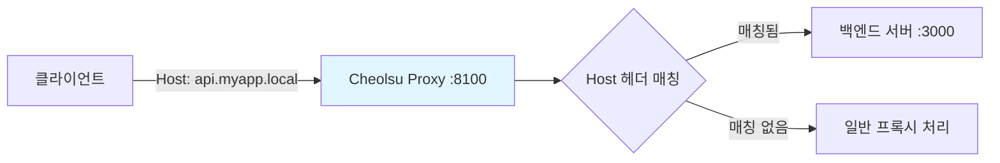

# Reverse Proxy

## 개요

Reverse Proxy는 Cheolsu Proxy를 리버스 프록시로 사용하는 기능입니다. 일반적인 포워드 프록시와 달리, 클라이언트가 프록시 설정 없이 Cheolsu Proxy의 포트로 직접 요청을 보내면, Host 헤더를 기반으로 설정된 백엔드 서버로 요청을 전달합니다.

프록시 설정이 어려운 환경이나, 특정 도메인에 대한 트래픽만 선택적으로 캡처하려는 경우에 유용합니다.

---

## 규칙 설정

| 항목 | 설명 |
| --- | --- |
| **매칭 호스트** | Host 헤더 매칭 패턴 (예: `api.myapp.local`, `*.local`) |
| **백엔드 스킴** | `http` 또는 `https` (기본값: `http`) |
| **백엔드 호스트** | 전달할 백엔드 서버 주소 |
| **백엔드 포트** | 백엔드 서버 포트 |
| **Host 헤더 재작성** | Host 헤더를 백엔드 서버 주소로 변경할지 여부 (기본값: 예) |
| **활성화** | 규칙 활성화/비활성화 |

---

## 동작 방식



1. 클라이언트가 Cheolsu Proxy 포트로 상대 경로 요청 전송 (예: `GET /api/users`)
2. Host 헤더를 확인하여 리버스 프록시 규칙 매칭
3. 매칭된 규칙의 백엔드 서버로 요청 전달
4. 백엔드 응답을 클라이언트에 반환

---

## 활용 사례

### 로컬 개발 환경

```
매칭 호스트:  api.myapp.local
백엔드 호스트: localhost
백엔드 포트:  3000
```

`/etc/hosts`에 `127.0.0.1 api.myapp.local`을 추가하고, 브라우저에서 `http://api.myapp.local:8100`으로 접속하면 로컬 개발 서버의 트래픽을 모니터링할 수 있습니다.

### 마이크로서비스 디버깅

여러 리버스 프록시 규칙을 설정하여 마이크로서비스 간 통신을 단일 프록시에서 모니터링할 수 있습니다.

```
매칭 호스트:  auth.local    → localhost:3001
매칭 호스트:  users.local   → localhost:3002
매칭 호스트:  orders.local  → localhost:3003
```

---

## 사용 방법

### Desktop

1. 사이드바에서 **Reverse Proxy** 메뉴 선택
2. **규칙 추가** 버튼 클릭
3. 매칭 호스트, 백엔드 서버 설정
4. 저장

### MCP

```
"api.local을 localhost:3000으로 리버스 프록시 설정해줘"
"리버스 프록시 규칙 목록을 보여줘"
```
