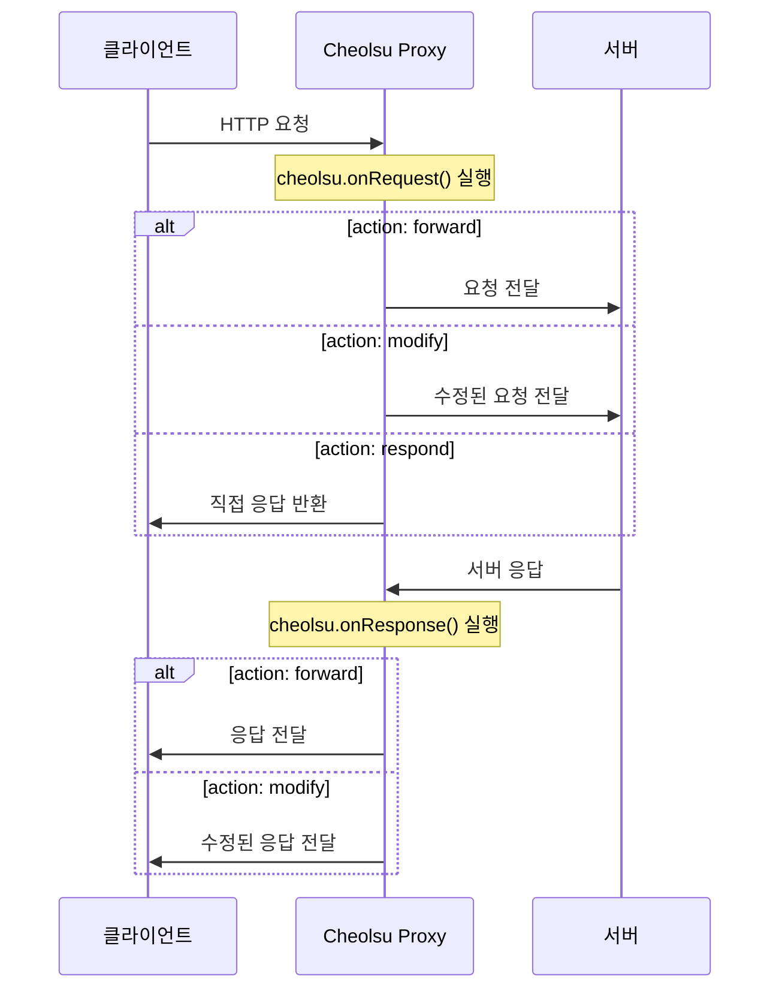

# 스크립팅

## 개요

Cheolsu Proxy의 스크립팅 엔진은 Deno Core(V8) 기반의 JavaScript/TypeScript 런타임으로, HTTP 요청/응답 및 WebSocket 메시지를 프로그래밍 방식으로 조작할 수 있습니다.

인터셉트 규칙이 정적인 패턴 매칭과 사전 정의된 액션을 제공하는 반면, 스크립팅은 조건 분기, 데이터 변환, 상태 유지 등 코드로 표현할 수 있는 모든 로직을 적용할 수 있습니다. 다음과 같은 상황에서 인터셉트 규칙 대신 스크립팅을 사용하는 것이 적합합니다.

- 요청/응답의 내용에 따라 동적으로 다른 처리가 필요한 경우
- JSON 바디의 특정 필드만 수정하거나 마스킹해야 하는 경우
- 여러 요청에 걸쳐 상태를 유지해야 하는 경우 (예: 요청 횟수 카운팅)
- 요청 간의 지연 시간을 시뮬레이션해야 하는 경우
- 복잡한 조건 조합이 필요한 경우

---

## 지원 파일 형식

- `.js`, `.ts`, `.mjs`, `.mts`
- TypeScript는 oxc 기반으로 자동 트랜스파일됩니다. 별도의 컴파일 단계 없이 TypeScript 파일을 바로 사용할 수 있습니다.

---

## 실전 예제

### 1. API 응답에 CORS 헤더 추가하기

로컬에서 프론트엔드를 개발할 때 API 서버가 CORS 헤더를 반환하지 않아 브라우저에서 요청이 차단되는 경우가 흔합니다. 이 스크립트는 모든 API 응답에 CORS 헤더를 자동으로 추가합니다.

```javascript
cheolsu.onResponse((request, response) => {
  // 특정 API 서버의 응답에만 CORS 헤더 추가
  if (request.url.includes("api.example.com")) {
    return {
      action: "modify",
      response: {
        ...response,
        headers: {
          ...response.headers,
          "Access-Control-Allow-Origin": "*",
          "Access-Control-Allow-Methods": "GET, POST, PUT, DELETE, OPTIONS",
          "Access-Control-Allow-Headers": "Content-Type, Authorization",
          "Access-Control-Max-Age": "86400",
        },
      },
    };
  }
  return { action: "forward" };
});

// OPTIONS preflight 요청에 직접 응답하여 서버 요청을 생략
cheolsu.onRequest((request) => {
  if (
    request.method === "OPTIONS" &&
    request.url.includes("api.example.com")
  ) {
    return {
      action: "respond",
      response: {
        status: 204,
        headers: {
          "Access-Control-Allow-Origin": "*",
          "Access-Control-Allow-Methods": "GET, POST, PUT, DELETE, OPTIONS",
          "Access-Control-Allow-Headers": "Content-Type, Authorization",
          "Access-Control-Max-Age": "86400",
        },
        body: "",
      },
    };
  }
  return { action: "forward" };
});
```

### 2. 요청에 인증 토큰 자동 추가하기

특정 API 서버로 가는 모든 요청에 인증 헤더를 자동으로 추가합니다. 개발 중 매번 토큰을 수동으로 설정하지 않아도 됩니다.

```javascript
const AUTH_TOKEN = "Bearer eyJhbGciOiJIUzI1NiIsInR5cCI6IkpXVCJ9...";

cheolsu.onRequest((request) => {
  if (request.url.includes("api.example.com")) {
    return {
      action: "modify",
      request: {
        ...request,
        headers: {
          ...request.headers,
          Authorization: AUTH_TOKEN,
        },
      },
    };
  }
  return { action: "forward" };
});
```

### 3. 응답 JSON에서 특정 필드 마스킹하기

개인정보가 포함된 API 응답을 디버깅할 때 민감한 필드를 마스킹하여 표시합니다. 화면 공유나 스크린샷을 찍을 때 유용합니다.

```javascript
cheolsu.onResponse((request, response) => {
  if (!request.url.includes("api.example.com/users")) {
    return { action: "forward" };
  }

  try {
    const body = JSON.parse(response.body);

    // 재귀적으로 민감한 필드 마스킹
    const sensitiveFields = ["email", "phone", "ssn", "password"];

    function maskFields(obj) {
      if (Array.isArray(obj)) {
        return obj.map(maskFields);
      }
      if (obj && typeof obj === "object") {
        const masked = {};
        for (const [key, value] of Object.entries(obj)) {
          if (sensitiveFields.includes(key) && typeof value === "string") {
            masked[key] = value.substring(0, 2) + "****";
          } else {
            masked[key] = maskFields(value);
          }
        }
        return masked;
      }
      return obj;
    }

    return {
      action: "modify",
      response: {
        ...response,
        body: JSON.stringify(maskFields(body)),
      },
    };
  } catch (e) {
    return { action: "forward" };
  }
});
```

### 4. API 응답 지연 시뮬레이션하기

느린 네트워크나 서버 응답 지연 상황을 시뮬레이션하여 로딩 UI, 타임아웃 처리, 재시도 로직 등을 테스트할 수 있습니다.

```javascript
cheolsu.onResponse(async (request, response) => {
  if (request.url.includes("api.example.com")) {
    // 3초 지연 추가
    await new Promise((resolve) => setTimeout(resolve, 3000));
    console.log(`[지연] ${request.method} ${request.url} - 3초 지연 적용`);
  }
  return { action: "forward" };
});
```



---

## 훅 API

훅 함수는 **동기(sync)** 및 **비동기(async)** 모두 지원됩니다. async 함수를 사용하면 `await`로 비동기 작업을 수행할 수 있습니다.

### cheolsu.onRequest(handler)

HTTP 요청이 서버로 전달되기 전에 호출됩니다. 요청을 그대로 전달하거나, 수정하여 전달하거나, 서버 요청 없이 직접 응답할 수 있습니다.

**handler 파라미터**: `request` 객체

| 필드 | 타입 | 설명 |
| --- | --- | --- |
| `method` | string | HTTP 메서드 (GET, POST 등) |
| `url` | string | 전체 요청 URL |
| `headers` | object | 요청 헤더 (key-value) |
| `body` | string | 요청 바디 |

**반환값**: 다음 중 하나

| action | 설명 | 추가 필드 |
| --- | --- | --- |
| `"forward"` | 요청을 그대로 서버에 전달 | 없음 |
| `"modify"` | 수정된 요청을 서버에 전달 | `request`: 수정된 요청 객체 |
| `"respond"` | 서버 요청 없이 직접 응답 | `response`: `{ status, headers, body }` |

```javascript
cheolsu.onRequest((request) => {
  // 그대로 전달
  return { action: "forward" };

  // 수정된 요청 전달
  return {
    action: "modify",
    request: {
      ...request,
      headers: { ...request.headers, "X-Custom": "value" },
    },
  };

  // 직접 응답 (서버 요청 생략)
  return {
    action: "respond",
    response: {
      status: 200,
      headers: { "Content-Type": "application/json" },
      body: JSON.stringify({ mocked: true }),
    },
  };
});
```

### cheolsu.onResponse(handler)

서버 응답이 클라이언트에 전달되기 전에 호출됩니다.

**handler 파라미터**: `request` 객체, `response` 객체

| 필드 (response) | 타입 | 설명 |
| --- | --- | --- |
| `status` | number | HTTP 상태 코드 |
| `headers` | object | 응답 헤더 (key-value) |
| `body` | string | 응답 바디 |

**반환값**:

| action | 설명 | 추가 필드 |
| --- | --- | --- |
| `"forward"` | 응답을 그대로 클라이언트에 전달 | 없음 |
| `"modify"` | 수정된 응답을 클라이언트에 전달 | `response`: 수정된 응답 객체 |

```javascript
cheolsu.onResponse((request, response) => {
  return {
    action: "modify",
    response: {
      ...response,
      headers: { ...response.headers, "X-Modified": "true" },
    },
  };
});
```

### cheolsu.onWebSocketMessage(handler)

WebSocket 메시지가 전달되기 전에 호출됩니다.

**handler 파라미터**: `message` 객체

| 필드 | 타입 | 설명 |
| --- | --- | --- |
| `direction` | string | `"to_server"` 또는 `"to_client"` |
| `payload` | string | 메시지 내용 |
| `is_binary` | boolean | 바이너리 메시지 여부 |

**반환값**:

| action | 설명 | 추가 필드 |
| --- | --- | --- |
| `"forward"` | 메시지를 그대로 전달 | 없음 |
| `"modify"` | 수정된 메시지 전달 | `payload`, `is_binary` |
| `"drop"` | 메시지를 버림 (전달하지 않음) | 없음 |

```javascript
cheolsu.onWebSocketMessage((message) => {
  // 그대로 전달
  return { action: "forward" };

  // 수정된 메시지 전달
  return { action: "modify", payload: "modified", is_binary: false };

  // 메시지 버림
  return { action: "drop" };
});
```

---

## 타이머 API

```javascript
// 지정된 시간(ms) 후 콜백 실행
const id = setTimeout(callback, delay);
clearTimeout(id);

// 지정된 간격(ms)마다 콜백 반복 실행
const id = setInterval(callback, delay);
clearInterval(id);
```

> **참고:** 타이머는 훅 실행 중(이벤트 루프가 동작하는 동안)에만 동작합니다. 훅 호출 사이에는 이벤트 루프가 유휴 상태이므로 백그라운드 타이머로 사용할 수 없습니다.

---

## 콘솔 API

스크립트 내에서 다음 콘솔 함수를 사용할 수 있으며, 로그는 GUI/TUI 콘솔 패널에 실시간으로 출력됩니다. 스크립트의 동작을 확인하거나 디버깅할 때 활용하세요.

- `console.log()` - 일반 로그
- `console.warn()` - 경고
- `console.error()` - 에러
- `console.info()` - 정보
- `console.debug()` - 디버그

---

## API 레퍼런스

### 사용 가능한 기능

| API | 설명 |
| --- | --- |
| `cheolsu.onRequest(handler)` | HTTP 요청 훅 등록 (sync/async) |
| `cheolsu.onResponse(handler)` | HTTP 응답 훅 등록 (sync/async) |
| `cheolsu.onWebSocketMessage(handler)` | WebSocket 메시지 훅 등록 (sync/async) |
| `console.log/warn/error/info/debug()` | 콘솔 로깅 |
| `setTimeout(callback, delay)` | 지연 실행 |
| `clearTimeout(id)` | 타이머 취소 |
| `setInterval(callback, delay)` | 반복 실행 |
| `clearInterval(id)` | 반복 타이머 취소 |
| `async` / `await` | 비동기 처리 |
| `Promise` | Promise API |
| `JSON.parse()` / `JSON.stringify()` | JSON 처리 |
| `Math.*` | 수학 함수 |
| `Date` | 날짜/시간 |
| `RegExp` | 정규표현식 |
| `Array` / `Object` / `String` / `Map` / `Set` | 표준 내장 객체 |
| `Symbol` / `WeakMap` / `WeakSet` / `Proxy` / `Reflect` | ECMAScript 표준 |
| `TextEncoder` / `TextDecoder` | 텍스트 인코딩 (V8 내장) |
| `structuredClone()` | 깊은 복사 (V8 내장) |
| TypeScript | 자동 트랜스파일 지원 |

### 사용 불가능한 기능

| API | 이유 |
| --- | --- |
| `fetch()` | 네트워크 I/O op 미등록 |
| `XMLHttpRequest` | 브라우저 전용 API |
| `require()` | CommonJS 모듈 시스템 미지원 |
| `import` / `export` (ESM) | ES 모듈 시스템 미지원 |
| `fs` / `path` / `os` | Node.js 내장 모듈 미지원 |
| `process` | Node.js 전용 전역 객체 |
| `Buffer` | Node.js 전용 (대신 `Uint8Array` 사용) |
| `crypto` | Web Crypto API 미등록 |
| `WebSocket` (클라이언트) | 네트워크 I/O 미지원 |
| `Worker` / `SharedWorker` | 워커 스레드 미지원 |
| `localStorage` / `sessionStorage` | 브라우저 전용 API |
| `DOM API` (`document`, `window`) | 브라우저 전용 |
| `alert()` / `confirm()` / `prompt()` | 브라우저 전용 |
| Top-level `await` | 스크립트 모드에서 미지원 (훅 내부에서만 가능) |

---

## 사용 방법

### Desktop

1. 사이드바에서 **Script** 메뉴 선택
2. Monaco Editor에서 직접 코드를 작성하거나, 기존 스크립트 파일의 경로를 입력하여 로드
3. `Cmd/Ctrl + Enter`로 스크립트 실행
4. 하단 콘솔 패널에서 `console.log` 등의 로그 출력을 실시간 확인
5. API Reference 탭에서 전체 API 문서 확인 가능

스크립트를 언로드하면 등록된 모든 훅이 해제되고, 이후의 트래픽은 스크립트의 영향을 받지 않습니다.

### TUI

1. **Script** 탭으로 이동
2. 스크립트 파일 경로를 입력
3. 로드/언로드 명령으로 스크립트 제어

### MCP

AI 어시스턴트에게 스크립트 작성을 요청할 수 있습니다.

```
"API 응답에서 특정 필드를 마스킹하는 스크립트를 작성해줘"
"모든 요청에 Authorization 헤더를 추가하는 스크립트를 만들어줘"
"api.example.com 응답에 3초 지연을 추가하는 스크립트를 작성해줘"
```

---

## 파일 자동 리로드

파일에서 스크립트를 로드한 경우, 파일이 변경되면 자동으로 리로드됩니다. 500ms 디바운스가 적용되어 빈번한 저장에도 안정적으로 동작합니다. 에디터에서 스크립트를 수정하고 저장하면 즉시 반영되므로, 별도의 리로드 조작 없이 빠르게 개발할 수 있습니다.
