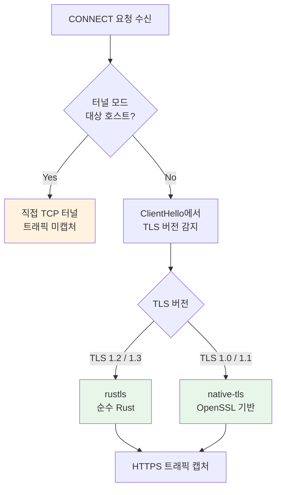

# TLS 지원

## 개요

Cheolsu Proxy는 HTTPS 트래픽을 캡처하고 분석하기 위해 TLS 연결을 중간에서 처리합니다. 최신 TLS 1.2/1.3뿐만 아니라 레거시 TLS 1.0/1.1 클라이언트도 지원하며, 특정 호스트에 대해서는 터널 모드로 직접 연결을 제공합니다. 대부분의 경우 별도의 설정 없이 자동으로 동작합니다.

---

## TLS 버전별 처리

Cheolsu Proxy는 클라이언트가 보내는 TLS ClientHello 메시지에서 TLS 버전을 자동으로 감지하고, 버전에 따라 적절한 방식으로 연결을 처리합니다.

| TLS 버전 | 처리 방식 | 설명 |
| --- | --- | --- |
| TLS 1.2 / 1.3 | rustls | 대부분의 최신 브라우저와 애플리케이션이 사용하는 버전입니다. 기본 처리 방식입니다. |
| TLS 1.0 / 1.1 | native-tls | 오래된 디바이스나 레거시 시스템이 사용하는 버전입니다. 이전 버전의 Android, iOS, 구형 IoT 장비 등이 해당됩니다. |

이 하이브리드 방식 덕분에 최신 클라이언트와 레거시 클라이언트가 혼재하는 환경에서도 모든 HTTPS 트래픽을 캡처할 수 있습니다. 예를 들어, 모바일 앱을 다양한 OS 버전에서 테스트할 때 TLS 버전 차이로 인해 일부 디바이스의 트래픽을 캡처하지 못하는 문제를 방지합니다.

---

## 터널 모드

일부 호스트는 엄격한 TLS 요구사항(인증서 고정, 상호 TLS 등)으로 인해 프록시를 통한 TLS 핸드셰이크가 실패할 수 있습니다. 이러한 호스트에 대해서는 터널 모드를 사용하여 프록시가 TLS 처리를 우회하고, 클라이언트와 서버 간의 직접적인 TCP 터널을 생성합니다.

터널 모드가 적용된 트래픽은 암호화된 상태로 통과하므로 내용을 캡처할 수 없지만, 연결 자체는 정상적으로 유지됩니다.

### 터널 모드가 적용되는 주요 호스트

Apple 서비스 도메인이 대표적인 터널 모드 대상입니다.

- `gateway.icloud.com`
- `p112-contacts.icloud.com`
- `p112-caldav.icloud.com`
- `wps.apple.com`
- 기타 Apple 서비스 도메인

이러한 호스트는 인증서 고정(certificate pinning)을 사용하므로 프록시의 인증서를 신뢰하지 않습니다. 터널 모드가 없으면 iCloud 동기화, 연락처, 캘린더 등의 서비스가 중단될 수 있습니다.

### 터널 모드 동작

1. 클라이언트가 대상 호스트로 CONNECT 요청을 보냅니다.
2. Cheolsu Proxy가 해당 호스트가 터널 모드 대상인지 확인합니다.
3. 터널 모드 대상이면 즉시 `200 Connection Established` 응답을 반환합니다.
4. 클라이언트와 서버 간에 직접 TCP 연결을 생성하여 데이터를 양방향으로 중계합니다.

---

## 보안 참고 사항

### 레거시 TLS 버전에 대하여

TLS 1.0과 1.1은 알려진 보안 취약점이 있어 대부분의 최신 브라우저에서 비활성화되어 있습니다. Cheolsu Proxy가 레거시 TLS를 지원하는 것은 오래된 클라이언트의 트래픽을 디버깅 환경에서 캡처하기 위한 것이며, 프로덕션 환경에서 레거시 TLS 사용을 권장하는 것이 아닙니다.

레거시 TLS 클라이언트가 감지되면 해당 사실이 로그에 기록되므로, 어떤 클라이언트가 구버전 TLS를 사용하는지 파악하는 데에도 활용할 수 있습니다.

### CA 인증서 설치

HTTPS 트래픽을 캡처하려면 Cheolsu Proxy의 CA 인증서를 디바이스에 신뢰할 수 있는 인증서로 설치해야 합니다. 인증서 설치 방법은 [기본 사용법](../guide/basic-usage.md)을 참고하세요.

---

## 문제 해결

### Apple 서비스 연결 실패

**증상**: 프록시를 설정한 후 iCloud, App Store 등 Apple 서비스가 동작하지 않음

**원인**: Apple 서비스의 인증서 고정으로 인해 프록시의 TLS 핸들링이 실패할 수 있습니다.

**해결 방법**: 해당 도메인이 터널 모드 대상에 포함되어 있는지 확인하세요. Cheolsu Proxy는 알려진 Apple 서비스 도메인에 대해 자동으로 터널 모드를 적용하지만, 새로운 도메인이 추가된 경우 누락될 수 있습니다.

### 레거시 디바이스 연결 실패

**증상**: 오래된 Android/iOS 디바이스에서 HTTPS 요청이 실패함

**원인**: 디바이스가 TLS 1.0/1.1을 사용하며 native-tls 처리에서 문제가 발생할 수 있습니다.

**해결 방법**:
1. 디바이스에 CA 인증서가 올바르게 설치되었는지 확인
2. 디바이스의 시스템 시간이 정확한지 확인
3. 로그에서 TLS 핸드셰이크 관련 오류 메시지 확인

### 인증서 오류 (certificate verify failed)

**증상**: 브라우저나 앱에서 "certificate verify failed" 또는 유사한 인증서 오류 표시

**해결 방법**:
1. Cheolsu Proxy의 CA 인증서가 디바이스에 신뢰할 수 있는 인증서로 설치되어 있는지 확인
2. 인증서가 만료되지 않았는지 확인
3. 시스템 시간이 올바른지 확인
