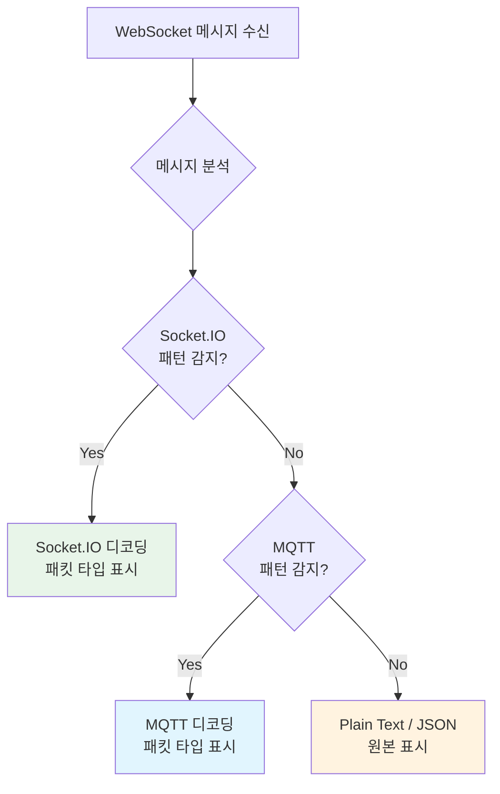

# WebSocket

## 개요

Cheolsu Proxy는 WebSocket 연결을 실시간으로 모니터링하고, 메시지를 검사하며, 필요한 경우 메시지를 주입하거나 수정할 수 있습니다.

WebSocket은 채팅 애플리케이션, 실시간 알림, 게임, 주식 시세 등 양방향 실시간 통신이 필요한 곳에서 널리 사용됩니다. 이러한 애플리케이션을 개발하거나 디버깅할 때 WebSocket 메시지의 흐름을 관찰하는 것은 필수적이지만, 일반적인 브라우저 개발자 도구로는 제한적인 정보만 확인할 수 있습니다. Cheolsu Proxy를 사용하면 모든 WebSocket 메시지를 시간순으로 확인하고, 프로토콜별로 파싱된 상세 정보를 볼 수 있으며, 메시지를 직접 주입하여 서버나 클라이언트의 동작을 테스트할 수 있습니다.

---

## 프로토콜 자동 감지

Cheolsu Proxy는 WebSocket 메시지의 콘텐츠를 분석하여 사용 중인 프로토콜을 자동으로 감지합니다. 감지된 프로토콜에 따라 메시지를 파싱하여 가독성 높은 형태로 표시합니다.



### Plain Text / JSON

일반 텍스트 또는 JSON 형식의 메시지입니다. JSON 메시지의 경우 자동으로 포맷팅하여 표시합니다. 커스텀 프로토콜을 사용하는 애플리케이션의 메시지도 이 타입으로 표시됩니다.

### Socket.IO

Engine.IO 위에 구축된 Socket.IO 프로토콜을 자동으로 감지합니다. Socket.IO는 Node.js 기반 실시간 애플리케이션에서 가장 널리 사용되는 라이브러리 중 하나입니다.

감지되는 패킷 타입:

| 패킷 타입 | 설명 |
| --- | --- |
| connect | 네임스페이스 연결 |
| disconnect | 네임스페이스 연결 해제 |
| event | 이벤트 전송 (가장 빈번한 메시지 타입) |
| ack | 이벤트에 대한 응답 확인 |
| connect_error | 연결 오류 |
| binary event | 바이너리 데이터를 포함한 이벤트 |
| binary ack | 바이너리 데이터를 포함한 응답 확인 |

Engine.IO의 ping/pong 패킷도 별도로 표시되어 연결 유지 상태를 확인할 수 있습니다.

### MQTT

IoT(사물인터넷) 환경에서 널리 사용되는 MQTT 프로토콜을 감지합니다. MQTT v3.1.1과 v5.0을 모두 지원합니다.

감지되는 패킷 타입:

| 패킷 타입 | 설명 |
| --- | --- |
| CONNECT | 클라이언트 연결 요청 |
| CONNACK | 연결 응답 |
| PUBLISH | 메시지 발행 (토픽, QoS, 페이로드 표시) |
| SUBSCRIBE | 토픽 구독 요청 |
| SUBACK | 구독 응답 |
| UNSUBSCRIBE | 토픽 구독 해제 |
| PINGREQ / PINGRESP | 연결 유지 확인 |
| DISCONNECT | 연결 종료 |

---

## 주요 기능

### 연결 목록

활성 및 종료된 WebSocket 연결을 시간순으로 표시합니다.

- 연결/해제 상태 구분
- 연결별 URI 표시
- 각 연결의 메시지 수 확인

### 메시지 보기

선택한 연결의 모든 메시지를 시간순으로 표시합니다.

- **방향 표시**: 클라이언트에서 서버로 보낸 메시지와 서버에서 클라이언트로 보낸 메시지를 구분하여 표시
- **메시지 타입 표시**: Text, Binary, Ping, Pong, Close 프레임 구분
- **페이로드 내용**: 텍스트 메시지는 원본 내용을 표시하고, 프로토콜이 감지된 경우 파싱된 형태로 표시
- **바이너리 데이터**: 바이너리 프레임의 경우 크기 정보와 함께 16진수 형태로 표시

### 메시지 주입

활성 WebSocket 연결에 메시지를 직접 주입할 수 있습니다. 이 기능을 사용하면 서버 이벤트를 시뮬레이션하여 클라이언트의 동작을 테스트하거나, 반대로 클라이언트 요청을 시뮬레이션하여 서버의 동작을 확인할 수 있습니다.

- **방향 선택**: Client -> Server 또는 Server -> Client 방향 지정
- **텍스트/바이너리**: 텍스트 또는 바이너리 메시지 전송

예를 들어, 채팅 앱을 개발할 때 서버가 특정 메시지를 보낸 것처럼 시뮬레이션하여 클라이언트의 메시지 렌더링이 올바른지 확인하거나, 에러 메시지를 주입하여 에러 처리 UI를 테스트할 수 있습니다.

### 메시지 인터셉트 (스크립팅)

스크립팅 훅 `cheolsu.onWebSocketMessage`를 사용하면 WebSocket 메시지를 프로그래밍 방식으로 수정하거나 차단할 수 있습니다. 인터셉트 규칙보다 더 세밀한 제어가 필요할 때 사용합니다.

```javascript
cheolsu.onWebSocketMessage((message) => {
  // message.direction: "to_server" | "to_client"
  // message.payload: 메시지 내용
  // message.is_binary: 바이너리 여부

  // 서버로 가는 메시지 중 특정 이벤트를 수정
  if (message.direction === "to_server") {
    try {
      const data = JSON.parse(message.payload);
      if (data.type === "location") {
        // 위치 정보를 테스트 좌표로 변경
        data.lat = 37.5665;
        data.lng = 126.978;
        return {
          action: "modify",
          payload: JSON.stringify(data),
          is_binary: false,
        };
      }
    } catch (e) {
      // JSON이 아닌 메시지는 그대로 전달
    }
  }

  // 특정 조건의 메시지를 차단
  if (
    message.direction === "to_client" &&
    message.payload.includes("heartbeat")
  ) {
    return { action: "drop" };
  }

  return { action: "forward" };
});
```

---

## 사용 방법

### Desktop

1. 사이드바에서 **WebSocket** 메뉴 선택
2. 좌측 패널에서 WebSocket 연결 목록 확인
3. 연결을 선택하면 우측 패널에 해당 연결의 메시지 목록이 표시
4. 메시지를 선택하면 하단에 상세 페이로드 표시
5. 하단의 입력 영역에서 메시지를 작성하고 방향을 선택하여 주입

### TUI

1. **WebSocket** 탭으로 이동
2. 연결 목록에서 연결 선택
3. 메시지 내용 확인

### MCP

AI 어시스턴트에게 자연어로 WebSocket 데이터를 조회할 수 있습니다.

```
"WebSocket 메시지 중 MQTT PUBLISH 메시지를 보여줘"
"최근 WebSocket 연결 목록을 보여줘"
"Socket.IO event 타입 메시지만 필터링해줘"
```
