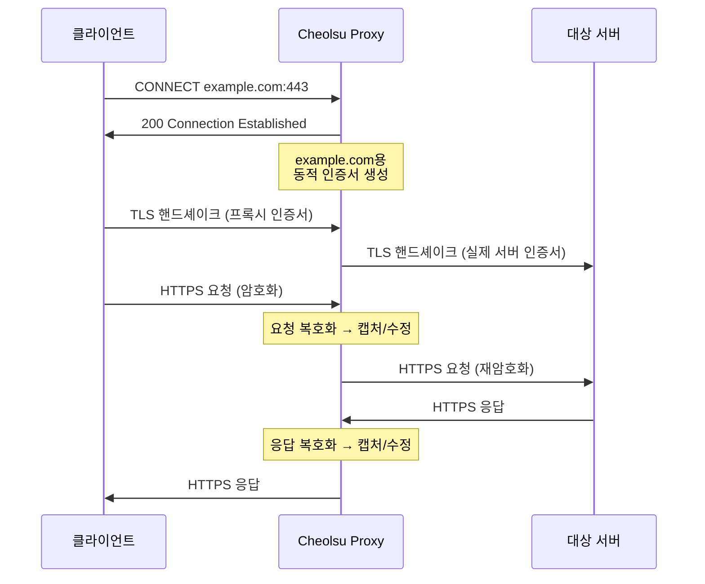

# SSL 인증서

Cheolsu Proxy로 HTTPS 트래픽을 가로채려면 자체 CA 인증서를 시스템에 신뢰하도록 설정해야 합니다. 이 가이드에서는 인증서의 동작 원리와 각 환경별 설치 방법을 설명합니다.

---

## HTTPS 가로채기 원리

일반적인 HTTPS 통신에서는 클라이언트와 서버 사이에 암호화된 TLS 터널이 형성되어, 중간에서 트래픽 내용을 읽을 수 없습니다. Cheolsu Proxy는 MITM(Man-In-The-Middle) 프록시로서 이 터널 사이에 위치하여 트래픽을 복호화하고 다시 암호화합니다.

구체적인 동작 방식은 다음과 같습니다:

1. 클라이언트가 `https://example.com`에 접속을 시도합니다
2. Cheolsu Proxy가 **CONNECT** 요청을 가로챕니다
3. 프록시가 자체 CA 인증서로 `example.com`에 대한 **동적 인증서**를 즉석에서 생성합니다
4. 클라이언트와 프록시 사이에 이 동적 인증서를 사용하여 TLS 연결을 맺습니다
5. 프록시와 실제 서버 사이에 별도의 TLS 연결을 맺습니다
6. 프록시가 양쪽의 트래픽을 중계하면서 요청/응답 내용을 캡처합니다

이 과정에서 클라이언트가 프록시의 동적 인증서를 신뢰하려면, 프록시의 **CA(Certificate Authority) 인증서**를 시스템에 설치하고 신뢰해야 합니다.

> TLS 버전별 처리 방식에 대한 기술적인 상세 내용은 [TLS 지원](../features/tls-support.md) 문서를 참고하세요.

---

## 인증서를 신뢰해야 하는 이유

CA 인증서를 설치하지 않으면 브라우저와 OS에서 "연결이 안전하지 않습니다" 경고를 표시합니다. 이는 클라이언트가 프록시의 동적 인증서를 알 수 없는 기관이 서명한 것으로 판단하기 때문입니다.

인증서를 "항상 신뢰"로 설정하면, Cheolsu Proxy가 생성하는 모든 동적 인증서가 해당 CA로부터 서명되었음을 시스템이 인정하게 됩니다.

**보안 참고사항**: 이 인증서는 개발/디버깅 환경에서만 사용하세요. Cheolsu Proxy의 CA 인증서를 신뢰하면, 해당 CA 키를 가진 누구든 HTTPS 트래픽을 복호화할 수 있게 됩니다. 프록시 사용이 끝나면 인증서 신뢰를 해제하거나 인증서를 삭제하는 것을 권장합니다.

---

## macOS 인증서 설치

1. Cheolsu Proxy를 실행합니다
2. 앱 **설정** → **인증서** 메뉴로 이동합니다
3. **"인증서 설치"** 버튼을 클릭합니다
4. 시스템 비밀번호를 입력하여 설치를 승인합니다

앱에서 인증서 설치와 신뢰 설정이 자동으로 처리됩니다. 설치 후 브라우저를 재시작하세요.

## Windows 인증서 설치

> Windows 지원은 현재 준비 중입니다.

---

## 모바일 기기 인증서 설치

모바일 기기에서 HTTPS 트래픽을 캡처하려면 해당 기기에도 CA 인증서를 설치해야 합니다.

### 사전 준비

모바일 기기가 Cheolsu Proxy를 통해 트래픽을 전달하도록 프록시 설정이 되어 있어야 합니다. 프록시 설정 방법은 [프록시 설정 가이드](./proxying.md)를 참고하세요.

### iOS

1. 모바일 기기의 Wi-Fi 프록시를 Cheolsu Proxy로 설정합니다
2. Safari에서 인증서 다운로드 URL에 접속합니다 (프록시가 제공하는 URL)
3. **프로파일 다운로드** 대화상자에서 **허용**을 선택합니다
4. **설정** → **일반** → **VPN 및 기기 관리**에서 다운로드한 프로파일을 탭합니다
5. **설치**를 탭하고 기기 암호를 입력합니다
6. **설정** → **일반** → **정보** → **인증서 신뢰 설정**에서 Cheolsu Proxy 인증서를 **활성화**합니다

> iOS에서는 5단계와 6단계가 모두 필요합니다. 프로파일 설치만으로는 인증서가 신뢰되지 않습니다.

### Android

1. 모바일 기기의 Wi-Fi 프록시를 Cheolsu Proxy로 설정합니다
2. 브라우저에서 인증서 다운로드 URL에 접속합니다
3. 인증서 파일을 다운로드합니다
4. **설정** → **보안** → **암호화 및 사용자 인증 정보** → **인증서 설치**를 선택합니다
5. 다운로드한 인증서 파일을 선택하고 설치합니다

> Android 버전 및 제조사에 따라 메뉴 경로가 다를 수 있습니다. "인증서 설치"를 설정 검색으로 찾으면 빠릅니다.

---

## Firefox 인증서 설정

Firefox는 운영체제의 인증서 저장소를 사용하지 않고 **자체 인증서 저장소**를 사용합니다. 따라서 macOS Keychain에 인증서를 설치하더라도 Firefox에서는 별도로 설정해야 합니다.

### 방법 1: Firefox 설정에서 직접 추가

1. Firefox 주소창에 `about:preferences#privacy`를 입력합니다
2. 페이지 하단의 **인증서** 섹션에서 **인증서 보기** 버튼을 클릭합니다
3. **기관** 탭에서 **가져오기** 버튼을 클릭합니다
4. Cheolsu Proxy의 CA 인증서 파일을 선택합니다
5. **"웹 사이트를 식별할 때 이 인증 기관 신뢰"** 체크박스를 선택합니다
6. **확인**을 클릭합니다

### 방법 2: 시스템 인증서 사용 허용

Firefox가 OS의 인증서 저장소를 사용하도록 설정할 수도 있습니다:

1. Firefox 주소창에 `about:config`를 입력합니다
2. `security.enterprise_roots.enabled`를 검색합니다
3. 값을 **true**로 변경합니다

> 방법 2를 사용하면 macOS Keychain에 설치된 인증서를 Firefox에서도 인식하므로, 별도의 인증서 가져오기가 필요 없습니다.

---

## 인증서 재생성

CA 인증서가 만료되었거나 보안상의 이유로 인증서를 새로 생성해야 하는 경우:

1. Cheolsu Proxy 앱의 **설정** → **인증서**에서 **"인증서 제거"**를 실행합니다
2. **"인증서 설치"**를 다시 실행합니다
3. 브라우저를 재시작합니다

> 인증서를 재생성하면 모바일 기기에도 새 인증서를 다시 설치해야 합니다.

---

## 문제 해결

### "연결이 안전하지 않습니다" 경고가 표시됩니다

- 앱 **설정** → **인증서**에서 인증서 상태가 **신뢰됨**인지 확인하세요
- 인증서 설치 후 브라우저를 재시작했는지 확인하세요
- Firefox를 사용하는 경우 별도의 인증서 설정이 필요합니다 (위 Firefox 섹션 참고)

### 인증서 설치가 되지 않습니다

- Cheolsu Proxy 앱에서 인증서 설치를 다시 시도하세요
- 시스템 비밀번호를 올바르게 입력했는지 확인하세요

### 특정 사이트에서만 인증서 오류가 발생합니다

일부 서비스(특히 Apple 서비스)는 인증서 피닝(Certificate Pinning)을 적용하여 프록시를 통한 HTTPS 가로채기가 불가능합니다. 이러한 호스트는 자동으로 터널 모드로 처리되어 TLS를 우회합니다. 자세한 내용은 [TLS 지원](../features/tls-support.md)의 터널 모드 섹션을 참고하세요.

### 모바일 기기에서 인증서 오류가 발생합니다

- 모바일 기기의 프록시 설정이 올바른지 확인하세요 ([프록시 설정](./proxying.md) 참고)
- iOS의 경우 프로파일 설치와 인증서 신뢰 설정을 **모두** 완료했는지 확인하세요
- 인증서를 재생성한 경우 모바일 기기에서도 새 인증서를 설치해야 합니다

---

## 관련 문서

- [기본 사용법](./basic-usage.md) - 프록시 시작 및 기본 사용법
- [프록시 설정](./proxying.md) - 시스템 프록시 및 모바일 기기 설정
- [TLS 지원](../features/tls-support.md) - TLS 버전별 처리 및 터널 모드
- [문제 해결](./troubleshooting.md) - 일반적인 문제 해결
